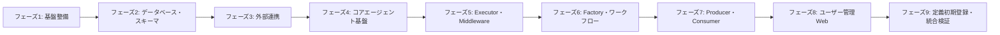
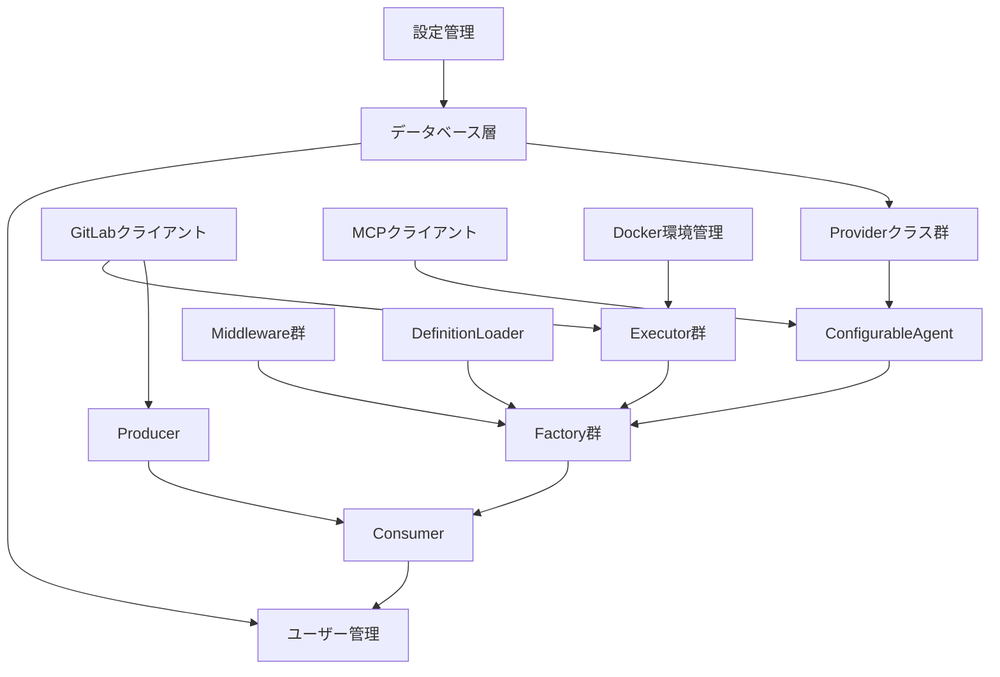

# AutomataCodex 実装計画

## 概要

本ドキュメントは、AutomataCodexシステム（GitLab Issue/MRを自動処理するコードエージェントオーケストレーションシステム）の実装計画を示す。  
全実装はPython 3.11以上を対象とし、Microsoft Agent Framework（Python）を基盤として用いる。

---

## 実装フェーズ一覧



## 実装ディレクトリ構成

```
/
├── pyproject.toml              # ワークスペースルート（[tool.uv.workspace]）
├── docker-compose.yml
├── config.yaml
├── .env.example
├── .dockerignore
│
├── shared/                     # 共通ライブラリ（automata-shared）
│   ├── pyproject.toml
│   ├── models/                 # フェーズ1-3
│   ├── config/                 # フェーズ1-2
│   ├── gitlab_client/          # フェーズ3-1
│   ├── messaging/              # フェーズ3-4
│   └── database/               # フェーズ2-1, 2-2, 9-1
│       ├── migrations/
│       ├── repositories/
│       └── seeds/
│
├── producer/                   # Producerサービス（automata-producer）
│   ├── pyproject.toml
│   ├── Dockerfile              # フェーズ7-1
│   └── （モジュール群）
│
├── consumer/                   # Consumerサービス（automata-consumer）
│   ├── pyproject.toml
│   ├── Dockerfile
│   ├── mcp/                    # フェーズ3-2, 3-3
│   ├── execution/              # フェーズ4-1
│   ├── providers/              # フェーズ4-2
│   ├── analysis/               # フェーズ4-3
│   ├── planning/               # フェーズ4-3
│   ├── agents/                 # フェーズ4-4, 6-3
│   ├── executors/              # フェーズ5-1
│   ├── middleware/             # フェーズ5-2
│   ├── tools/                  # フェーズ5-3, 5-4
│   ├── definitions/            # フェーズ6-1
│   ├── factories/              # フェーズ6-2
│   └── strategies/             # フェーズ6-4
│
├── backend/                    # User Config APIサービス（automata-backend）
│   ├── pyproject.toml
│   ├── Dockerfile
│   └── user_management/        # フェーズ8-1, 8-2
│       └── cli/
│
├── frontend/                   # Vue.jsフロントエンド（フェーズ8-3）
│   ├── Dockerfile
│   └── src/
│       ├── router/
│       ├── api/
│       └── views/
│
├── docs/
│   └── definitions/            # 既存JSONファイル群
│
└── tests/
    └── integration/            # フェーズ9-2, 9-3
```

---

## フェーズ1: 基盤整備（環境・依存関係）

### 1-1. プロジェクト構造の作成

**参照ドキュメント:**
- `docs/AUTOMATA_CODEX_SPEC.md` § 2（システムアーキテクチャ）
- `docs/AUTOMATA_CODEX_SPEC.md` § 14（設定ファイル定義）

**実装ファイル:**
- `pyproject.toml`（ワークスペースルート：`[tool.uv.workspace]` で `shared`・`producer`・`consumer`・`backend` を管理）
- `docker-compose.yml`
- `.env.example`
- `.dockerignore`
- `shared/pyproject.toml`
- `producer/pyproject.toml`
- `producer/Dockerfile`
- `consumer/pyproject.toml`
- `consumer/Dockerfile`
- `backend/pyproject.toml`
- `backend/Dockerfile`
- `frontend/Dockerfile`

**実装内容:**  
ルートの `pyproject.toml` に `[tool.uv.workspace]` を設定し、`shared`・`producer`・`consumer`・`backend` の4パッケージをワークスペースメンバーとして管理する。  
producer・consumer・backend の3つのPythonサービスは `shared` を共通ライブラリとして依存し、コード重複なしに `models/`・`database/`・`gitlab_client/`・`config/` を共有する。  
各サービスディレクトリ直下の `Dockerfile` は `context: .`（ルート）を共有ビルドコンテキストとして使用し、`docker-compose.yml` の `build` 指定は `{ context: ., dockerfile: <サービス>/Dockerfile }` 形式とする。  
Docker Compose構成でProducerコンテナ1台・Consumerコンテナ5〜10台・RabbitMQ・PostgreSQLを定義する。  
ConsumerコンテナはホストのDocker daemonに接続するため `/var/run/docker.sock` をボリュームマウントする（Docker-outside-of-Docker）。  
環境変数POSTGRES_PASSWORD、ENCRYPTION_KEY、GITLAB_PAT、GITLAB_URL、RABBITMQ_URL、USER_CONFIG_API_URLをサポートする。

---

### 1-2. 設定管理クラスの実装

**参照ドキュメント:**
- `docs/AUTOMATA_CODEX_SPEC.md` § 14.1（config.yaml完全定義）
- `docs/AUTOMATA_CODEX_SPEC.md` § 14.2（設定管理クラス設計）
- `docs/AUTOMATA_CODEX_SPEC.md` § 14.2.1（ConfigManager）
- `docs/AUTOMATA_CODEX_SPEC.md` § 14.2.2（設定データクラス）
- `docs/AUTOMATA_CODEX_SPEC.md` § 14.2.3（環境変数マッピング）

**実装ファイル:**
- `shared/config/config_manager.py`
- `shared/config/models.py`
- `config.yaml`

**実装内容:**  
config.yamlをYAMLファイルとして読み込み、各設定項目をデータクラスにマッピングするConfigManagerを実装する。  
環境変数による設定の上書きを優先する仕組みを組み込む。  
GitLab設定・LLMデフォルト設定・RabbitMQ設定・PostgreSQL設定・Docker設定・MCP設定・リトライポリシー等の全設定カテゴリーを網羅する。

---

### 1-3. ドメインモデル定義

**参照ドキュメント:**
- `docs/AUTOMATA_CODEX_SPEC.md` § 4（エージェント構成・AgentNodeConfig）
- `docs/AUTOMATA_CODEX_SPEC.md` § 7.2（GitlabClientレスポンスの変換先データクラス）
- `docs/GRAPH_DEFINITION_SPEC.md` § 3（JSON形式の仕様）
- `docs/AGENT_DEFINITION_SPEC.md` § 3（JSON形式の仕様）
- `docs/PROMPT_DEFINITION_SPEC.md` § 3（JSON形式の仕様）

**実装ファイル:**
- `shared/models/task.py`
- `shared/models/graph_definition.py`
- `shared/models/agent_definition.py`
- `shared/models/prompt_definition.py`

**実装内容:**  
Task・AgentNodeConfig・GraphDefinition・PromptConfigなどのドメインデータクラスをPydantic BaseModelとして定義する。  
GitLabClientのレスポンス変換・WorkflowFactory・DefinitionLoader・TaskStrategyFactory等がシステム全体で共有する型定義として機能する。  
`shared` パッケージに配置し、producer・consumer・backendの全サービスから参照可能にする。

---

## フェーズ2: データベース・スキーマ

### 2-1. データベーススキーマの作成とマイグレーション管理

**参照ドキュメント:**
- `docs/DATABASE_SCHEMA_SPEC.md` § 1（概要・ER図）
- `docs/DATABASE_SCHEMA_SPEC.md` § 2（ユーザー管理テーブル群）
- `docs/DATABASE_SCHEMA_SPEC.md` § 3（ワークフロー定義テーブル）
- `docs/DATABASE_SCHEMA_SPEC.md` § 4（タスク管理テーブル）
- `docs/DATABASE_SCHEMA_SPEC.md` § 4.5（ワークフロー実行管理テーブル群）
- `docs/DATABASE_SCHEMA_SPEC.md` § 5（コンテキストストレージテーブル群）
- `docs/DATABASE_SCHEMA_SPEC.md` § 6（Todo管理テーブル）
- `docs/DATABASE_SCHEMA_SPEC.md` § 7（メトリクステーブル）
- `docs/DATABASE_SCHEMA_SPEC.md` § 9（データベース初期化SQL）
- `docs/DATABASE_SCHEMA_SPEC.md` § 12（マイグレーション管理）

**実装ファイル:**
- `shared/database/schema.sql`
- `shared/database/migrations/`（マイグレーションファイル群）
- `shared/database/connection.py`

**実装内容:**  
PostgreSQLデータベース「coding_agent」に対し、16テーブル以上をSQLで定義する。  
各テーブルの主キー・外部キー・インデックス・制約を仕様書通りに作成する。  
APIキー列（openai_api_key）はAES-256-GCMで暗号化してバイト列として保存する。  
JSONBカラム（graph_definition、agent_definition、prompt_definitionなど）はPostgreSQLのJSONB型を利用する。  
マイグレーション管理はバージョン番号付きSQLファイルとし、適用済み管理テーブルでべき等に実行できるようにする。  
非同期接続にはasyncpgを使用し、接続プールを管理するモジュールを用意する。

---

### 2-2. データアクセス層（リポジトリクラス）の実装

**参照ドキュメント:**
- `docs/DATABASE_SCHEMA_SPEC.md` § 2〜7（各テーブル仕様）
- `docs/DATABASE_SCHEMA_SPEC.md` § 10（データベース設定）
- `docs/DATABASE_SCHEMA_SPEC.md` § 11（セキュリティ設定）

**実装ファイル:**
- `shared/database/repositories/user_repository.py`
- `shared/database/repositories/task_repository.py`
- `shared/database/repositories/workflow_definition_repository.py`
- `shared/database/repositories/context_repository.py`
- `shared/database/repositories/token_usage_repository.py`
- `shared/database/repositories/workflow_execution_state_repository.py`

**実装内容:**  
各テーブルへのCRUD操作を非同期メソッドとして実装する。  
usersテーブル・user_configsテーブル・tasksテーブル・workflow_definitionsテーブル・context系テーブル・token_usageテーブル・workflow_execution_statesテーブルを対象とする。  
暗号化・復号処理はUserRepositoryの内部で透過的に行い、呼び出し側に暗号処理を露出させない。

---

## フェーズ3: 外部連携クライアント

### 3-1. GitLab クライアントの実装

**参照ドキュメント:**
- `docs/AUTOMATA_CODEX_SPEC.md` § 7（GitLab API操作設計）
- `docs/AUTOMATA_CODEX_SPEC.md` § 7.1（実装方針）
- `docs/AUTOMATA_CODEX_SPEC.md` § 7.2（GitlabClientクラスの責務）
- `docs/AUTOMATA_CODEX_SPEC.md` § 7.3（主要メソッドグループ）
- `docs/AUTOMATA_CODEX_SPEC.md` § 7.4（エラーハンドリングポリシー）

**実装ファイル:**
- `shared/gitlab_client/gitlab_client.py`

**実装内容:**  
python-gitlabライブラリを用いてGitLabのREST API操作をラップするGitlabClientクラスを実装する。  
Issue取得・MR作成・MRコメント投稿・ブランチ作成・ファイル取得・ファイル更新コミット（update_file）などのメソッドを提供する。  
環境変数GITLAB_PATを認証に使用し、レート制限エラー（429）に対しては自動リトライを行う。  
ネットワークエラーはtransient扱いとして上位に伝播させる。

---

### 3-2. MCPクライアントの実装

**参照ドキュメント:**
- `docs/AUTOMATA_CODEX_SPEC.md` § 9（Tool管理設計）
- `docs/CLASS_IMPLEMENTATION_SPEC.md` § 9（MCPClient関連）
- `docs/CLASS_IMPLEMENTATION_SPEC.md` § 9.1（MCPClient）
- `docs/CLASS_IMPLEMENTATION_SPEC.md` § 9.2（EnvironmentAwareMCPClient）

**実装ファイル:**
- `consumer/mcp/mcp_client.py`

**実装内容:**  
MCPClientクラスはMCP（Model Context Protocol）サーバーにStdio経由で接続し、ツール一覧取得とツール呼び出しを行うメソッドを実装する。  
EnvironmentAwareMCPClientはMCPClientを継承し、env_idをコンテキストに自動付与してから各ツールを呼び出すラッパーとして実装する。  
接続・切断のライフサイクル管理と、呼び出し失敗時の例外ハンドリングを含める。

---

### 3-3. MCPClientFactoryの実装

**参照ドキュメント:**
- `docs/AUTOMATA_CODEX_SPEC.md` § 4.2.4（MCPClientFactory）
- `docs/CLASS_IMPLEMENTATION_SPEC.md` § 2.4（MCPClientFactory）
- `docs/CLASS_IMPLEMENTATION_SPEC.md` § 2.4.3（主要メソッド）

**実装ファイル:**
- `consumer/mcp/mcp_client_factory.py`

**実装内容:**  
MCPClientFactoryはエージェント定義に記述されたmcp_serversリストを参照し、エージェントごとに新規MCPクライアントインスタンスを生成する。  
text_editorサーバー・command_executorサーバー・todo_listサーバーの各MCPStdioToolを生成するメソッドをそれぞれ実装する。  
各ツール生成時にenv_idをサーバープロセスの起動パラメータとして埋め込む。

### 3-4. RabbitMQクライアントの実装

**参照ドキュメント:**
- `docs/AUTOMATA_CODEX_SPEC.md` § 2.2.1（Producer: タスク検出＆キューイング）
- `docs/AUTOMATA_CODEX_SPEC.md` § 2.2.2（Consumer: タスク処理）

**実装ファイル:**
- `shared/messaging/rabbitmq_client.py`

**実装内容:**  
aio-pikaライブラリを用いてRabbitMQへの接続・メッセージパブリッシュ・サブスクライブを共通ライブラリとして実装する。  
Producerは本クライアントを通じタスクエンキューを行い、Consumerはキューからタスクを取得する。  
接続失敗時の自動再接続・メッセージACK/NACK処理・キュー名設定をラップする。

---

## フェーズ4: コアエージェント基盤

### 4-1. Docker実行環境管理の実装

**参照ドキュメント:**
- `docs/AUTOMATA_CODEX_SPEC.md` § 2.3.4（Runtime Layer）
- `docs/CLASS_IMPLEMENTATION_SPEC.md` § 6（ExecutionEnvironmentManager）
- `docs/CLASS_IMPLEMENTATION_SPEC.md` § 6.1（概要）
- `docs/CLASS_IMPLEMENTATION_SPEC.md` § 6.3（主要メソッド）

**実装ファイル:**
- `consumer/execution/execution_environment_manager.py`

**実装内容:**  
ExecutionEnvironmentManagerはDocker SDKを用い、タスクごとのコンテナのライフサイクルを管理する。  
prepare_environments()でcount数のコンテナを起動し、node_idとenv_idのマッピングを保持する。  
get_environment()でノードに対応するenv_idを返す。  
cleanup_environments()でコンテナを停止・削除する。  
save_environment_mapping()・load_environment_mapping()でDocker環境のマッピングをDBに永続化し、停止・再開に対応する。

---

### 4-2. カスタムProviderの実装

**参照ドキュメント:**
- `docs/AUTOMATA_CODEX_SPEC.md` § 8.2（Agent Framework標準Providerのカスタム実装）
- `docs/AUTOMATA_CODEX_SPEC.md` § 8.2.1（PostgreSqlChatHistoryProvider）
- `docs/AUTOMATA_CODEX_SPEC.md` § 8.2.2（PlanningContextProvider）
- `docs/AUTOMATA_CODEX_SPEC.md` § 8.2.3（ToolResultContextProvider）
- `docs/AUTOMATA_CODEX_SPEC.md` § 8.4（コンテキスト圧縮）
- `docs/CLASS_IMPLEMENTATION_SPEC.md` § 4.1（PostgreSqlChatHistoryProvider）
- `docs/CLASS_IMPLEMENTATION_SPEC.md` § 4.2（PlanningContextProvider）
- `docs/CLASS_IMPLEMENTATION_SPEC.md` § 4.3（ToolResultContextProvider）
- `docs/CLASS_IMPLEMENTATION_SPEC.md` § 4.4（TaskInheritanceContextProvider）

**実装ファイル:**
- `consumer/providers/chat_history_provider.py`
- `consumer/providers/planning_context_provider.py`
- `consumer/providers/tool_result_context_provider.py`
- `consumer/providers/task_inheritance_context_provider.py`
- `consumer/providers/context_compression_service.py`
- `consumer/providers/context_storage_manager.py`

**実装内容:**  
PostgreSqlChatHistoryProviderはAgent Frameworkの標準ChatHistoryProviderを継承し、会話履歴をPostgreSQLのcontext_messagesテーブルに保存・取得する。  
コンテキスト圧縮の設定（max_tokens、compression_ratio等）をconfig.yamlから読み込み、トークン超過時に古いメッセージを自動圧縮して記録する。  
PlanningContextProviderはbefore_run・after_runフックを実装し、プランニング履歴をcontext_planning_historyテーブルに保存する。  
ToolResultContextProviderはツール実行結果をファイルシステムとcontext_tool_results_metadataテーブルに分割保存し、取得時はメタデータのみをLLMコンテキストに注入する。  
TaskInheritanceContextProviderは過去タスクの実行履歴をtasksテーブルから取得し、同一リポジトリ・同一ユーザーの過去タスク情報をコンテキストとして注入する。  
ContextStorageManagerは各カスタムProviderとリポジトリへの参照を集約し、TokenUsageMiddleware・ErrorHandlingMiddlewareがトークン記録・エラー記録に使用する統合管理クラスとして機能する。

---

### 4-3. 環境アナライザーと事前計画マネージャーの実装

**参照ドキュメント:**
- `docs/CLASS_IMPLEMENTATION_SPEC.md` § 7（EnvironmentAnalyzer）
- `docs/CLASS_IMPLEMENTATION_SPEC.md` § 8（PrePlanningManager）
- `docs/STANDARD_MR_PROCESSING_FLOW.md` § 4.1（計画前情報収集フェーズ）

**実装ファイル:**
- `consumer/analysis/environment_analyzer.py`
- `consumer/planning/pre_planning_manager.py`

**実装内容:**  
EnvironmentAnalyzerはリポジトリのファイル一覧からDockerfile・docker-compose.yml・requirements.txt・package.json等の環境ファイルを検出し、言語・テストフレームワーク・実行コマンドを判定する。  
PrePlanningManagerはplan_env_setup後にEnvironmentAnalyzerを呼び出し、リポジトリ構造・コンテキスト・テスト実行環境情報をまとめてワークフローコンテキストに保存する。

---

### 4-4. ConfigurableAgentの実装

**参照ドキュメント:**
- `docs/AUTOMATA_CODEX_SPEC.md` § 4.3.1（エージェント共通設計）
- `docs/AUTOMATA_CODEX_SPEC.md` § 4.3.1 ConfigurableAgent（単一エージェントクラス）
- `docs/CLASS_IMPLEMENTATION_SPEC.md` § 1（ConfigurableAgent）
- `docs/CLASS_IMPLEMENTATION_SPEC.md` § 1.4（主要メソッド）
- `docs/AGENT_DEFINITION_SPEC.md` § 3（JSON形式の仕様）
- `docs/AGENT_DEFINITION_SPEC.md` § 6（各エージェントノードの詳細説明）

**実装ファイル:**
- `consumer/agents/configurable_agent.py`

**実装内容:**  
ConfigurableAgentはAgent Frameworkのエージェントクラスを継承し、グラフ内のすべてのエージェントノードを統一的に実装する単一クラスとして実装する。  
handle()メソッドでエージェント定義のroleフィールド（planning・execution・reflection・review）に応じた処理を行い、input_keysのコンテキスト値を取得してLLMに渡し、output_keysにLLM応答を保存する。  
get_chat_history()でPostgreSqlChatHistoryProviderから会話履歴を取得する。  
invoke_mcp_tool()でEnvironmentAwareMCPClientを通じてMCPツールを呼び出し、結果をToolResultContextProviderに保存する。  
report_progress()でProgressReporterを呼び出してMRコメントに進捗を投稿する。呼び出しタイミングはノード処理開始時（phase=start）とノード処理完了時（phase=end）の2回とし、エラー発生時にはphase=errorとして呼び出す。

---

## フェーズ5: Executor・Middleware

### 5-1. Executor群の実装

**参照ドキュメント:**
- `docs/AUTOMATA_CODEX_SPEC.md` § 4.3.2（エージェントノード一覧）
- `docs/AUTOMATA_CODEX_SPEC.md` § 4.3.2 固定実装のExecutor群
- `docs/CLASS_IMPLEMENTATION_SPEC.md` § 3（Executor群）
- `docs/CLASS_IMPLEMENTATION_SPEC.md` § 3.1（BaseExecutor）
- `docs/CLASS_IMPLEMENTATION_SPEC.md` § 3.2（UserResolverExecutor）
- `docs/CLASS_IMPLEMENTATION_SPEC.md` § 3.3（ContentTransferExecutor）
- `docs/CLASS_IMPLEMENTATION_SPEC.md` § 3.4（PlanEnvSetupExecutor）
- `docs/CLASS_IMPLEMENTATION_SPEC.md` § 3.5（ExecEnvSetupExecutor）
- `docs/CLASS_IMPLEMENTATION_SPEC.md` § 3.6（BranchMergeExecutor）

**実装ファイル:**
- `consumer/executors/base_executor.py`
- `consumer/executors/user_resolver_executor.py`
- `consumer/executors/content_transfer_executor.py`
- `consumer/executors/plan_env_setup_executor.py`
- `consumer/executors/exec_env_setup_executor.py`
- `consumer/executors/branch_merge_executor.py`

**実装内容:**  
BaseExecutorはAgent Frameworkのハンドラー基底クラスを継承し、get_context_value()・set_context_value()のヘルパーメソッドを提供する。  
UserResolverExecutorはGitLabのMR情報からアサイニーのメールアドレスを取得し、Userテーブルを参照してuser_configを取得してワークフローコンテキストに保存する。  
ContentTransferExecutorはIssueの説明・コメント内容をMRに転記する。  
PlanEnvSetupExecutorはリポジトリのクローン・分析用Docker環境の起動をPrePlanningManagerを通じて実行する。  
ExecEnvSetupExecutorはグラフ定義のenv_count数に応じた実行用Docker環境を並列起動し、各環境でリポジトリをクローンしてブランチをチェックアウトする。  
BranchMergeExecutorは選択された実装ブランチをメインのfeatureブランチにマージし、非選択ブランチをクリーンアップする。

---

### 5-2. Middleware群の実装

**参照ドキュメント:**
- `docs/AUTOMATA_CODEX_SPEC.md` § 8（状態管理設計）
- `docs/AUTOMATA_CODEX_SPEC.md` § 8.8.7（InfiniteLoopDetectionMiddleware実装）
- `docs/CLASS_IMPLEMENTATION_SPEC.md` § 5（Middleware実装）
- `docs/CLASS_IMPLEMENTATION_SPEC.md` § 5.1（IMiddlewareインターフェース）
- `docs/CLASS_IMPLEMENTATION_SPEC.md` § 5.2（CommentCheckMiddleware）
- `docs/CLASS_IMPLEMENTATION_SPEC.md` § 5.3（TokenUsageMiddleware）
- `docs/CLASS_IMPLEMENTATION_SPEC.md` § 5.4（ErrorHandlingMiddleware）
- `docs/STANDARD_MR_PROCESSING_FLOW.md` § 4.8（差分計画パターン）
- `docs/STANDARD_MR_PROCESSING_FLOW.md` § 4.8.1（Middleware実装の特徴）

**実装ファイル:**
- `consumer/middleware/i_middleware.py`
- `consumer/middleware/comment_check_middleware.py`
- `consumer/middleware/infinite_loop_detection_middleware.py`
- `consumer/middleware/token_usage_middleware.py`
- `consumer/middleware/error_handling_middleware.py`

**実装内容:**  
IMiddlewareインターフェースはintercept(phase, node, context)を抽象メソッドとして定義する。  
CommentCheckMiddlewareは各ノード実行前にGitLab MRの新着コメントを検出し、ユーザーコメントがあればcomment_contentキーにコンテキストを保存してノード実行を継続させる。差分計画判定はplan_reflectionエージェントが担う。  
InfiniteLoopDetectionMiddlewareは同一ノードへの到達回数をカウントし、設定値を超過した場合にワークフローを異常終了させる。  
TokenUsageMiddlewareはノード実行後にLLMトークン使用量（prompt_tokens・completion_tokens・model）をtoken_usageテーブルに記録する。  
ErrorHandlingMiddlewareはノード実行中の例外をキャッチし、エラー種別（transient・configuration・implementation・resource）を判定してリトライまたはGitLab通知・ワークフロー停止を行う。

---

### 5-3. 進捗報告関連クラスの実装

**参照ドキュメント:**
- `docs/AUTOMATA_CODEX_SPEC.md` § 6（進捗報告機能）
- `docs/AUTOMATA_CODEX_SPEC.md` § 6.1（概要）
- `docs/AUTOMATA_CODEX_SPEC.md` § 6.2（報告タイミング）
- `docs/AUTOMATA_CODEX_SPEC.md` § 6.3（コメントフォーマット）
- `docs/AUTOMATA_CODEX_SPEC.md` § 6.4（実装方法）
- `docs/CLASS_IMPLEMENTATION_SPEC.md` § 10.3（ProgressReporter）
- `docs/CLASS_IMPLEMENTATION_SPEC.md` § 10.4（MermaidGraphRenderer）
- `docs/CLASS_IMPLEMENTATION_SPEC.md` § 10.5（ProgressCommentManager）

**実装ファイル:**
- `consumer/tools/progress_reporter.py`
- `consumer/tools/mermaid_graph_renderer.py`
- `consumer/tools/progress_comment_manager.py`

**実装内容:**  
ProgressReporterはワークフローコンテキストとノード実行イベントを受け取り、ProgressCommentManagerを通じてGitLab MRにコメントを作成・更新する。  
MermaidGraphRendererはグラフ定義とノード状態（pending・running・completed・failed）をもとにMermaid記法のフローチャートを生成する。  
ProgressCommentManagerはMRコメントの作成（初回）と更新（2回目以降）を管理し、コメントIDをワークフローコンテキストに保存する。

---

### 5-4. その他ユーティリティクラスの実装

**参照ドキュメント:**
- `docs/CLASS_IMPLEMENTATION_SPEC.md` § 10.1（TodoManagementTool）
- `docs/CLASS_IMPLEMENTATION_SPEC.md` § 10.2（IssueToMRConverter）

**実装ファイル:**
- `consumer/tools/todo_management_tool.py`
- `consumer/tools/issue_to_mr_converter.py`

**実装内容:**  
TodoManagementToolはGitLab MRのスレッド機能を使い、Todoリストの作成・更新・完了チェックをGitLab APIを通じて管理する。  
IssueToMRConverterはGitLab IssueをMRに変換し、Issue説明・ラベル・アサイニーをMRに引き継ぐ。LLMを使いブランチ名を自動生成する。

---

## フェーズ6: Factory・ワークフロー

### 6-1. DefinitionLoaderの実装

**参照ドキュメント:**
- `docs/AUTOMATA_CODEX_SPEC.md` § 4.4（定義ファイル管理）
- `docs/AUTOMATA_CODEX_SPEC.md` § 4.4.4（DefinitionLoader）
- `docs/AUTOMATA_CODEX_SPEC.md` § 4.4.4 validate_graph_definition()
- `docs/AUTOMATA_CODEX_SPEC.md` § 4.4.4 validate_agent_definition()
- `docs/AUTOMATA_CODEX_SPEC.md` § 4.4.4 validate_prompt_definition()
- `docs/GRAPH_DEFINITION_SPEC.md` § 3（JSON形式の仕様）
- `docs/GRAPH_DEFINITION_SPEC.md` § 5（バリデーション仕様）
- `docs/GRAPH_DEFINITION_SPEC.md` § 6（定義の取得・更新フロー）
- `docs/AGENT_DEFINITION_SPEC.md` § 3（JSON形式の仕様）
- `docs/PROMPT_DEFINITION_SPEC.md` § 3（JSON形式の仕様）

**実装ファイル:**
- `consumer/definitions/definition_loader.py`

**実装内容:**  
DefinitionLoaderはworkflow_definitionsテーブルからグラフ定義・エージェント定義・プロンプト定義をロードし、それぞれを対応するPythonデータクラスに変換する。  
validate_graph_definition()はノード・エッジの整合性、エントリポイントの存在、条件分岐ノードのエッジ定義の完全性を検証する。  
validate_agent_definition()はグラフ定義内のノードIDとエージェント定義IDの対応関係を検証する。  
validate_prompt_definition()はエージェント定義内のprompt_idとプロンプト定義IDの対応関係を検証する。

---

### 6-2. Factory群の実装

**参照ドキュメント:**
- `docs/AUTOMATA_CODEX_SPEC.md` § 4.1（Factory設計）
- `docs/AUTOMATA_CODEX_SPEC.md` § 4.2.1（WorkflowFactory）
- `docs/AUTOMATA_CODEX_SPEC.md` § 4.2.2（ExecutorFactory）
- `docs/AUTOMATA_CODEX_SPEC.md` § 4.2.3（TaskStrategyFactory）
- `docs/CLASS_IMPLEMENTATION_SPEC.md` § 2.1（WorkflowFactory）
- `docs/CLASS_IMPLEMENTATION_SPEC.md` § 2.2（ExecutorFactory）
- `docs/CLASS_IMPLEMENTATION_SPEC.md` § 2.3（AgentFactory）
- `docs/CLASS_IMPLEMENTATION_SPEC.md` § 2.5（TaskStrategyFactory）

**実装ファイル:**
- `consumer/factories/workflow_factory.py`
- `consumer/factories/executor_factory.py`
- `consumer/factories/agent_factory.py`
- `consumer/factories/task_strategy_factory.py`
- `consumer/user_config_client.py`

**実装内容:**  
WorkflowFactoryはDefinitionLoaderで取得した定義からAgent Frameworkのワークフローを構築する主要クラスである。  
グラフ定義のノードを順次処理し、type=executor_nodeはExecutorFactoryから、type=agent_nodeはAgentFactoryからインスタンスを生成してノードとして登録する。  
グラフ定義のエッジ（condition付き含む）をワークフローに追加し、学習ノード（GuidelineLearningAgent）を自動挿入する。  
ワークフローの停止・再開のためにsave_workflow_state()・load_workflow_state()・resume_workflow()を実装し、SIGTERMシグナルのハンドラーを設定する。  
ExecutorFactoryはBaseExecutorサブクラスのインスタンスを生成するcreateメソッド群を実装する。  
AgentFactoryはエージェント定義とプロンプト定義を受け取り、user_email・env_idを設定した上でConfigurableAgentを生成する。User Config APIからユーザーのLLM設定を取得してエージェントに適用する。  
TaskStrategyFactoryはタスク種別（issue_to_mr・standard_mr_processing・multi_codegen_mr_processing等）に応じたITaskStrategyを返す。  
UserConfigClientはConsumerコンテナが `USER_CONFIG_API_URL` 経由でUser Config APIへHTTPで問い合わせるクライアントとして実装する。ユーザーのLLM設定・APIキー取得に使用し、AgentFactoryとUserResolverExecutorが依存する。

---

### 6-3. GuidelineLearningAgentの実装

**参照ドキュメント:**
- `docs/AUTOMATA_CODEX_SPEC.md` § 11（学習機能）
- `docs/AUTOMATA_CODEX_SPEC.md` § 11.2（GuidelineLearningAgent）
- `docs/AUTOMATA_CODEX_SPEC.md` § 11.3（処理フロー）
- `docs/AUTOMATA_CODEX_SPEC.md` § 11.5（例外的なGitLab API直接操作の許可）
- `docs/CLASS_IMPLEMENTATION_SPEC.md` § 11（GuidelineLearningAgent）
- `docs/CLASS_IMPLEMENTATION_SPEC.md` § 11.4（invoke_asyncの処理フロー）
- `docs/CLASS_IMPLEMENTATION_SPEC.md` § 11.5（例外的なGitLab API直接操作の許可）

**実装ファイル:**
- `consumer/agents/guideline_learning_agent.py`

**実装内容:**  
GuidelineLearningAgentはAgent Framework標準の`Agent`クラスを継承し、ワークフロー最終ノードとしてグラフに自動挿入される固定実装エージェントとして動作する。  
ユーザーコメントに対しLLMでガイドライン化すべき内容かを判定し、学習が必要な場合はリポジトリのPROJECT_GUIDELINES.mdを取得・更新してGitLab APIに直接コミットする（このクラスのみgit操作を例外的に許可する）。  
GuidelineLearningAgent自体の実行エラーはワークフローに影響させず、ログ記録のみとする。  
user_configのlearning_enabled設定が無効の場合は処理をスキップする。

---

### 6-4. TaskStrategy群の実装

**参照ドキュメント:**
- `docs/AUTOMATA_CODEX_SPEC.md` § 4.2.3（TaskStrategyFactory）
- `docs/CLASS_IMPLEMENTATION_SPEC.md` § 2.5.3（create_strategy処理フロー）

**実装ファイル:**
- `consumer/strategies/i_task_strategy.py`
- `consumer/strategies/issue_to_mr_conversion_strategy.py`
- `consumer/strategies/issue_only_strategy.py`
- `consumer/strategies/merge_request_strategy.py`

**実装内容:**  
ITaskStrategyインターフェースは `execute(task)` を抽象メソッドとして定義し、ConsumerがTaskStrategyFactoryから受け取る戦略オブジェクトの共通型とする。  
IssueToMRConversionStrategyはIssueをMRに変換後にMR処理ワークフローを実行する。  
IssueOnlyStrategyはIssue上での直接処理（MR変換なし）を実行する。  
MergeRequestStrategyはMR処理ワークフローをDefinitionLoaderで定義をロードしWorkflowFactoryで構築して実行する。

---

## フェーズ7: Producer・Consumer・タスク処理

### 7-1. Producerの実装

**参照ドキュメント:**
- `docs/AUTOMATA_CODEX_SPEC.md` § 2.1（レイヤー構成）
- `docs/AUTOMATA_CODEX_SPEC.md` § 2.2.1（Producer: タスク検出＆キューイング）
- `docs/AUTOMATA_CODEX_SPEC.md` § 4.3 Producer（タスク検出コンポーネント）
- `docs/AUTOMATA_CODEX_SPEC.md` § 13.1（デプロイ構成）

**実装ファイル:**
- `producer/producer.py`
- `producer/gitlab_event_handler.py`

**実装内容:**  
ProducerはFastAPIを用いてGitLab Webhookエンドポイント（POST /webhook）を提供し、Issue・MR・コメントのWebhookイベントを受信する。  
処理対象かどうかを判定してRabbitMQにタスクをエンキューする。  
タスクにはtask_uuid・task_type・gitlab_project_id・mr_iid等の情報を含める。  
実行済みタスクの重複検出のためtasksテーブルを参照する。

---

### 7-2. Consumerの実装

**参照ドキュメント:**
- `docs/AUTOMATA_CODEX_SPEC.md` § 2.2.2（Consumer: タスク処理）
- `docs/AUTOMATA_CODEX_SPEC.md` § 4.3 Consumer（タスク処理コンポーネント）
- `docs/AUTOMATA_CODEX_SPEC.md` § 13（運用設計）
- `docs/AUTOMATA_CODEX_SPEC.md` § 13.4（ワークフロー停止・再開機構）

**実装ファイル:**
- `consumer/consumer.py`
- `consumer/task_processor.py`

**実装内容:**  
ConsumerはRabbitMQからタスクを取得し、TaskStrategyFactoryでタスク種別を判定し、DefinitionLoaderで定義をロードしてWorkflowFactoryでワークフローを構築・実行する。  
タスク処理開始時にtasksテーブルのstatusをin_progressに更新し、完了・失敗時にcompleted・failedに更新する。  
SIGTERMシグナル受信時はノード間でグレースフルシャットダウンし、workflow_execution_statesテーブルに実行状態を保存する。  
再起動時は保存された実行状態を確認し、中断したタスクを再開する。

---

## フェーズ8: ユーザー管理Web

### 8-1. User Config APIの実装

**参照ドキュメント:**
- `docs/USER_MANAGEMENT_SPEC.md` § 1（概要）
- `docs/USER_MANAGEMENT_SPEC.md` § 2（ユーザー登録フロー）
- `docs/USER_MANAGEMENT_SPEC.md` § 3（データベース設計）
- `docs/USER_MANAGEMENT_SPEC.md` § 4（APIキー暗号化）
- `docs/USER_MANAGEMENT_SPEC.md` § 6（User Config API）
- `docs/USER_MANAGEMENT_SPEC.md` § 6.1（ユーザー管理エンドポイント）
- `docs/USER_MANAGEMENT_SPEC.md` § 6.2（ワークフロー定義管理エンドポイント）
- `docs/USER_MANAGEMENT_SPEC.md` § 6.4（ユーザー別ワークフロー設定エンドポイント）
- `docs/USER_MANAGEMENT_SPEC.md` § 8（ユーザー別トークン統計処理）

**実装ファイル:**
- `backend/user_management/api.py`
- `backend/user_management/auth.py`
- `backend/user_management/encryption.py`

**実装内容:**  
FastAPIを用いてUser Config APIを実装する。  
ユーザー登録（POST /api/v1/auth/register）・ログイン（POST /api/v1/auth/login）・ユーザー設定取得（GET /api/v1/config/{email}）・ユーザー設定更新（PUT /api/v1/config/{email}）を実装する。  
ワークフロー定義のCRUD（GET/POST/PUT/DELETE /api/v1/workflow_definitions）とユーザー別ワークフロー設定（GET/PUT /api/v1/users/{user_id}/workflow_setting）を実装する。  
パスワードはbcryptでハッシュ化して保存する。OpenAI APIキーはAES-256-GCMで暗号化し、暗号化キーは環境変数ENCRYPTION_KEYから取得する。

---

### 8-2. 初期管理者作成CLIツールの実装

**参照ドキュメント:**
- `docs/USER_MANAGEMENT_SPEC.md` § 5（初期管理者作成ツール）
- `docs/USER_MANAGEMENT_SPEC.md` § 5.1（CLIコマンド）
- `docs/USER_MANAGEMENT_SPEC.md` § 5.3（処理フロー）
- `docs/USER_MANAGEMENT_SPEC.md` § 5.4（バリデーション）
- `docs/USER_MANAGEMENT_SPEC.md` § 5.7（セキュリティ考慮事項）

**実装ファイル:**
- `backend/user_management/cli/create_admin.py`

**実装内容:**  
コマンドラインからメールアドレス・パスワード・ユーザー名を対話的に入力し、管理者権限（role=admin）でユーザーを作成するCLIツールを実装する。  
既存ユーザーとの重複チェック・メールアドレス形式バリデーション・パスワード強度チェックを行う。

---

### 8-3. Web管理画面の実装

**参照ドキュメント:**
- `docs/USER_MANAGEMENT_SPEC.md` § 7（Web管理画面）
- `docs/USER_MANAGEMENT_SPEC.md` § 9（Web管理画面の詳細設計）
- `docs/USER_MANAGEMENT_SPEC.md` § 9.1（技術スタック）
- `docs/USER_MANAGEMENT_SPEC.md` § 9.2（画面一覧）
- `docs/USER_MANAGEMENT_SPEC.md` § 9.3（画面遷移図）
- `docs/USER_MANAGEMENT_SPEC.md` § 9.4（ワイヤーフレーム）
- `docs/USER_MANAGEMENT_SPEC.md` § 9.5（画面共通仕様）

**実装ファイル:**
- `frontend/`（Vue.jsプロジェクト）
- `frontend/package.json`
- `frontend/vite.config.js`
- `frontend/src/router/index.js`
- `frontend/src/api/`（User Config APIクライアント群）
- `frontend/src/views/LoginView.vue`
- `frontend/src/views/DashboardView.vue`
- `frontend/src/views/UserListView.vue`
- `frontend/src/views/UserDetailView.vue`
- `frontend/src/views/UserCreateView.vue`
- `frontend/src/views/UserEditView.vue`
- `frontend/src/views/WorkflowDefinitionListView.vue`
- `frontend/src/views/WorkflowDefinitionDetailView.vue`
- `frontend/src/views/WorkflowDefinitionCreateView.vue`
- `frontend/src/views/WorkflowDefinitionEditView.vue`
- `frontend/src/views/TokenUsageView.vue`
- `frontend/src/views/TaskHistoryView.vue`
- `frontend/src/views/UserSettingsView.vue`
- `frontend/src/views/PasswordChangeView.vue`

**実装内容:**  
Vue.js（Composition API）とVue Routerを使用し、User Config APIと連携するSPA（Single Page Application）として実装する。  
ログイン・ダッシュボード・ユーザー管理（一覧・詳細・作成・編集）・ワークフロー定義管理（一覧・詳細・作成・編集）・トークン使用量統計・タスク実行履歴・ユーザー設定・パスワード変更の各画面を実装する。  
共通レイアウト（サイドメニュー・ヘッダー）・レスポンシブ対応・アクセシビリティ・エラーハンドリング・ローディング表示を実装する。

---

## フェーズ9: 定義ファイル初期登録・統合検証

### 9-1. システムプリセット定義の初期登録

**参照ドキュメント:**
- `docs/AUTOMATA_CODEX_SPEC.md` § 4.4.2（システムプリセットの初期登録）
- `docs/GRAPH_DEFINITION_SPEC.md` § 4.1（標準MR処理グラフ）
- `docs/GRAPH_DEFINITION_SPEC.md` § 4.2（複数コード生成並列グラフ）
- `docs/AGENT_DEFINITION_SPEC.md` § 4.1（標準MR処理エージェント定義）
- `docs/AGENT_DEFINITION_SPEC.md` § 4.2（複数コード生成並列エージェント定義）
- `docs/PROMPT_DEFINITION_SPEC.md` § 4.1（標準MR処理プロンプト定義）
- `docs/PROMPT_DEFINITION_SPEC.md` § 4.2（複数コード生成並列プロンプト定義）
- `docs/definitions/standard_mr_processing_agents.json`
- `docs/definitions/standard_mr_processing_graph.json`
- `docs/definitions/standard_mr_processing_prompts.json`
- `docs/definitions/multi_codegen_mr_processing_agents.json`
- `docs/definitions/multi_codegen_mr_processing_graph.json`
- `docs/definitions/multi_codegen_mr_processing_prompts.json`
- `docs/PROMPTS.md`（各エージェントのシステムプロンプト原文・デフォルト定義）

**実装ファイル:**
- `shared/database/seeds/seed_workflow_definitions.py`

**実装内容:**  
データベース初期化時に、docs/definitions/配下のJSONファイルをworkflow_definitionsテーブルにシステムプリセットとして登録するシードスクリプトを実装する。  
既に登録済みの場合はスキップする冪等な処理とする。  
標準MR処理（standard_mr_processing）と複数コード生成並列処理（multi_codegen_mr_processing）の2種類を登録する。

---

### 9-2. 標準MR処理フローの動作確認

**参照ドキュメント:**
- `docs/STANDARD_MR_PROCESSING_FLOW.md` § 3（MR処理の全体フロー）
- `docs/STANDARD_MR_PROCESSING_FLOW.md` § 4（フェーズ詳細）
- `docs/STANDARD_MR_PROCESSING_FLOW.md` § 5（タスク種別別詳細フロー）
- `docs/AGENT_DEFINITION_SPEC.md` § 6（各エージェントノードの詳細説明）

**実装ファイル:**
- `tests/integration/test_standard_mr_processing.py`

**実装内容:**  
コード生成・バグ修正・テスト作成・ドキュメント生成の4タスクについて、ワークフロー全体（task_classifier → planning → execution → reflection → review → plan_reflection）が正常に動作することを確認する統合テストを実装する。

---

### 9-3. 複数コード生成並列処理フローの動作確認

**参照ドキュメント:**
- `docs/MULTI_MR_PROCESSING_FLOW.md` § 3（MR処理の全体フロー）
- `docs/MULTI_MR_PROCESSING_FLOW.md` § 4（フェーズ詳細）
- `docs/MULTI_MR_PROCESSING_FLOW.md` § 5（コード生成タスクの詳細フロー）
- `docs/MULTI_MR_PROCESSING_FLOW.md` § 6（ブランチ管理）

**実装ファイル:**
- `tests/integration/test_multi_codegen_mr_processing.py`

**実装内容:**  
code_generation_fast・code_generation_standard・code_generation_creativeの3エージェントが並列実行され、code_reviewによる自動選択・BranchMergeによるマージが正常に完了することを確認する統合テストを実装する。

---

## 実装優先度サマリー

| フェーズ | 主要コンポーネント | 優先度 |
|----------|-------------------|--------|
| フェーズ1 | プロジェクト構造・設定管理 | 最高 |
| フェーズ2 | データベース・リポジトリ | 最高 |
| フェーズ3 | GitLabクライアント・MCPクライアント | 高 |
| フェーズ4 | Docker環境管理・Provider・ConfigurableAgent | 高 |
| フェーズ5 | Executor・Middleware・進捗報告 | 高 |
| フェーズ6 | DefinitionLoader・Factory・学習エージェント | 中 |
| フェーズ7 | Producer・Consumer | 中 |
| フェーズ8 | ユーザー管理API・CLI・Web管理画面 | 中 |
| フェーズ9 | 定義初期登録・統合テスト | 低 |

---

## 主要な依存関係


