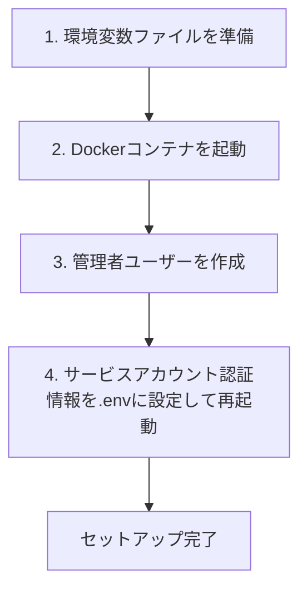
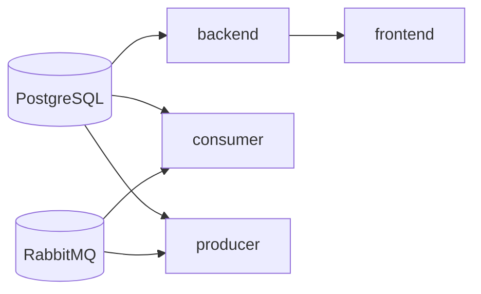

# AutomataCodex 初期セットアップ手順

## 前提条件

- Docker / Docker Compose がインストール済みであること
- GitLab にbotアカウントが作成済みで Personal Access Token（PAT）を取得済みであること

---

## 手順概要



---

## 1. 環境変数ファイルを準備する

`.env.example` をコピーして `.env` を作成し、各値を設定する。

```bash
cp .env.example .env
```

`.env` 内の各変数の説明は下表を参照。

| 変数名 | 説明 |
|--------|------|
| `GITLAB_PAT` | GitLab botアカウントの Personal Access Token |
| `POSTGRES_PASSWORD` | PostgreSQL パスワード（任意の文字列）|
| `RABBITMQ_PASS` | RabbitMQ パスワード（任意の文字列）|
| `ENCRYPTION_KEY` | APIキー暗号化用ランダムキー（32バイト以上）|
| `JWT_SECRET_KEY` | JWT署名キー（任意の長いランダム文字列）|
| `USER_CONFIG_API_SERVICE_USERNAME` | Consumer が Backend に認証する際のユーザー名（後述の管理者ユーザー名と同じ値を設定する）|
| `USER_CONFIG_API_SERVICE_PASSWORD` | Consumer が Backend に認証する際のパスワード（後述の管理者パスワードと同じ値を設定する）|

`ENCRYPTION_KEY` の生成例：

```bash
python -c "import secrets; print(secrets.token_urlsafe(32))"
```

### GitLab URLの設定

クラウド版 GitLab（`https://gitlab.com`）を使う場合は設定不要。
セルフホスト版 GitLab を使う場合は `/etc/hosts` やDNSでコンテナからアクセス可能なURLを指定する。

```
GITLAB_URL=http://your-gitlab-host
```

---

## 2. Dockerコンテナを起動する

```bash
docker compose up -d
```

起動されるサービスと起動順序：



PostgreSQL の初期スキーマは `shared/database/schema.sql` が自動的に適用される。
Consumer 起動時にワークフロー定義のシードデータ（`seed_workflow_definitions`）が自動登録される。

コンテナの起動状況は以下で確認できる。

```bash
docker compose ps
```

---

## 3. 管理者ユーザーを作成する

Backend コンテナ内で初期管理者ユーザーを作成する。
ここで設定するユーザー名・パスワードは、手順1で `.env` に設定した `USER_CONFIG_API_SERVICE_USERNAME` / `USER_CONFIG_API_SERVICE_PASSWORD` と一致させる必要がある。

### 対話式モード（推奨）

```bash
docker compose exec backend \
  python -m backend.user_management.cli.create_admin
```

### コマンドライン引数モード

```bash
docker compose exec backend \
  python -m backend.user_management.cli.create_admin \
    --username <ユーザー名> \
    --password <パスワード>
```

パスワード要件：8文字以上・大文字・小文字・数字・記号をそれぞれ1文字以上含む。

---

## 4. Consumerを再起動する

手順3で作成したユーザー名・パスワードが `.env` の `USER_CONFIG_API_SERVICE_USERNAME` / `USER_CONFIG_API_SERVICE_PASSWORD` と一致していることを確認したうえで、Consumerを再起動する。

```bash
docker compose restart consumer
```

Consumer が Backend に `/api/v1/auth/login` でJWT認証を行い、ユーザー設定の取得が可能になる。

---

## 5. 管理画面にログインする

ブラウザで `http://localhost` にアクセスし、手順3で作成した管理者アカウントでログインする。

管理画面でできること：

- 一般ユーザーの追加（GitLabユーザー名・LLM設定の登録）
- LLMプロバイダー・モデル・APIキーの設定変更
- ワークフロー定義の管理

---

## プリセット定義の更新

`docs/definitions/` 配下のJSONファイルを編集した後、以下のコマンドでDBのプリセットを更新する。
Consumer起動時の自動シードは既存レコードをスキップするため、編集内容を反映するには手動実行が必要。

```bash
docker compose exec backend \
  python -m shared.database.seeds.update_preset_workflow_definitions
```

---

## トラブルシューティング

### Consumer が 401 Unauthorized で起動失敗する

Consumer が Backend の `/api/v1/auth/login` で 401 を返す場合、以下を確認する。

1. `.env` の `USER_CONFIG_API_SERVICE_USERNAME` / `USER_CONFIG_API_SERVICE_PASSWORD` が設定されているか
2. そのユーザー名・パスワードで手順3の管理者作成が完了しているか
3. 設定変更後に `docker compose restart consumer` を実行したか

### DBスキーマが適用されない

`postgres` コンテナのボリュームが残っている場合、`docker-entrypoint-initdb.d/` の初期化スクリプトが再実行されない。
ボリュームを削除して再起動する。

```bash
docker compose down -v
docker compose up -d
```

> **注意**: `-v` はデータボリュームを削除するため、既存データがすべて消去される。
