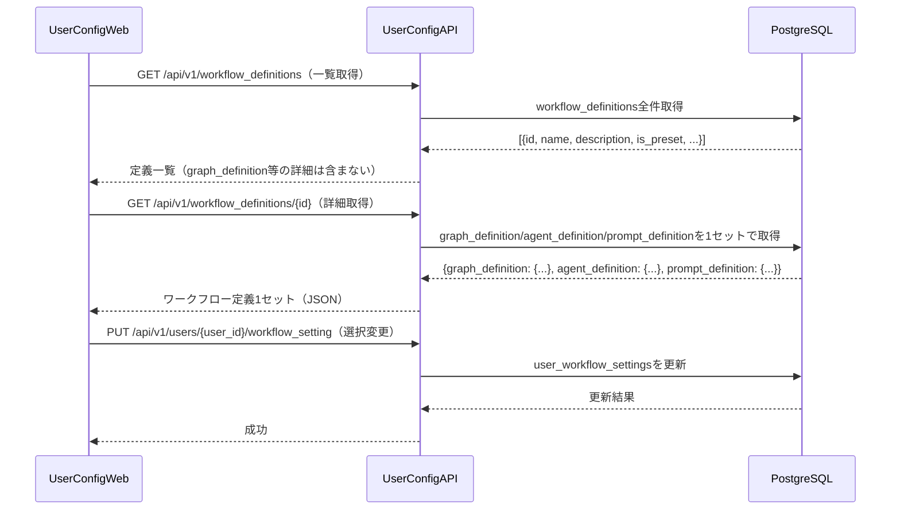

# グラフ定義ファイル 詳細設計書

## 1. 概要

グラフ定義ファイルはワークフローのフロー構造（ノード・エッジ・条件分岐）をJSON形式で定義する。`workflow_definitions`テーブルの`graph_definition`カラム（JSONB型）に保存され、エージェント定義・プロンプト定義と1セットで管理される。

`DefinitionLoader`がこのJSONをパースし、`WorkflowBuilder`に渡すことでグラフ構造を動的に構築する。

## 2. DBへの保存形式

`workflow_definitions`テーブルの`graph_definition`カラムにJSONBとして保存する。

| カラム | 型 | 説明 |
|-------|------|------|
| graph_definition | JSONB NOT NULL | グラフ定義JSON（本仕様で定義する形式） |

グラフ定義・エージェント定義・プロンプト定義は同一テーブルの同一レコードに格納し、常に1セットで取得・更新する。

## 3. JSON形式の仕様

### 3.1 トップレベル構造

グラフ定義は以下のトップレベルフィールドを持つJSONオブジェクトである。

| フィールド | 型 | 必須 | 説明 |
|-----------|------|------|------|
| `version` | 文字列 | 必須 | 定義フォーマットバージョン（例: "1.0"） |
| `name` | 文字列 | 必須 | グラフの名前（例: "標準MR処理グラフ"） |
| `description` | 文字列 | 任意 | グラフの説明文 |
| `entry_node` | 文字列 | 必須 | 最初に実行するノードのID |
| `nodes` | オブジェクト配列 | 必須 | ノード定義の配列（後述） |
| `edges` | オブジェクト配列 | 必須 | エッジ定義の配列（後述） |

### 3.2 ノード定義（nodes）

`nodes`は各グラフノードを定義するオブジェクトの配列である。

| フィールド | 型 | 必須 | 説明 |
|-----------|------|------|------|
| `id` | 文字列 | 必須 | ノードの一意識別子（エージェント定義の`node_id`と一致させる） |
| `type` | 文字列 | 必須 | ノードの種別（"agent" / "executor" / "condition"） |
| `agent_definition_id` | 文字列 | agent時必須 | エージェント定義ファイル内のエージェントID |
| `executor_class` | 文字列 | executor時必須 | 使用するExecutorクラス名（"UserResolverExecutor"等） |
| `env_ref` | 文字列 | 任意 | 使用する実行環境の参照（"plan": plan共有環境、"1"/"2"/"3": 分岐内の第N実行環境、省略: 環境不要） |
| `env_count` | 整数 | ExecEnvSetupExecutor時必須 | 作成する実行環境の数。`executor_class: "ExecEnvSetupExecutor"`のノードにのみ指定する |
| `label` | 文字列 | 任意 | 表示用ラベル |
| `metadata` | オブジェクト | 任意 | ノード固有の拡張設定（後述） |

**typeの種別**:
- `agent`: `ConfigurableAgent`として実行されるノード
- `executor`: `BaseExecutor`のサブクラスとして実行される前処理ノード（UserResolverExecutor等）
- `condition`: 分岐条件を評価するノード

**env_refの説明**:
- `"plan"`: WorkflowFactoryがワークフロー開始前に作成した共有plan環境を使用する。コンテキストの`plan_environment_id`キーから環境IDを取得する（task_classifierおよびplanningエージェント）
- `"1"` / `"2"` / `"3"`: 分岐内の第N実行環境を使用する。対応するExecEnvSetupExecutorが事前に作成した`branch_envs`辞書の第N番環境を参照する（実行エージェントおよびレビューエージェント）
- 省略: Docker環境を使用しない（リフレクション、条件分岐、Executorノードなど環境参照が不要なノード）

**env_countの説明**:
- `ExecEnvSetupExecutor`ノード専用フィールド。作成する実行環境の数を整数で指定する。standard_mr_processingでは各分岐で`1`を指定し、multi_codegen_mr_processingのコード生成分岐では並列エージェント数（例: `3`）を指定する

**metadataフィールドの定義**:

metadataはノード固有の動作をカスタマイズするオプションのオブジェクトである。認識されるフィールドは以下のとおり。

| フィールド | 型 | 説明 |
|-----------|------|------|
| `check_comments_before` | bool | trueの場合、ノード実行前にCommentCheckMiddlewareが新規コメントを確認する |
| `comment_redirect_to` | 文字列 | 新規コメント検出時のリダイレクト先ノードID。`check_comments_before: true`を指定する場合は必須。省略した場合はバリデーションエラー |
| `preserve_context` | 文字列配列 | 再計画時に保持するコンテキストキーのリスト |
| `max_retries` | 整数 | `role: "reflection"`ノードの最大リトライ回数。LoopGuardMiddlewareが`allowed_retry_patterns`の構築に使用する。省略時は3 |

### 3.3 エッジ定義（edges）

`edges`はノード間の接続を定義するオブジェクトの配列である。

| フィールド | 型 | 必須 | 説明 |
|-----------|------|------|------|
| `from` | 文字列 | 必須 | 遷移元ノードのID |
| `to` | 文字列またはnull | 必須 | 遷移先ノードのID。**`null`を指定した場合はワークフローの終了を意味する** |
| `condition` | 文字列 | 任意 | 遷移条件式（省略時は無条件遷移）。ワークフローコンテキストのキーを参照して評価する。 |
| `label` | 文字列 | 任意 | 表示用ラベル |

**condition の記述方法**:

条件式はワークフローコンテキスト内のキーと値を参照するDSL（ドメイン固有言語）形式の文字列で記述する。

- 単純な値比較: `"context.classification_result.task_type == 'code_generation'"`
- 存在チェック: `"context.plan_result.spec_file_exists == true"`
- 論理演算: `"context.reflection_result.action == 'proceed'"`

## 4. システムプリセット

### 4.1 標準MR処理グラフ（standard_mr_processing）

標準的なMR処理フローを定義するプリセット。

```json
{
  "version": "1.0",
  "name": "標準MR処理グラフ",
  "description": "コード生成・バグ修正・テスト作成・ドキュメント生成の4タスクに対応する標準フロー",
  "entry_node": "user_resolve",
  "nodes": [
    {
      "id": "user_resolve",
      "type": "executor",
      "executor_class": "UserResolverExecutor",
      "label": "ユーザー情報取得"
    },
    {
      "id": "task_classifier",
      "type": "agent",
      "agent_definition_id": "task_classifier",
      "env_ref": "plan",
      "label": "タスク分類"
    },
    {
      "id": "task_type_branch",
      "type": "condition",
      "label": "タスク種別判定"
    },
    {
      "id": "code_generation_planning",
      "type": "agent",
      "agent_definition_id": "code_generation_planning",
      "env_ref": "plan",
      "label": "コード生成計画",
      "metadata": {
        "check_comments_before": true,
        "comment_redirect_to": "task_classifier"
      }
    },
    {
      "id": "bug_fix_planning",
      "type": "agent",
      "agent_definition_id": "bug_fix_planning",
      "env_ref": "plan",
      "label": "バグ修正計画",
      "metadata": {
        "check_comments_before": true,
        "comment_redirect_to": "task_classifier"
      }
    },
    {
      "id": "test_creation_planning",
      "type": "agent",
      "agent_definition_id": "test_creation_planning",
      "env_ref": "plan",
      "label": "テスト作成計画",
      "metadata": {
        "check_comments_before": true,
        "comment_redirect_to": "task_classifier"
      }
    },
    {
      "id": "documentation_planning",
      "type": "agent",
      "agent_definition_id": "documentation_planning",
      "env_ref": "plan",
      "label": "ドキュメント生成計画",
      "metadata": {
        "check_comments_before": true,
        "comment_redirect_to": "task_classifier"
      }
    },
    {
      "id": "spec_check_branch",
      "type": "condition",
      "label": "仕様書確認"
    },
    {
      "id": "exec_env_setup_code_gen",
      "type": "executor",
      "executor_class": "ExecEnvSetupExecutor",
      "env_count": 1,
      "label": "実行環境セットアップ（コード生成）"
    },
    {
      "id": "exec_env_setup_bug_fix",
      "type": "executor",
      "executor_class": "ExecEnvSetupExecutor",
      "env_count": 1,
      "label": "実行環境セットアップ（バグ修正）"
    },
    {
      "id": "exec_env_setup_test",
      "type": "executor",
      "executor_class": "ExecEnvSetupExecutor",
      "env_count": 1,
      "label": "実行環境セットアップ（テスト作成）"
    },
    {
      "id": "exec_env_setup_doc",
      "type": "executor",
      "executor_class": "ExecEnvSetupExecutor",
      "env_count": 1,
      "label": "実行環境セットアップ（ドキュメント）"
    },
    {
      "id": "code_generation",
      "type": "agent",
      "agent_definition_id": "code_generation",
      "env_ref": "1",
      "label": "コード生成",
      "metadata": {
        "check_comments_before": true,
        "comment_redirect_to": "plan_reflection"
      }
    },
    {
      "id": "bug_fix",
      "type": "agent",
      "agent_definition_id": "bug_fix",
      "env_ref": "1",
      "label": "バグ修正",
      "metadata": {
        "check_comments_before": true,
        "comment_redirect_to": "plan_reflection"
      }
    },
    {
      "id": "test_creation",
      "type": "agent",
      "agent_definition_id": "test_creation",
      "env_ref": "1",
      "label": "テスト作成",
      "metadata": {
        "check_comments_before": true,
        "comment_redirect_to": "plan_reflection"
      }
    },
    {
      "id": "documentation",
      "type": "agent",
      "agent_definition_id": "documentation",
      "env_ref": "1",
      "label": "ドキュメント作成",
      "metadata": {
        "check_comments_before": true,
        "comment_redirect_to": "plan_reflection"
      }
    },
    {
      "id": "execution_type_branch",
      "type": "condition",
      "label": "実行タイプ判定"
    },
    {
      "id": "test_execution_evaluation",
      "type": "agent",
      "agent_definition_id": "test_execution_evaluation",
      "env_ref": "1",
      "label": "テスト実行・評価",
      "metadata": {
        "check_comments_before": true,
        "comment_redirect_to": "plan_reflection"
      }
    },
    {
      "id": "code_review",
      "type": "agent",
      "agent_definition_id": "code_review",
      "env_ref": "1",
      "label": "コードレビュー",
      "metadata": {
        "check_comments_before": true,
        "comment_redirect_to": "plan_reflection"
      }
    },
    {
      "id": "documentation_review",
      "type": "agent",
      "agent_definition_id": "documentation_review",
      "env_ref": "1",
      "label": "ドキュメントレビュー",
      "metadata": {
        "check_comments_before": true,
        "comment_redirect_to": "plan_reflection"
      }
    },
    {
      "id": "plan_reflection",
      "type": "agent",
      "agent_definition_id": "plan_reflection",
      "label": "リフレクション",
      "metadata": {
        "check_comments_before": true,
        "comment_redirect_to": "task_classifier",
        "max_retries": 3
      }
    },
    {
      "id": "replan_branch",
      "type": "condition",
      "label": "再計画判定"
    }
  ],
  "edges": [
    { "from": "user_resolve", "to": "task_classifier" },
    { "from": "task_classifier", "to": "task_type_branch" },
    {
      "from": "task_type_branch",
      "to": "code_generation_planning",
      "condition": "context.classification_result.task_type == 'code_generation'",
      "label": "コード生成"
    },
    {
      "from": "task_type_branch",
      "to": "bug_fix_planning",
      "condition": "context.classification_result.task_type == 'bug_fix'",
      "label": "バグ修正"
    },
    {
      "from": "task_type_branch",
      "to": "test_creation_planning",
      "condition": "context.classification_result.task_type == 'test_creation'",
      "label": "テスト作成"
    },
    {
      "from": "task_type_branch",
      "to": "documentation_planning",
      "condition": "context.classification_result.task_type == 'documentation'",
      "label": "ドキュメント生成"
    },
    { "from": "code_generation_planning", "to": "spec_check_branch" },
    { "from": "bug_fix_planning", "to": "spec_check_branch" },
    { "from": "test_creation_planning", "to": "spec_check_branch" },
    { "from": "documentation_planning", "to": "exec_env_setup_doc" },
    {
      "from": "spec_check_branch",
      "to": "documentation_planning",
      "condition": "context.plan_result.spec_file_exists == false",
      "label": "仕様書なし"
    },
    {
      "from": "spec_check_branch",
      "to": "exec_env_setup_code_gen",
      "condition": "context.plan_result.spec_file_exists == true && context.classification_result.task_type == 'code_generation'",
      "label": "仕様書あり（コード生成）"
    },
    {
      "from": "spec_check_branch",
      "to": "exec_env_setup_bug_fix",
      "condition": "context.plan_result.spec_file_exists == true && context.classification_result.task_type == 'bug_fix'",
      "label": "仕様書あり（バグ修正）"
    },
    {
      "from": "spec_check_branch",
      "to": "exec_env_setup_test",
      "condition": "context.plan_result.spec_file_exists == true && context.classification_result.task_type == 'test_creation'",
      "label": "仕様書あり（テスト作成）"
    },
    { "from": "exec_env_setup_code_gen", "to": "code_generation" },
    { "from": "exec_env_setup_bug_fix", "to": "bug_fix" },
    { "from": "exec_env_setup_test", "to": "test_creation" },
    { "from": "exec_env_setup_doc", "to": "documentation" },
    { "from": "code_generation", "to": "execution_type_branch" },
    { "from": "bug_fix", "to": "execution_type_branch" },
    { "from": "test_creation", "to": "execution_type_branch" },
    { "from": "documentation", "to": "execution_type_branch" },
    {
      "from": "execution_type_branch",
      "to": "test_execution_evaluation",
      "condition": "context.classification_result.task_type in ['code_generation', 'bug_fix']",
      "label": "テスト実行"
    },
    {
      "from": "execution_type_branch",
      "to": "code_review",
      "condition": "context.classification_result.task_type == 'test_creation'",
      "label": "レビュー（テスト作成）"
    },
    {
      "from": "execution_type_branch",
      "to": "documentation_review",
      "condition": "context.classification_result.task_type == 'documentation'",
      "label": "レビュー（ドキュメント）"
    },
    { "from": "test_execution_evaluation", "to": "code_review" },
    { "from": "code_review", "to": "plan_reflection" },
    { "from": "documentation_review", "to": "plan_reflection" },
    { "from": "plan_reflection", "to": "replan_branch" },
    {
      "from": "replan_branch",
      "to": "task_type_branch",
      "condition": "context.reflection_result.action == 'revise_plan' && (context.reflection_result.severity == 'critical' || context.reflection_result.replan_mode == 'full')",
      "label": "フル再計画",
      "metadata": {
        "trigger": "replan",
        "context_transform": {
          "plan_result": "previous_plan_result",
          "reflection_result.replan_reason": "replan_reason"
        }
      }
    },
    {
      "from": "replan_branch",
      "to": "task_type_branch",
      "condition": "context.reflection_result.action == 'revise_plan' && context.reflection_result.replan_mode == 'incremental'",
      "label": "差分計画",
      "metadata": {
        "trigger": "replan_incremental",
        "context_transform": {
          "plan_result": "previous_plan_result",
          "reflection_result.replan_reason": "replan_reason",
          "reflection_result.new_requirements": "delta_requirements"
        }
      }
    },
    {
      "from": "replan_branch",
      "to": null,
      "condition": "context.reflection_result.action == 'proceed'",
      "label": "完了"
    },
    {
      "from": "replan_branch",
      "to": "execution_type_branch",
      "condition": "context.reflection_result.action == 'revise_plan' && context.reflection_result.severity != 'critical'",
      "label": "軽微な修正"
    }
  ]
}
```

### 4.2 複数コード生成並列グラフ（multi_codegen_mr_processing）

コーディングエージェントを複数モデル・温度設定で並列実行し、レビューエージェントが最良のものを自動選択するフロー。

```json
{
  "version": "1.0",
  "name": "複数コード生成並列グラフ",
  "description": "コーディングエージェントを3種類の設定で並列実行し、レビューエージェントが最良のものを自動選択するフロー",
  "entry_node": "user_resolve",
  "nodes": [
    {
      "id": "user_resolve",
      "type": "executor",
      "executor_class": "UserResolverExecutor"
    },
    {
      "id": "task_classifier",
      "type": "agent",
      "agent_definition_id": "task_classifier",
      "env_ref": "plan"
    },
    {
      "id": "code_generation_planning",
      "type": "agent",
      "agent_definition_id": "code_generation_planning",
      "env_ref": "plan"
    },
    {
      "id": "exec_env_setup_code_gen",
      "type": "executor",
      "executor_class": "ExecEnvSetupExecutor",
      "env_count": 3,
      "label": "実行環境セットアップ（コード生成3並列）"
    },
    {
      "id": "code_generation_a",
      "type": "agent",
      "agent_definition_id": "code_generation_fast",
      "env_ref": "1",
      "label": "コード生成A（高速モデル）"
    },
    {
      "id": "code_generation_b",
      "type": "agent",
      "agent_definition_id": "code_generation_standard",
      "env_ref": "2",
      "label": "コード生成B（標準モデル）"
    },
    {
      "id": "code_generation_c",
      "type": "agent",
      "agent_definition_id": "code_generation_creative",
      "env_ref": "3",
      "label": "コード生成C（高温度設定）"
    },
    {
      "id": "code_review",
      "type": "agent",
      "agent_definition_id": "code_review",
      "label": "コードレビュー（3案比較・自動選択）"
    },
    {
      "id": "plan_reflection",
      "type": "agent",
      "agent_definition_id": "plan_reflection"
    }
  ],
  "edges": [
    { "from": "user_resolve", "to": "task_classifier" },
    { "from": "task_classifier", "to": "code_generation_planning" },
    { "from": "code_generation_planning", "to": "exec_env_setup_code_gen" },
    { "from": "exec_env_setup_code_gen", "to": "code_generation_a" },
    { "from": "exec_env_setup_code_gen", "to": "code_generation_b" },
    { "from": "exec_env_setup_code_gen", "to": "code_generation_c" },
    { "from": "code_generation_a", "to": "code_review" },
    { "from": "code_generation_b", "to": "code_review" },
    { "from": "code_generation_c", "to": "code_review" },
    { "from": "code_review", "to": "plan_reflection" },
    {
      "from": "plan_reflection",
      "to": null,
      "condition": "context.reflection_result.action == 'proceed'",
      "label": "完了"
    }
  ]
}
```

**注意**: 上記は簡略版です。実際のグラフではブランチマージ用のExecutorノードやテスト実行ノードが追加されます。

#### 4.2.1 multi_codegen_mr_processingの詳細説明

複数の異なるLLM設定で並列にコード生成を行い、レビューエージェントが最良のものを自動選択するプリセット。

**特徴**:
- 3つの並列コード生成ノード: `code_generation_a`（高速モデル）、`code_generation_b`（標準モデル）、`code_generation_c`（高温度設定モデル）
- 各並列ノードは独立したDocker環境と専用ブランチで実行（`env_ref: "1"/"2"/"3"`）
- 各エージェントは専用ブランチ（例: `feature/login-a`, `feature/login-b`, `feature/login-c`）で作業
- 並列実行後、`code_review`エージェントが3つの実装を比較レビューし、最良のものを自動選択
- 選択されたブランチを元のMRブランチにマージ、他のブランチはGitLab上に保持

**ユースケース**:
- 複雑な実装が複数パターン考えられる場合
- 最適なアプローチが事前に分からない場合
- 複数の代替案を自動評価して最良のものを採用したい場合

**並列実行の仕組み**:
- ワークフロー開始時に元のMRブランチ（例: `feature/login`）から3つのサブブランチを作成
- 各エージェントに専用ブランチ名を`task_context`で渡す
- `exec_env_setup_code_gen`ノード（env_count: 3）がplanning完了後に3つの実行環境を作成して`branch_envs`に保存
- `parallel_codegen_branch`から`code_generation_a/b/c`の3つのエッジが並列に発火し、各エージェントは`branch_envs[1/2/3]`から対応する環境IDを取得
- 3つのエージェントが完了後、`code_review`ノードが`branch_envs`から3つの環境を参照し、比較レビューして最良のものを`selected_implementation`として出力
- 選択されたブランチを元のMRブランチにマージし、後続フロー（`test_execution_evaluation`）に進む

```json
{
  "version": "1.0",
  "name": "並列コード生成MR処理グラフ",
  "description": "3つの異なるLLM設定で並列にコード生成し、ユーザーが最適な実装を選択する",
  "entry_node": "user_resolve",
  "nodes": [
    {
      "id": "user_resolve",
      "type": "executor",
      "executor_class": "UserResolverExecutor",
      "label": "ユーザー情報取得"
    },
    {
      "id": "task_classifier",
      "type": "agent",
      "agent_definition_id": "task_classifier",
      "env_ref": "plan",
      "label": "タスク分類"
    },
    {
      "id": "task_type_branch",
      "type": "condition",
      "label": "タスク種別分岐"
    },
    {
      "id": "code_generation_planning",
      "type": "agent",
      "agent_definition_id": "code_generation_planning",
      "env_ref": "plan",
      "label": "コード生成計画"
    },
    {
      "id": "plan_reflection",
      "type": "agent",
      "agent_definition_id": "plan_reflection",
      "label": "プラン検証"
    },
    {
      "id": "plan_revision_branch",
      "type": "condition",
      "label": "プラン再検討判定"
    },
    {
      "id": "exec_env_setup_code_gen",
      "type": "executor",
      "executor_class": "ExecEnvSetupExecutor",
      "env_count": 3,
      "label": "実行環境セットアップ（並列3環境）"
    },
    {
      "id": "parallel_codegen_branch",
      "type": "condition",
      "label": "並列コード生成開始"
    },
    {
      "id": "code_generation_a",
      "type": "agent",
      "agent_definition_id": "code_generation_a",
      "env_ref": "1",
      "label": "コード生成（高速モデル）"
    },
    {
      "id": "code_generation_b",
      "type": "agent",
      "agent_definition_id": "code_generation_b",
      "env_ref": "2",
      "label": "コード生成（標準モデル）"
    },
    {
      "id": "code_generation_c",
      "type": "agent",
      "agent_definition_id": "code_generation_c",
      "env_ref": "3",
      "label": "コード生成（高温度モデル）"
    },
    {
      "id": "code_review",
      "type": "agent",
      "agent_definition_id": "code_review",
      "label": "コードレビュー（3案比較・自動選択）"
    },
    {
      "id": "branch_merge",
      "type": "executor",
      "executor_class": "BranchMergeExecutor",
      "label": "選択ブランチのマージ"
    },
    {
      "id": "test_execution_evaluation",
      "type": "agent",
      "agent_definition_id": "test_execution_evaluation",
      "env_ref": "1",
      "label": "テスト実行・評価"
    },
    {
      "id": "test_result_branch",
      "type": "condition",
      "label": "テスト結果判定"
    },
    {
      "id": "final_code_review",
      "type": "agent",
      "agent_definition_id": "code_review",
      "env_ref": "1",
      "label": "コードレビュー"
    },
    {
      "id": "review_result_branch",
      "type": "condition",
      "label": "レビュー結果判定"
    }
  ],
  "edges": [
    {
      "from": "user_resolve",
      "to": "task_classifier",
      "label": "次へ"
    },
    {
      "from": "task_classifier",
      "to": "task_type_branch",
      "label": "分類完了"
    },
    {
      "from": "task_type_branch",
      "to": "code_generation_planning",
      "condition": "context.classification_result.task_type == 'code_generation'",
      "label": "コード生成"
    },
    {
      "from": "code_generation_planning",
      "to": "plan_reflection",
      "label": "計画完了"
    },
    {
      "from": "plan_reflection",
      "to": "plan_revision_branch",
      "label": "検証完了"
    },
    {
      "from": "plan_revision_branch",
      "to": "code_generation_planning",
      "condition": "context.reflection_result.action == 'revise_plan' and context.plan_revision_count < config.max_plan_revision_count",
      "label": "再計画"
    },
    {
      "from": "plan_revision_branch",
      "to": "exec_env_setup_code_gen",
      "condition": "context.reflection_result.action == 'proceed'",
      "label": "環境セットアップ"
    },
    {
      "from": "exec_env_setup_code_gen",
      "to": "parallel_codegen_branch",
      "label": "環境準備完了"
    },
    {
      "from": "parallel_codegen_branch",
      "to": "code_generation_a",
      "condition": "true",
      "label": "高速モデル"
    },
    {
      "from": "parallel_codegen_branch",
      "to": "code_generation_b",
      "condition": "true",
      "label": "標準モデル"
    },
    {
      "from": "parallel_codegen_branch",
      "to": "code_generation_c",
      "condition": "true",
      "label": "高温度モデル"
    },
    {
      "from": "code_generation_a",
      "to": "code_review",
      "label": "完了"
    },
    {
      "from": "code_generation_b",
      "to": "code_review",
      "label": "完了"
    },
    {
      "from": "code_generation_c",
      "to": "code_review",
      "label": "完了"
    },
    {
      "from": "code_review",
      "to": "branch_merge",
      "label": "レビュー完了・最良案選択"
    },
    {
      "from": "branch_merge",
      "to": "test_execution_evaluation",
      "label": "マージ完了"
    },
    {
      "from": "test_execution_evaluation",
      "to": "test_result_branch",
      "label": "評価完了"
    },
    {
      "from": "test_result_branch",
      "to": "final_code_review",
      "condition": "context.review_result.status == 'passed'",
      "label": "テスト成功"
    },
    {
      "from": "test_result_branch",
      "to": null,
      "condition": "context.review_result.status == 'failed' and context.test_fix_iteration >= config.max_test_fix_iterations",
      "label": "修正上限"
    },
    {
      "from": "final_code_review",
      "to": "review_result_branch",
      "label": "レビュー完了"
    },
    {
      "from": "review_result_branch",
      "to": null,
      "condition": "context.review_result.status == 'approved'",
      "label": "承認"
    },
    {
      "from": "review_result_branch",
      "to": "parallel_codegen_branch",
      "condition": "context.review_result.status == 'needs_major_revision' and context.review_retry_count < config.max_review_retry_count",
      "label": "大幅修正（並列再実行）"
    },
    {
      "from": "review_result_branch",
      "to": null,
      "condition": "context.review_result.status == 'needs_major_revision' and context.review_retry_count >= config.max_review_retry_count",
      "label": "レビューリトライ上限"
    }
  ]
}
```

**並列実行ノードの実装ポイント**:

1. **Docker環境の独立性**: `exec_env_setup_code_gen`ノード（env_count: 3）がplanning完了後に3つの独立したDockerコンテナを起動し、`branch_envs: {1: env_id_1, 2: env_id_2, 3: env_id_3}`としてコンテキストに保存する。各並列ノードはenv_refで指定された番号の環境を使用する。

2. **env_refによる環境参照**: 各並列ノードは`env_ref: "1"/"2"/"3"`を持ち、`branch_envs`コンテキストから対応する環境IDを自動取得する。これにより、3つの実装が互いに干渉せずに並行して実行される。

3. **集約ノード（code_review）**: `env_ref`を省略し、`input_keys`に`branch_envs`を含める。これにより全3環境にアクセスして比較レビューを実施し、最良のものを`selected_implementation`として出力する。

4. **選択された環境の引き継ぎ**: `selected_implementation`には選択された実装のブランチ名と環境IDが含まれ、`branch_merge`でマージ後、`test_execution_evaluation`（`env_ref: "1"`）が選択環境でテストを実行する。

5. **env_countバリデーション**: `DefinitionLoader.validate_graph_definition()`は`exec_env_setup_code_gen`の`env_count: 3`が同一分岐内のノードの最大`env_ref`番号（3）以上であることを検証する。

---

## 5. バリデーション仕様

`DefinitionLoader.validate_graph_definition(graph_def)`が以下のチェックを実施する。

| チェック項目 | 説明 |
|-----------|------|
| 必須フィールドの存在 | `version`・`name`・`entry_node`・`nodes`・`edges`の存在確認 |
| entryノードの存在 | `entry_node`に指定されたIDがnodesに存在するか |
| エッジの参照整合性 | `edges`の`from`に指定されたIDがすべてnodesに存在するか。`to`はnull（ワークフロー終了）またはnodesに存在するIDであるか |
| condition構文 | condition式に含まれるコンテキストキーが`agent_definition`内の`output_keys`に含まれるか |
| env_refバリデーション | 各ノードの`env_ref`値が有効か（"plan"、"1"〜"N"の整数文字列、または省略）。ExecEnvSetupExecutorノードは`env_count`フィールドが必須。同一分岐内で`env_ref: "N"`を持つノードの最大N値が同分岐のExecEnvSetupExecutorの`env_count`以下であるかを検証する |

## 6. 定義の取得・更新フロー


