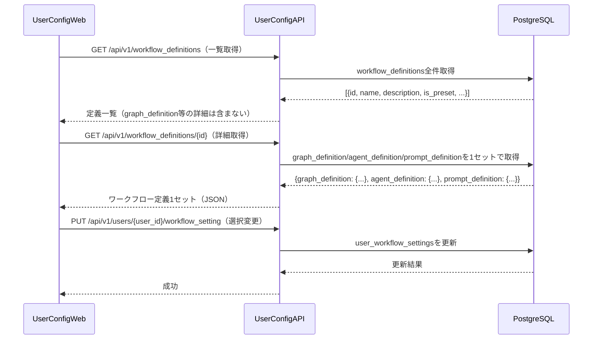

# グラフ定義ファイル 詳細設計書

## 1. 概要

グラフ定義ファイルはワークフローのフロー構造（ノード・エッジ・条件分岐）をJSON形式で定義する。`workflow_definitions`テーブルの`graph_definition`カラム（JSONB型）に保存され、エージェント定義・プロンプト定義と1セットで管理される。

`DefinitionLoader`がこのJSONをパースし、`WorkflowBuilder`に渡すことでグラフ構造を動的に構築する。

## 2. DBへの保存形式

`workflow_definitions`テーブルの`graph_definition`カラムにJSONBとして保存する。

| カラム | 型 | 説明 |
|-------|------|------|
| graph_definition | JSONB NOT NULL | グラフ定義JSON（本仕様で定義する形式） |

グラフ定義・エージェント定義・プロンプト定義は同一テーブルの同一レコードに格納し、常に1セットで取得・更新する。

## 3. JSON形式の仕様

### 3.1 トップレベル構造

グラフ定義は以下のトップレベルフィールドを持つJSONオブジェクトである。

| フィールド | 型 | 必須 | 説明 |
|-----------|------|------|------|
| `version` | 文字列 | 必須 | 定義フォーマットバージョン（例: "1.0"） |
| `name` | 文字列 | 必須 | グラフの名前（例: "標準MR処理グラフ"） |
| `description` | 文字列 | 任意 | グラフの説明文 |
| `entry_node` | 文字列 | 必須 | 最初に実行するノードのID |
| `nodes` | オブジェクト配列 | 必須 | ノード定義の配列（後述） |
| `edges` | オブジェクト配列 | 必須 | エッジ定義の配列（後述） |

### 3.2 ノード定義（nodes）

`nodes`は各グラフノードを定義するオブジェクトの配列である。

| フィールド | 型 | 必須 | 説明 |
|-----------|------|------|------|
| `id` | 文字列 | 必須 | ノードの一意識別子（エージェント定義の`node_id`と一致させる） |
| `type` | 文字列 | 必須 | ノードの種別（"agent" / "executor" / "condition"） |
| `agent_definition_id` | 文字列 | agent時必須 | エージェント定義ファイル内のエージェントID |
| `executor_class` | 文字列 | executor時必須 | 使用するExecutorクラス名（"UserResolverExecutor"等） |
| `environment_mode` | 文字列 | 任意 | 実行環境（Docker）の使用方法（"create": 新規作成、"inherit": 引き継ぎ、"none": 不要、デフォルト: "none"） |
| `label` | 文字列 | 任意 | 表示用ラベル |
| `metadata` | オブジェクト | 任意 | ノード固有の拡張設定（後述） |

**typeの種別**:
- `agent`: `ConfigurableAgent`として実行されるノード
- `executor`: `BaseExecutor`のサブクラスとして実行される前処理ノード（UserResolverExecutor等）
- `condition`: 分岐条件を評価するノード

**environment_modeの説明**:
- `"create"`: 新規Docker環境を作成し、`execution_environments`辞書に環境IDを書き込む（実行エージェント）
- `"inherit"`: `execution_environments`辞書から既存の環境IDを読み取って使用する（レビューエージェント、評価エージェント）
- `"none"`: Docker環境を使用しない（計画エージェント、リフレクションエージェント）

**metadataフィールドの定義**:

metadataはノード固有の動作をカスタマイズするオプションのオブジェクトである。認識されるフィールドは以下のとおり。

| フィールド | 型 | 説明 |
|-----------|------|------|
| `check_comments_before` | bool | trueの場合、ノード実行前にCommentCheckMiddlewareが新規コメントを確認する |
| `comment_redirect_to` | 文字列 | 新規コメント検出時のリダイレクト先ノードID。省略時はデフォルト値`"plan_reflection"`が使用される |
| `replan_mode` | 文字列 | 再計画時の動作（"full": 完全再計画、"incremental": 差分計画、"hybrid": LLMが判断） |
| `preserve_context` | 文字列配列 | 再計画時に保持するコンテキストキーのリスト |

### 3.3 エッジ定義（edges）

`edges`はノード間の接続を定義するオブジェクトの配列である。

| フィールド | 型 | 必須 | 説明 |
|-----------|------|------|------|
| `from` | 文字列 | 必須 | 遷移元ノードのID |
| `to` | 文字列またはnull | 必須 | 遷移先ノードのID。**`null`を指定した場合はワークフローの終了を意味する** |
| `condition` | 文字列 | 任意 | 遷移条件式（省略時は無条件遷移）。ワークフローコンテキストのキーを参照して評価する。 |
| `label` | 文字列 | 任意 | 表示用ラベル |

**condition の記述方法**:

条件式はワークフローコンテキスト内のキーと値を参照するDSL（ドメイン固有言語）形式の文字列で記述する。

- 単純な値比較: `"context.classification_result.task_type == 'code_generation'"`
- 存在チェック: `"context.plan_result.spec_file_exists == true"`
- 論理演算: `"context.reflection_result.action == 'proceed'"`

## 4. システムプリセット

### 4.1 標準MR処理グラフ（standard_mr_processing）

標準的なMR処理フローを定義するプリセット。

```json
{
  "version": "1.0",
  "name": "標準MR処理グラフ",
  "description": "コード生成・バグ修正・テスト作成・ドキュメント生成の4タスクに対応する標準フロー",
  "entry_node": "user_resolve",
  "nodes": [
    {
      "id": "user_resolve",
      "type": "executor",
      "executor_class": "UserResolverExecutor",
      "environment_mode": "none",
      "label": "ユーザー情報取得"
    },
    {
      "id": "task_classifier",
      "type": "agent",
      "agent_definition_id": "task_classifier",
      "environment_mode": "none",
      "label": "タスク分類"
    },
    {
      "id": "task_type_branch",
      "type": "condition",
      "label": "タスク種別判定"
    },
    {
      "id": "code_generation_planning",
      "type": "agent",
      "agent_definition_id": "code_generation_planning",
      "environment_mode": "none",
      "label": "コード生成計画",
      "metadata": {
        "check_comments_before": true,
        "comment_redirect_to": "task_classifier"
      }
    },
    {
      "id": "bug_fix_planning",
      "type": "agent",
      "agent_definition_id": "bug_fix_planning",
      "environment_mode": "none",
      "label": "バグ修正計画",
      "metadata": {
        "check_comments_before": true,
        "comment_redirect_to": "task_classifier"
      }
    },
    {
      "id": "test_creation_planning",
      "type": "agent",
      "agent_definition_id": "test_creation_planning",
      "environment_mode": "none",
      "label": "テスト作成計画",
      "metadata": {
        "check_comments_before": true,
        "comment_redirect_to": "task_classifier"
      }
    },
    {
      "id": "documentation_planning",
      "type": "agent",
      "agent_definition_id": "documentation_planning",
      "environment_mode": "none",
      "label": "ドキュメント生成計画",
      "metadata": {
        "check_comments_before": true,
        "comment_redirect_to": "task_classifier"
      }
    },
    {
      "id": "spec_check_branch",
      "type": "condition",
      "label": "仕様書確認"
    },
    {
      "id": "code_generation",
      "type": "agent",
      "agent_definition_id": "code_generation",
      "environment_mode": "create",
      "label": "コード生成"
    },
    {
      "id": "bug_fix",
      "type": "agent",
      "agent_definition_id": "bug_fix",
      "environment_mode": "create",
      "label": "バグ修正"
    },
    {
      "id": "test_creation",
      "type": "agent",
      "agent_definition_id": "test_creation",
      "environment_mode": "create",
      "label": "テスト作成"
    },
    {
      "id": "documentation",
      "type": "agent",
      "agent_definition_id": "documentation",
      "environment_mode": "none",
      "label": "ドキュメント作成"
    },
    {
      "id": "code_review",
      "type": "agent",
      "agent_definition_id": "code_review",
      "environment_mode": "inherit",
      "label": "コードレビュー"
    },
    {
      "id": "documentation_review",
      "type": "agent",
      "agent_definition_id": "documentation_review",
      "environment_mode": "inherit",
      "label": "ドキュメントレビュー"
    },
    {
      "id": "test_execution_evaluation",
      "type": "agent",
      "agent_definition_id": "test_execution_evaluation",
      "environment_mode": "inherit",
      "label": "テスト実行・評価"
    },
    {
      "id": "plan_reflection",
      "type": "agent",
      "agent_definition_id": "plan_reflection",
      "environment_mode": "none",
      "label": "リフレクション",
      "metadata": {
        "check_comments_before": true,
        "comment_redirect_to": "task_classifier"
      }
    },
    {
      "id": "replan_branch",
      "type": "condition",
      "label": "再計画判定"
    }
  ],
  "edges": [
    { "from": "user_resolve", "to": "task_classifier" },
    { "from": "task_classifier", "to": "task_type_branch" },
    {
      "from": "task_type_branch",
      "to": "code_generation_planning",
      "condition": "context.classification_result.task_type == 'code_generation'",
      "label": "コード生成"
    },
    {
      "from": "task_type_branch",
      "to": "bug_fix_planning",
      "condition": "context.classification_result.task_type == 'bug_fix'",
      "label": "バグ修正"
    },
    {
      "from": "task_type_branch",
      "to": "test_creation_planning",
      "condition": "context.classification_result.task_type == 'test_creation'",
      "label": "テスト作成"
    },
    {
      "from": "task_type_branch",
      "to": "documentation_planning",
      "condition": "context.classification_result.task_type == 'documentation'",
      "label": "ドキュメント生成"
    },
    { "from": "code_generation_planning", "to": "spec_check_branch" },
    { "from": "bug_fix_planning", "to": "spec_check_branch" },
    { "from": "test_creation_planning", "to": "spec_check_branch" },
    {
      "from": "spec_check_branch",
      "to": "documentation_planning",
      "condition": "context.plan_result.spec_file_exists == false",
      "label": "仕様書なし"
    },
    {
      "from": "spec_check_branch",
      "to": "code_generation",
      "condition": "context.plan_result.spec_file_exists == true && context.classification_result.task_type == 'code_generation'",
      "label": "仕様書あり（コード生成）"
    },
    {
      "from": "spec_check_branch",
      "to": "bug_fix",
      "condition": "context.plan_result.spec_file_exists == true && context.classification_result.task_type == 'bug_fix'",
      "label": "仕様書あり（バグ修正）"
    },
    {
      "from": "spec_check_branch",
      "to": "test_creation",
      "condition": "context.plan_result.spec_file_exists == true && context.classification_result.task_type == 'test_creation'",
      "label": "仕様書あり（テスト作成）"
    },
    { "from": "documentation_planning", "to": "documentation" },
    { "from": "code_generation", "to": "code_review" },
    { "from": "bug_fix", "to": "code_review" },
    { "from": "test_creation", "to": "code_review" },
    { "from": "documentation", "to": "documentation_review" },
    { "from": "code_review", "to": "test_execution_evaluation" },
    { "from": "test_execution_evaluation", "to": "plan_reflection" },
    { "from": "documentation_review", "to": "plan_reflection" },
    { "from": "plan_reflection", "to": "replan_branch" },
    {
      "from": "replan_branch",
      "to": "task_type_branch",
      "condition": "context.reflection_result.action == 'revise_plan'",
      "label": "再計画"
    },
    {
      "from": "replan_branch",
      "to": "code_generation",
      "condition": "context.reflection_result.action == 'proceed' && context.reflection_result.status == 'needs_revision' && context.classification_result.task_type == 'code_generation'",
      "label": "軽微修正（コード生成）"
    },
    {
      "from": "replan_branch",
      "to": "bug_fix",
      "condition": "context.reflection_result.action == 'proceed' && context.reflection_result.status == 'needs_revision' && context.classification_result.task_type == 'bug_fix'",
      "label": "軽微修正（バグ修正）"
    },
    {
      "from": "replan_branch",
      "to": "test_creation",
      "condition": "context.reflection_result.action == 'proceed' && context.reflection_result.status == 'needs_revision' && context.classification_result.task_type == 'test_creation'",
      "label": "軽微修正（テスト作成）"
    },
    {
      "from": "replan_branch",
      "to": "documentation",
      "condition": "context.reflection_result.action == 'proceed' && context.reflection_result.status == 'needs_revision' && context.classification_result.task_type == 'documentation'",
      "label": "軽微修正（ドキュメント）"
    },
    {
      "from": "replan_branch",
      "to": null,
      "condition": "context.reflection_result.action == 'proceed' && context.reflection_result.status == 'success'",
      "label": "完了"
    }
  ]
}
```

### 4.2 複数コード生成並列グラフ（multi_codegen_mr_processing）

コーディングエージェントを複数モデル・温度設定で並列実行し、レビューエージェントが最良のものを自動選択するフロー。

```json
{
  "version": "1.0",
  "name": "複数コード生成並列グラフ",
  "description": "コーディングエージェントを3種類の設定で並列実行し、レビューエージェントが最良のものを自動選択するフロー",
  "entry_node": "user_resolve",
  "nodes": [
    {
      "id": "user_resolve",
      "type": "executor",
      "executor_class": "UserResolverExecutor",
      "environment_mode": "none"
    },
    {
      "id": "task_classifier",
      "type": "agent",
      "agent_definition_id": "task_classifier",
      "environment_mode": "none"
    },
    {
      "id": "code_generation_planning",
      "type": "agent",
      "agent_definition_id": "code_generation_planning",
      "environment_mode": "none"
    },
    {
      "id": "code_generation_a",
      "type": "agent",
      "agent_definition_id": "code_generation_fast",
      "environment_mode": "create",
      "label": "コード生成A（高速モデル）"
    },
    {
      "id": "code_generation_b",
      "type": "agent",
      "agent_definition_id": "code_generation_standard",
      "environment_mode": "create",
      "label": "コード生成B（標準モデル）"
    },
    {
      "id": "code_generation_c",
      "type": "agent",
      "agent_definition_id": "code_generation_creative",
      "environment_mode": "create",
      "label": "コード生成C（高温度設定）"
    },
    {
      "id": "code_review",
      "type": "agent",
      "agent_definition_id": "code_review",
      "environment_mode": "inherit",
      "label": "コードレビュー（3案比較・自動選択）"
    },
    {
      "id": "plan_reflection",
      "type": "agent",
      "agent_definition_id": "plan_reflection",
      "environment_mode": "none"
    }
  ],
  "edges": [
    { "from": "user_resolve", "to": "task_classifier" },
    { "from": "task_classifier", "to": "code_generation_planning" },
    { "from": "code_generation_planning", "to": "code_generation_a" },
    { "from": "code_generation_planning", "to": "code_generation_b" },
    { "from": "code_generation_planning", "to": "code_generation_c" },
    { "from": "code_generation_a", "to": "code_review" },
    { "from": "code_generation_b", "to": "code_review" },
    { "from": "code_generation_c", "to": "code_review" },
    { "from": "code_review", "to": "plan_reflection" },
    {
      "from": "plan_reflection",
      "to": null,
      "condition": "context.reflection_result.action == 'proceed'",
      "label": "完了"
    }
  ]
}
```

**注意**: 上記は簡略版です。実際のグラフではブランチマージ用のExecutorノードやテスト実行ノードが追加されます。

#### 4.2.1 multi_codegen_mr_processingの詳細説明

複数の異なるLLM設定で並列にコード生成を行い、レビューエージェントが最良のものを自動選択するプリセット。

**特徴**:
- 3つの並列コード生成ノード: `code_generation_fast`（高速モデル）、`code_generation_standard`（標準モデル）、`code_generation_creative`（高温度設定モデル）
- 各並列ノードは独立したDocker環境と専用ブランチで実行（`environment_mode: "create"`）
- 各エージェントは専用ブランチ（例: `feature/login-fast`, `feature/login-standard`, `feature/login-creative`）で作業
- 並列実行後、`code_review`エージェントが3つの実装を比較レビューし、最良のものを自動選択
- 選択されたブランチを元のMRブランチにマージ、他のブランチはGitLab上に保持

**ユースケース**:
- 複雑な実装が複数パターン考えられる場合
- 最適なアプローチが事前に分からない場合
- 複数の代替案を自動評価して最良のものを採用したい場合

**並列実行の仕組み**:
- ワークフロー開始時に元のMRブランチ（例: `feature/login`）から3つのサブブランチを作成
- 各エージェントに専用ブランチ名を`task_context`で渡す
- `task_type_branch`から`code_generation_fast`, `code_generation_standard`, `code_generation_creative`の3つのエッジが並列に発火
- 各エージェントは辞書型キー（`execution_environments`と`execution_results`）に自身のエージェント定義IDをキーとして書き込む
- 3つのエージェントが完了後、`code_review`ノードが辞書から3つの実装結果を取得し、比較レビューして最良のものを`selected_implementation`として出力
- 選択されたブランチを元のMRブランチにマージし、後続フロー（`test_execution_evaluation`）に進む

```json
{
  "version": "1.0",
  "name": "並列コード生成MR処理グラフ",
  "description": "3つの異なるLLM設定で並列にコード生成し、ユーザーが最適な実装を選択する",
  "entry_node": "user_resolve",
  "nodes": [
    {
      "id": "user_resolve",
      "type": "executor",
      "executor_class": "UserResolverExecutor",
      "environment_mode": "none",
      "label": "ユーザー情報取得"
    },
    {
      "id": "task_classifier",
      "type": "agent",
      "agent_definition_id": "task_classifier",
      "environment_mode": "none",
      "label": "タスク分類"
    },
    {
      "id": "task_type_branch",
      "type": "condition",
      "label": "タスク種別分岐"
    },
    {
      "id": "code_generation_planning",
      "type": "agent",
      "agent_definition_id": "code_generation_planning",
      "environment_mode": "none",
      "label": "コード生成計画"
    },
    {
      "id": "plan_reflection",
      "type": "agent",
      "agent_definition_id": "plan_reflection",
      "environment_mode": "none",
      "label": "プラン検証"
    },
    {
      "id": "plan_revision_branch",
      "type": "condition",
      "label": "プラン再検討判定"
    },
    {
      "id": "parallel_codegen_branch",
      "type": "condition",
      "label": "並列コード生成開始"
    },
    {
      "id": "code_generation_fast",
      "type": "agent",
      "agent_definition_id": "code_generation_fast",
      "environment_mode": "create",
      "label": "コード生成（高速モデル）"
    },
    {
      "id": "code_generation_standard",
      "type": "agent",
      "agent_definition_id": "code_generation_standard",
      "environment_mode": "create",
      "label": "コード生成（標準モデル）"
    },
    {
      "id": "code_generation_creative",
      "type": "agent",
      "agent_definition_id": "code_generation_creative",
      "environment_mode": "create",
      "label": "コード生成（高温度モデル）"
    },
    {
      "id": "code_review",
      "type": "agent",
      "agent_definition_id": "code_review",
      "environment_mode": "none",
      "label": "コードレビュー（3案比較・自動選択）"
    },
    {
      "id": "branch_merge",
      "type": "executor",
      "executor_class": "BranchMergeExecutor",
      "environment_mode": "none",
      "label": "選択ブランチのマージ"
    },
    {
      "id": "test_execution_evaluation",
      "type": "agent",
      "agent_definition_id": "test_execution_evaluation",
      "environment_mode": "inherit",
      "label": "テスト実行・評価"
    },
    {
      "id": "test_result_branch",
      "type": "condition",
      "label": "テスト結果判定"
    },
    {
      "id": "code_review",
      "type": "agent",
      "agent_definition_id": "code_review",
      "environment_mode": "inherit",
      "label": "コードレビュー"
    },
    {
      "id": "review_result_branch",
      "type": "condition",
      "label": "レビュー結果判定"
    }
  ],
  "edges": [
    {
      "from": "user_resolve",
      "to": "task_classifier",
      "label": "次へ"
    },
    {
      "from": "task_classifier",
      "to": "task_type_branch",
      "label": "分類完了"
    },
    {
      "from": "task_type_branch",
      "to": "code_generation_planning",
      "condition": "context.classification_result.task_type == 'code_generation'",
      "label": "コード生成"
    },
    {
      "from": "code_generation_planning",
      "to": "plan_reflection",
      "label": "計画完了"
    },
    {
      "from": "plan_reflection",
      "to": "plan_revision_branch",
      "label": "検証完了"
    },
    {
      "from": "plan_revision_branch",
      "to": "code_generation_planning",
      "condition": "context.reflection_result.action == 'revise_plan' and context.plan_revision_count < config.max_plan_revision_count",
      "label": "再計画"
    },
    {
      "from": "plan_revision_branch",
      "to": "parallel_codegen_branch",
      "condition": "context.reflection_result.action == 'proceed'",
      "label": "並列実行"
    },
    {
      "from": "parallel_codegen_branch",
      "to": "code_generation_fast",
      "condition": "true",
      "label": "高速モデル"
    },
    {
      "from": "parallel_codegen_branch",
      "to": "code_generation_standard",
      "condition": "true",
      "label": "標準モデル"
    },
    {
      "from": "parallel_codegen_branch",
      "to": "code_generation_creative",
      "condition": "true",
      "label": "高温度モデル"
    },
    {
      "from": "code_generation_fast",
      "to": "code_review",
      "label": "完了"
    },
    {
      "from": "code_generation_standard",
      "to": "code_review",
      "label": "完了"
    },
    {
      "from": "code_generation_creative",
      "to": "code_review",
      "label": "完了"
    },
    {
      "from": "code_review",
      "to": "branch_merge",
      "label": "レビュー完了・最良案選択"
    },
    {
      "from": "branch_merge",
      "to": "test_execution_evaluation",
      "label": "マージ完了"
    },
    {
      "from": "test_execution_evaluation",
      "to": "test_result_branch",
      "label": "評価完了"
    },
    {
      "from": "test_result_branch",
      "to": "code_review",
      "condition": "context.review_result.status == 'passed'",
      "label": "テスト成功"
    },
    {
      "from": "test_result_branch",
      "to": null,
      "condition": "context.review_result.status == 'failed' and context.test_fix_iteration >= config.max_test_fix_iterations",
      "label": "修正上限"
    },
    {
      "from": "code_review",
      "to": "review_result_branch",
      "label": "レビュー完了"
    },
    {
      "from": "review_result_branch",
      "to": null,
      "condition": "context.review_result.status == 'approved'",
      "label": "承認"
    },
    {
      "from": "review_result_branch",
      "to": "parallel_codegen_branch",
      "condition": "context.review_result.status == 'needs_major_revision' and context.review_retry_count < config.max_review_retry_count",
      "label": "大幅修正（並列再実行）"
    },
    {
      "from": "review_result_branch",
      "to": null,
      "condition": "context.review_result.status == 'needs_major_revision' and context.review_retry_count >= config.max_review_retry_count",
      "label": "レビューリトライ上限"
    }
  ]
}
```

**並列実行ノードの実装ポイント**:

1. **Docker環境の独立性**: 各並列ノード（`code_generation_fast`, `code_generation_standard`, `code_generation_creative`）は`environment_mode: "create"`であり、`ExecutionEnvironmentManager`が各ノード用に独立したDockerコンテナを起動する。これにより、3つの実装が互いに干渉せずに並行して実行される。

2. **辞書型コンテキストキー**: 全ての実行エージェント（単一・並列問わず）は`output_keys`を`["execution_environments", "execution_results"]`とする。各エージェントは自身のエージェント定義IDをキーとして辞書に書き込むことで、単一エージェントでは1要素の辞書、並列エージェントでは複数要素の辞書としてワークフローコンテキストに共存できる。この統一設計により、エージェント定義が統一され、並列エージェントの数や名称に依存しない柔軟な設計が実現される。

3. **集約ノード（code_review）**: このノードは`input_keys`を`["execution_environments", "execution_results", "task_context"]`とし、辞書から全ての実行結果（単一または並列）を取得し、比較レビューを実施して最良のものを自動選択する。選択された実装情報を`selected_implementation`として出力。

4. **選択された環境の引き継ぎ**: `selected_implementation`には環境IDが含まれ、後続ノード（`test_execution_evaluation`）はこの環境IDを使用して選択された実装と同じDocker環境でテストを実行する。

5. **環境数の集計**: `DefinitionLoader.validate_graph_definition()`は`environment_mode: "create"`のノード数を数えて返す。このグラフでは3つの並列ノードがあるため、`WorkflowFactory._setup_environments()`は3つのDockerコンテナを事前に起動する。

---

## 5. バリデーション仕様

`DefinitionLoader.validate_graph_definition(graph_def)`が以下のチェックを実施する。

| チェック項目 | 説明 |
|-----------|------|
| 必須フィールドの存在 | `version`・`name`・`entry_node`・`nodes`・`edges`の存在確認 |
| entryノードの存在 | `entry_node`に指定されたIDがnodesに存在するか |
| エッジの参照整合性 | `edges`の`from`に指定されたIDがすべてnodesに存在するか。`to`はnull（ワークフロー終了）またはnodesに存在するIDであるか |
| condition構文 | condition式に含まれるコンテキストキーが`agent_definition`内の`output_keys`に含まれるか |
| environment_mode集計 | `environment_mode: "create"`のノード数を集計し、`WorkflowFactory._setup_environments()`で事前準備するDocker環境数の根拠として返す |

## 6. 定義の取得・更新フロー


