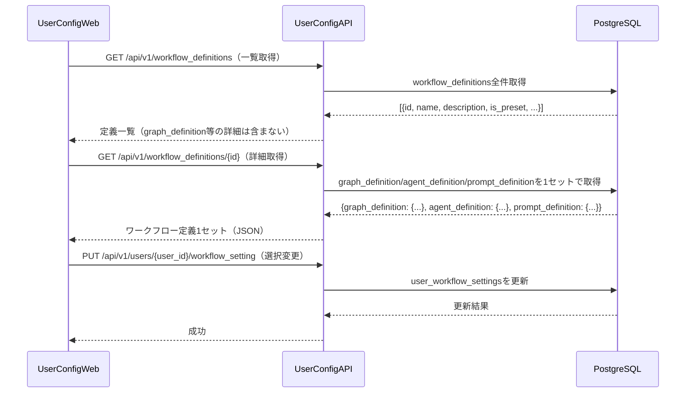

# グラフ定義ファイル 詳細設計書

## 1. 概要

グラフ定義ファイルはワークフローのフロー構造（ノード・エッジ・条件分岐）をJSON形式で定義する。`workflow_definitions`テーブルの`graph_definition`カラム（JSONB型）に保存され、エージェント定義・プロンプト定義と1セットで管理される。

`DefinitionLoader`がこのJSONをパースし、`WorkflowBuilder`に渡すことでグラフ構造を動的に構築する。

## 2. DBへの保存形式

`workflow_definitions`テーブルの`graph_definition`カラムにJSONBとして保存する。

| カラム | 型 | 説明 |
|-------|------|------|
| graph_definition | JSONB NOT NULL | グラフ定義JSON（本仕様で定義する形式） |

グラフ定義・エージェント定義・プロンプト定義は同一テーブルの同一レコードに格納し、常に1セットで取得・更新する。

## 3. JSON形式の仕様

### 3.1 トップレベル構造

グラフ定義は以下のトップレベルフィールドを持つJSONオブジェクトである。

| フィールド | 型 | 必須 | 説明 |
|-----------|------|------|------|
| `version` | 文字列 | 必須 | 定義フォーマットバージョン（例: "1.0"） |
| `name` | 文字列 | 必須 | グラフの名前（例: "標準MR処理グラフ"） |
| `description` | 文字列 | 任意 | グラフの説明文 |
| `entry_node` | 文字列 | 必須 | 最初に実行するノードのID |
| `nodes` | オブジェクト配列 | 必須 | ノード定義の配列（後述） |
| `edges` | オブジェクト配列 | 必須 | エッジ定義の配列（後述） |

### 3.2 ノード定義（nodes）

`nodes`は各グラフノードを定義するオブジェクトの配列である。

| フィールド | 型 | 必須 | 説明 |
|-----------|------|------|------|
| `id` | 文字列 | 必須 | ノードの一意識別子（エージェント定義の`node_id`と一致させる） |
| `type` | 文字列 | 必須 | ノードの種別（"agent" / "executor" / "condition"） |
| `agent_definition_id` | 文字列 | agent時必須 | エージェント定義ファイル内のエージェントID |
| `executor_class` | 文字列 | executor時必須 | 使用するExecutorクラス名（"UserResolverExecutor"等） |
| `requires_environment` | 真偽値 | 任意 | 実行環境（Docker）が必要か（デフォルト: false） |
| `label` | 文字列 | 任意 | 表示用ラベル |

**typeの種別**:
- `agent`: `ConfigurableAgent`として実行されるノード
- `executor`: `BaseExecutor`のサブクラスとして実行される前処理ノード（UserResolverExecutor等）
- `condition`: 分岐条件を評価するノード

### 3.3 エッジ定義（edges）

`edges`はノード間の接続を定義するオブジェクトの配列である。

| フィールド | 型 | 必須 | 説明 |
|-----------|------|------|------|
| `from` | 文字列 | 必須 | 遷移元ノードのID |
| `to` | 文字列またはnull | 必須 | 遷移先ノードのID。**`null`を指定した場合はワークフローの終了を意味する** |
| `condition` | 文字列 | 任意 | 遷移条件式（省略時は無条件遷移）。ワークフローコンテキストのキーを参照して評価する。 |
| `label` | 文字列 | 任意 | 表示用ラベル |

**condition の記述方法**:

条件式はワークフローコンテキスト内のキーと値を参照するDSL（ドメイン固有言語）形式の文字列で記述する。

- 単純な値比較: `"context.classification_result.task_type == 'code_generation'"`
- 存在チェック: `"context.plan_result.spec_file_exists == true"`
- 論理演算: `"context.reflection_result.action == 'proceed'"`

## 4. システムプリセット

### 4.1 標準MR処理グラフ（standard_mr_processing）

標準的なMR処理フローを定義するプリセット。

```json
{
  "version": "1.0",
  "name": "標準MR処理グラフ",
  "description": "コード生成・バグ修正・テスト作成・ドキュメント生成の4タスクに対応する標準フロー",
  "entry_node": "user_resolve",
  "nodes": [
    {
      "id": "user_resolve",
      "type": "executor",
      "executor_class": "UserResolverExecutor",
      "requires_environment": false,
      "label": "ユーザー情報取得"
    },
    {
      "id": "task_classifier",
      "type": "agent",
      "agent_definition_id": "task_classifier",
      "requires_environment": false,
      "label": "タスク分類"
    },
    {
      "id": "task_type_branch",
      "type": "condition",
      "label": "タスク種別判定"
    },
    {
      "id": "code_generation_planning",
      "type": "agent",
      "agent_definition_id": "code_generation_planning",
      "requires_environment": false,
      "label": "コード生成計画"
    },
    {
      "id": "bug_fix_planning",
      "type": "agent",
      "agent_definition_id": "bug_fix_planning",
      "requires_environment": false,
      "label": "バグ修正計画"
    },
    {
      "id": "test_creation_planning",
      "type": "agent",
      "agent_definition_id": "test_creation_planning",
      "requires_environment": false,
      "label": "テスト作成計画"
    },
    {
      "id": "documentation_planning",
      "type": "agent",
      "agent_definition_id": "documentation_planning",
      "requires_environment": false,
      "label": "ドキュメント生成計画"
    },
    {
      "id": "spec_check_branch",
      "type": "condition",
      "label": "仕様書確認"
    },
    {
      "id": "code_generation",
      "type": "agent",
      "agent_definition_id": "code_generation",
      "requires_environment": true,
      "label": "コード生成"
    },
    {
      "id": "bug_fix",
      "type": "agent",
      "agent_definition_id": "bug_fix",
      "requires_environment": true,
      "label": "バグ修正"
    },
    {
      "id": "test_creation",
      "type": "agent",
      "agent_definition_id": "test_creation",
      "requires_environment": true,
      "label": "テスト作成"
    },
    {
      "id": "documentation",
      "type": "agent",
      "agent_definition_id": "documentation",
      "requires_environment": false,
      "label": "ドキュメント作成"
    },
    {
      "id": "code_review",
      "type": "agent",
      "agent_definition_id": "code_review",
      "requires_environment": false,
      "label": "コードレビュー"
    },
    {
      "id": "documentation_review",
      "type": "agent",
      "agent_definition_id": "documentation_review",
      "requires_environment": false,
      "label": "ドキュメントレビュー"
    },
    {
      "id": "test_execution_evaluation",
      "type": "agent",
      "agent_definition_id": "test_execution_evaluation",
      "requires_environment": true,
      "label": "テスト実行・評価"
    },
    {
      "id": "plan_reflection",
      "type": "agent",
      "agent_definition_id": "plan_reflection",
      "requires_environment": false,
      "label": "リフレクション"
    },
    {
      "id": "replan_branch",
      "type": "condition",
      "label": "再計画判定"
    }
  ],
  "edges": [
    { "from": "user_resolve", "to": "task_classifier" },
    { "from": "task_classifier", "to": "task_type_branch" },
    {
      "from": "task_type_branch",
      "to": "code_generation_planning",
      "condition": "context.classification_result.task_type == 'code_generation'",
      "label": "コード生成"
    },
    {
      "from": "task_type_branch",
      "to": "bug_fix_planning",
      "condition": "context.classification_result.task_type == 'bug_fix'",
      "label": "バグ修正"
    },
    {
      "from": "task_type_branch",
      "to": "test_creation_planning",
      "condition": "context.classification_result.task_type == 'test_creation'",
      "label": "テスト作成"
    },
    {
      "from": "task_type_branch",
      "to": "documentation_planning",
      "condition": "context.classification_result.task_type == 'documentation'",
      "label": "ドキュメント生成"
    },
    { "from": "code_generation_planning", "to": "spec_check_branch" },
    { "from": "bug_fix_planning", "to": "spec_check_branch" },
    { "from": "test_creation_planning", "to": "spec_check_branch" },
    {
      "from": "spec_check_branch",
      "to": "documentation_planning",
      "condition": "context.plan_result.spec_file_exists == false",
      "label": "仕様書なし"
    },
    {
      "from": "spec_check_branch",
      "to": "code_generation",
      "condition": "context.plan_result.spec_file_exists == true && context.classification_result.task_type == 'code_generation'",
      "label": "仕様書あり（コード生成）"
    },
    {
      "from": "spec_check_branch",
      "to": "bug_fix",
      "condition": "context.plan_result.spec_file_exists == true && context.classification_result.task_type == 'bug_fix'",
      "label": "仕様書あり（バグ修正）"
    },
    {
      "from": "spec_check_branch",
      "to": "test_creation",
      "condition": "context.plan_result.spec_file_exists == true && context.classification_result.task_type == 'test_creation'",
      "label": "仕様書あり（テスト作成）"
    },
    { "from": "documentation_planning", "to": "documentation" },
    { "from": "code_generation", "to": "code_review" },
    { "from": "bug_fix", "to": "code_review" },
    { "from": "test_creation", "to": "code_review" },
    { "from": "documentation", "to": "documentation_review" },
    { "from": "code_review", "to": "test_execution_evaluation" },
    { "from": "test_execution_evaluation", "to": "plan_reflection" },
    { "from": "documentation_review", "to": "plan_reflection" },
    { "from": "plan_reflection", "to": "replan_branch" },
    {
      "from": "replan_branch",
      "to": "task_type_branch",
      "condition": "context.reflection_result.action == 'revise_plan'",
      "label": "再計画"
    },
    {
      "from": "replan_branch",
      "to": "code_generation",
      "condition": "context.reflection_result.action == 'proceed' && context.reflection_result.status == 'needs_revision' && context.classification_result.task_type == 'code_generation'",
      "label": "軽微修正（コード生成）"
    },
    {
      "from": "replan_branch",
      "to": null,
      "condition": "context.reflection_result.action == 'proceed' && context.reflection_result.status == 'success'",
      "label": "完了"
    }
  ]
}
```

### 4.2 複数コード生成並列グラフ（multi_codegen_mr_processing）

コーディングエージェントを複数モデル・温度設定で並列実行し、レビュー時にユーザーが選択できるフロー。

```json
{
  "version": "1.0",
  "name": "複数コード生成並列グラフ",
  "description": "コーディングエージェントを3種類の設定で並列実行し、レビュー時にユーザーが選択するフロー",
  "entry_node": "user_resolve",
  "nodes": [
    {
      "id": "user_resolve",
      "type": "executor",
      "executor_class": "UserResolverExecutor",
      "requires_environment": false
    },
    {
      "id": "task_classifier",
      "type": "agent",
      "agent_definition_id": "task_classifier",
      "requires_environment": false
    },
    {
      "id": "code_generation_planning",
      "type": "agent",
      "agent_definition_id": "code_generation_planning",
      "requires_environment": false
    },
    {
      "id": "code_generation_a",
      "type": "agent",
      "agent_definition_id": "code_generation_fast",
      "requires_environment": true,
      "label": "コード生成A（高速モデル）"
    },
    {
      "id": "code_generation_b",
      "type": "agent",
      "agent_definition_id": "code_generation_standard",
      "requires_environment": true,
      "label": "コード生成B（標準モデル）"
    },
    {
      "id": "code_generation_c",
      "type": "agent",
      "agent_definition_id": "code_generation_creative",
      "requires_environment": true,
      "label": "コード生成C（高温度設定）"
    },
    {
      "id": "code_review",
      "type": "agent",
      "agent_definition_id": "code_review",
      "requires_environment": false,
      "label": "コードレビュー（3案比較）"
    },
    {
      "id": "plan_reflection",
      "type": "agent",
      "agent_definition_id": "plan_reflection",
      "requires_environment": false
    }
  ],
  "edges": [
    { "from": "user_resolve", "to": "task_classifier" },
    { "from": "task_classifier", "to": "code_generation_planning" },
    { "from": "code_generation_planning", "to": "code_generation_a" },
    { "from": "code_generation_planning", "to": "code_generation_b" },
    { "from": "code_generation_planning", "to": "code_generation_c" },
    { "from": "code_generation_a", "to": "code_review" },
    { "from": "code_generation_b", "to": "code_review" },
    { "from": "code_generation_c", "to": "code_review" },
    { "from": "code_review", "to": "plan_reflection" },
    {
      "from": "plan_reflection",
      "to": null,
      "condition": "context.reflection_result.action == 'proceed'",
      "label": "完了"
    }
  ]
}
```

### 4.2 並列コード生成MR処理グラフ（multi_codegen_mr_processing）

複数の異なるLLM設定で並列にコード生成を行い、ユーザーが最適な実装を選択できるようにするプリセット。

**特徴**:
- 3つの並列コード生成ノード: `code_generation_fast`（高速モデル）、`code_generation_standard`（標準モデル）、`code_generation_creative`（高温度設定モデル）
- 各並列ノードは独立したDocker環境で実行（`requires_environment: true`）
- 並列実行後、ユーザーが3つの実装を比較選択する集約ノード（`implementation_selector`）
- 選択された実装に対してテスト・レビューを実行

**ユースケース**:
- 複雑な実装が複数パターン考えられる場合
- 最適なアプローチが事前に分からない場合
- ユーザーが複数の代替案から選択したい場合

**並列実行の仕組み**:
- `task_type_branch`から`code_generation_fast`, `code_generation_standard`, `code_generation_creative`の3つのエッジが並列に発火
- 各エージェントは`output_keys`にサフィックスを付けて区別（`execution_result_fast`, `execution_result_standard`, `execution_result_creative`）
- 3つのエージェントが完了後、`implementation_selector`ノードがすべての実装をGitLabのMRコメントに投稿し、ユーザー選択を待つ
- ユーザーがGitLabコメントで選択（例: `/select fast`）すると、選択された実装のみが後続フロー（`test_execution_evaluation` → `code_review`）に進む

```json
{
  "version": "1.0",
  "name": "並列コード生成MR処理グラフ",
  "description": "3つの異なるLLM設定で並列にコード生成し、ユーザーが最適な実装を選択する",
  "entry_node": "user_resolve",
  "nodes": [
    {
      "id": "user_resolve",
      "type": "executor",
      "executor_class": "UserResolverExecutor",
      "requires_environment": false,
      "label": "ユーザー情報取得"
    },
    {
      "id": "task_classifier",
      "type": "agent",
      "agent_definition_id": "task_classifier",
      "requires_environment": false,
      "label": "タスク分類"
    },
    {
      "id": "task_type_branch",
      "type": "condition",
      "label": "タスク種別分岐"
    },
    {
      "id": "code_generation_planning",
      "type": "agent",
      "agent_definition_id": "code_generation_planning",
      "requires_environment": false,
      "label": "コード生成計画"
    },
    {
      "id": "plan_reflection",
      "type": "agent",
      "agent_definition_id": "plan_reflection",
      "requires_environment": false,
      "label": "プラン検証"
    },
    {
      "id": "plan_revision_branch",
      "type": "condition",
      "label": "プラン再検討判定"
    },
    {
      "id": "parallel_codegen_branch",
      "type": "condition",
      "label": "並列コード生成開始"
    },
    {
      "id": "code_generation_fast",
      "type": "agent",
      "agent_definition_id": "code_generation_fast",
      "requires_environment": true,
      "label": "コード生成（高速モデル）"
    },
    {
      "id": "code_generation_standard",
      "type": "agent",
      "agent_definition_id": "code_generation_standard",
      "requires_environment": true,
      "label": "コード生成（標準モデル）"
    },
    {
      "id": "code_generation_creative",
      "type": "agent",
      "agent_definition_id": "code_generation_creative",
      "requires_environment": true,
      "label": "コード生成（高温度モデル）"
    },
    {
      "id": "implementation_selector",
      "type": "agent",
      "agent_definition_id": "implementation_selector",
      "requires_environment": false,
      "label": "実装選択"
    },
    {
      "id": "test_execution_evaluation",
      "type": "agent",
      "agent_definition_id": "test_execution_evaluation",
      "requires_environment": true,
      "label": "テスト実行・評価"
    },
    {
      "id": "test_result_branch",
      "type": "condition",
      "label": "テスト結果判定"
    },
    {
      "id": "code_review",
      "type": "agent",
      "agent_definition_id": "code_review",
      "requires_environment": false,
      "label": "コードレビュー"
    },
    {
      "id": "review_result_branch",
      "type": "condition",
      "label": "レビュー結果判定"
    }
  ],
  "edges": [
    {
      "from": "user_resolve",
      "to": "task_classifier",
      "label": "次へ"
    },
    {
      "from": "task_classifier",
      "to": "task_type_branch",
      "label": "分類完了"
    },
    {
      "from": "task_type_branch",
      "to": "code_generation_planning",
      "condition": "context.classification_result.task_type == 'code_generation'",
      "label": "コード生成"
    },
    {
      "from": "code_generation_planning",
      "to": "plan_reflection",
      "label": "計画完了"
    },
    {
      "from": "plan_reflection",
      "to": "plan_revision_branch",
      "label": "検証完了"
    },
    {
      "from": "plan_revision_branch",
      "to": "code_generation_planning",
      "condition": "context.reflection_result.action == 'revise_plan' and context.plan_revision_count < config.max_plan_revision_count",
      "label": "再計画"
    },
    {
      "from": "plan_revision_branch",
      "to": "parallel_codegen_branch",
      "condition": "context.reflection_result.action == 'proceed'",
      "label": "並列実行"
    },
    {
      "from": "parallel_codegen_branch",
      "to": "code_generation_fast",
      "condition": "true",
      "label": "高速モデル"
    },
    {
      "from": "parallel_codegen_branch",
      "to": "code_generation_standard",
      "condition": "true",
      "label": "標準モデル"
    },
    {
      "from": "parallel_codegen_branch",
      "to": "code_generation_creative",
      "condition": "true",
      "label": "高温度モデル"
    },
    {
      "from": "code_generation_fast",
      "to": "implementation_selector",
      "label": "完了"
    },
    {
      "from": "code_generation_standard",
      "to": "implementation_selector",
      "label": "完了"
    },
    {
      "from": "code_generation_creative",
      "to": "implementation_selector",
      "label": "完了"
    },
    {
      "from": "implementation_selector",
      "to": "test_execution_evaluation",
      "label": "選択完了"
    },
    {
      "from": "test_execution_evaluation",
      "to": "test_result_branch",
      "label": "評価完了"
    },
    {
      "from": "test_result_branch",
      "to": "code_review",
      "condition": "context.review_result.status == 'passed'",
      "label": "テスト成功"
    },
    {
      "from": "test_result_branch",
      "to": null,
      "condition": "context.review_result.status == 'failed' and context.test_fix_iteration >= config.max_test_fix_iterations",
      "label": "修正上限"
    },
    {
      "from": "code_review",
      "to": "review_result_branch",
      "label": "レビュー完了"
    },
    {
      "from": "review_result_branch",
      "to": null,
      "condition": "context.review_result.status == 'approved'",
      "label": "承認"
    },
    {
      "from": "review_result_branch",
      "to": "parallel_codegen_branch",
      "condition": "context.review_result.status == 'needs_major_revision' and context.review_retry_count < config.max_review_retry_count",
      "label": "大幅修正（並列再実行）"
    },
    {
      "from": "review_result_branch",
      "to": null,
      "condition": "context.review_result.status == 'needs_major_revision' and context.review_retry_count >= config.max_review_retry_count",
      "label": "レビューリトライ上限"
    }
  ]
}
```

**並列実行ノードの実装ポイント**:

1. **Docker環境の独立性**: 各並列ノード（`code_generation_fast`, `code_generation_standard`, `code_generation_creative`）は`requires_environment: true`であり、`ExecutionEnvironmentManager`が各ノード用に独立したDockerコンテナを起動する。これにより、3つの実装が互いに干渉せずに並行して実行される。

2. **コンテキストキーのサフィックス**: 各並列ノードのエージェント定義で`output_keys`をそれぞれ`["execution_result_fast"]`, `["execution_result_standard"]`, `["execution_result_creative"]`とすることで、3つの実装結果がワークフローコンテキストに共存できる。

3. **集約ノード（implementation_selector）**: このノードは3つの`input_keys`（`["execution_result_fast", "execution_result_standard", "execution_result_creative"]`）をすべて受け取り、3つの実装をGitLabのMRコメントに投稿する。ユーザーが選択するまでワークフローは一時停止する（GitLab Webhook待ち状態）。

4. **ユーザー選択の反映**: ユーザーがGitLabコメントで`/select fast`などのコマンドを入力すると、`implementation_selector`が選択された実装のみを`execution_result`キーに複製し、後続ノード（`test_execution_evaluation`）に渡す。

5. **環境数の集計**: `DefinitionLoader.validate_graph_definition()`は`requires_environment: true`のノード数を数えて返す。このグラフでは3つの並列ノードがあるため、`WorkflowFactory._setup_environments()`は3つのDockerコンテナを事前に起動する。

---

## 5. バリデーション仕様

`DefinitionLoader.validate_graph_definition(graph_def)`が以下のチェックを実施する。

| チェック項目 | 説明 |
|-----------|------|
| 必須フィールドの存在 | `version`・`name`・`entry_node`・`nodes`・`edges`の存在確認 |
| entryノードの存在 | `entry_node`に指定されたIDがnodesに存在するか |
| エッジの参照整合性 | `edges`の`from`に指定されたIDがすべてnodesに存在するか。`to`はnull（ワークフロー終了）またはnodesに存在するIDであるか |
| condition構文 | condition式に含まれるコンテキストキーが`agent_definition`内の`output_keys`に含まれるか |
| requires_environment集計 | `requires_environment: true`のノード数を集計し、`WorkflowFactory._setup_environments()`で事前準備するDocker環境数の根拠として返す |

## 6. 定義の取得・更新フロー


