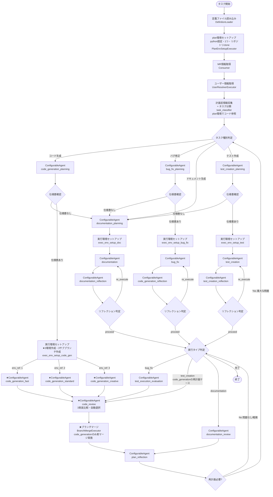
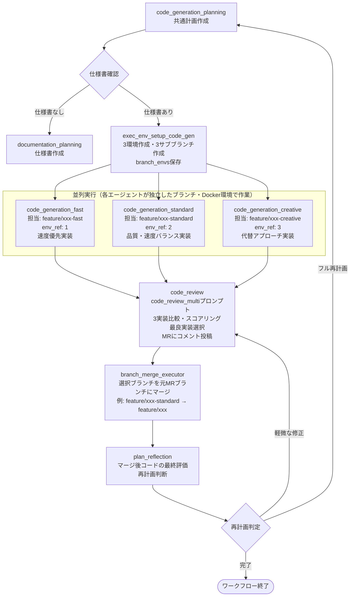
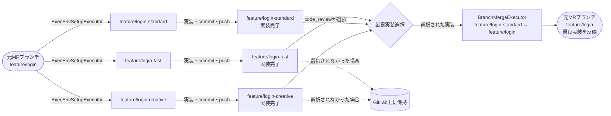

# 複数コード生成並列処理フロー詳細設計書

**参考**: [CODE_AGENT_ORCHESTRATOR_SPEC.md](CODE_AGENT_ORCHESTRATOR_SPEC.md) | [GRAPH_DEFINITION_SPEC.md](GRAPH_DEFINITION_SPEC.md) | [AGENT_DEFINITION_SPEC.md](AGENT_DEFINITION_SPEC.md) | [STANDARD_MR_PROCESSING_FLOW.md](STANDARD_MR_PROCESSING_FLOW.md)

## 1. 概要

### 1.1 本ドキュメントの目的

本ドキュメントは、GitLab Coding Agentシステムにおける**複数コード生成並列処理フロー（multi_codegen_mr_processing）**の動作を詳細に説明します。本フローは**コード生成タスクのみ**3つのエージェントを並列実行し、最良の実装を自動選択します。バグ修正・テスト作成・ドキュメント生成タスクは標準フローと同一の動作をします。

### 1.2 標準フローとの主な違い

| 項目 | 標準フロー（standard_mr_processing） | 本フロー（multi_codegen_mr_processing） |
|------|--------------------------------------|----------------------------------------|
| コード生成方式 | 1エージェントが単一実装を生成 | 3エージェントが並列で独立した実装を生成 |
| 実行環境数（コード生成） | 1環境（env_count: 1） | 3環境（env_count: 3） |
| コード生成ブランチ | 元MRブランチを直接使用 | サブブランチを3本作成して並列実装 |
| 実装選択 | なし（単一実装をそのまま採用） | code_review_multiが3実装を比較し最良を自動選択 |
| リフレクション（コード生成） | code_generation_reflectionで品質検証 | なし（3実装を直接code_reviewに渡す） |
| ブランチマージ | なし | BranchMergeExecutorが選択ブランチを元MRブランチにマージ |
| バグ修正・テスト作成・ドキュメント | 標準フローと同一 | 標準フローと同一 |

### 1.3 説明範囲

本ドキュメントでは以下を説明します：

- multi_codegen_mr_processingフローで使用されるエージェント一覧と役割
- MR処理の全体フロー（フェーズ構成と遷移条件）
- 各フェーズの詳細な処理内容（並列コード生成・比較選択・ブランチマージに重点を置く）
- ブランチ管理の仕組み（サブブランチ作成・保持ポリシー）

**本ドキュメントで説明しないもの**:
- 標準フローと同一の動作 → [STANDARD_MR_PROCESSING_FLOW.md](STANDARD_MR_PROCESSING_FLOW.md)を参照
- システムの実装設計 → [CODE_AGENT_ORCHESTRATOR_SPEC.md](CODE_AGENT_ORCHESTRATOR_SPEC.md)を参照
- グラフ/エージェント/プロンプト定義の詳細仕様 → 各専用ドキュメントを参照

### 1.4 関連ドキュメント

- **標準フロー**: [STANDARD_MR_PROCESSING_FLOW.md](STANDARD_MR_PROCESSING_FLOW.md)
- **システム全体設計**: [CODE_AGENT_ORCHESTRATOR_SPEC.md](CODE_AGENT_ORCHESTRATOR_SPEC.md)（§4.5 マルチエージェントブランチ管理）
- **グラフ定義**: [GRAPH_DEFINITION_SPEC.md](GRAPH_DEFINITION_SPEC.md) | [multi_codegen_mr_processing_graph.json](definitions/multi_codegen_mr_processing_graph.json)
- **エージェント定義**: [AGENT_DEFINITION_SPEC.md](AGENT_DEFINITION_SPEC.md) | [multi_codegen_mr_processing_agents.json](definitions/multi_codegen_mr_processing_agents.json)
- **プロンプト定義**: [PROMPT_DEFINITION_SPEC.md](PROMPT_DEFINITION_SPEC.md) | [multi_codegen_mr_processing_prompts.json](definitions/multi_codegen_mr_processing_prompts.json)

---

## 2. エージェント構成

すべてのエージェントノードは同一の`ConfigurableAgent`クラスで実装される。エージェント定義IDによって動作が決まる。標準フローと異なるエージェントには **★multi_codegen固有** と注記する。

| エージェント定義ID | 役割 | 入力コンテキストキー | 出力コンテキストキー |
|--------------|------|------|------|
| task_classifier | タスク分類 | task_context | classification_result |
| code_generation_planning | コード生成タスクの実行計画生成 | task_context, classification_result | plan_result, todo_list |
| bug_fix_planning | バグ修正タスクの実行計画生成 | task_context, classification_result | plan_result, todo_list |
| test_creation_planning | テスト作成タスクの実行計画生成 | task_context, classification_result | plan_result, todo_list |
| documentation_planning | ドキュメント生成タスクの実行計画生成 | task_context, classification_result | plan_result, todo_list |
| plan_reflection | プラン検証・改善 | plan_result, todo_list, task_context | reflection_result |
| **code_generation_fast** ★ | 速度優先でコードを生成（env_ref: 1） | plan_result, task_context | execution_results |
| **code_generation_standard** ★ | 品質・速度バランス重視でコードを生成（env_ref: 2） | plan_result, task_context | execution_results |
| **code_generation_creative** ★ | 代替アプローチで創造的にコードを生成（env_ref: 3） | plan_result, task_context | execution_results |
| bug_fix | バグ修正実装 | plan_result, task_context | execution_result |
| documentation | ドキュメント作成 | plan_result, task_context | execution_result |
| test_creation | テスト作成 | plan_result, task_context | execution_result |
| code_generation_reflection | バグ修正結果の検証とリトライ判断 | execution_result, plan_result, task_context, todo_list | execution_reflection_result |
| test_creation_reflection | テスト作成結果の検証とリトライ判断 | execution_result, plan_result, task_context, todo_list | execution_reflection_result |
| documentation_reflection | ドキュメント作成結果の検証とリトライ判断 | execution_result, plan_result, task_context, todo_list | execution_reflection_result |
| test_execution_evaluation | テスト実行・評価（バグ修正タスクのみ） | execution_result, task_context | review_result |
| **code_review** ★ | コード生成時は3実装を比較し最良を選択; バグ修正・テスト作成時は標準レビュー | execution_result, execution_results, branch_envs, task_context | review_result, selected_implementation |
| documentation_review | ドキュメントレビュー実施 | execution_result, task_context | review_result |

### 2.1 並列コード生成エージェントの設定比較

| エージェント定義ID | 実装方針 | max_iterations | timeout_seconds | LLM temperature |
|--------------|------|------|------|------|
| code_generation_fast | 速度優先・直接的・最小限実装 | 30 | 900 | 0.1 |
| code_generation_standard | 品質・速度バランス・標準パターン準拠 | 40 | 1800 | 0.2 |
| code_generation_creative | 代替アプローチ探索・拡張性重視 | 40 | 1800 | 0.7 |

### 2.2 共通実装ルール

**プロンプト管理**:
- 各エージェントノードのプロンプト詳細は[プロンプト定義ファイル](definitions/multi_codegen_mr_processing_prompts.json)を参照
- LLM呼び出し時には、プロンプト冒頭にAGENTS.mdの内容を含める

**プロンプト設定実装**:
- `AgentFactory`が`ConfigurableAgent`生成時にプロンプト定義ファイルから対応するプロンプトを取得する
- `ChatClientAgentOptions.instructions`にプロンプトを設定する

---

## 3. MR処理の全体フロー



**注**: `replan_branch → null`（完了）の条件は`context.reflection_result.action == 'proceed'`。グラフ定義では`replan_branch`から`null`エッジで終了を表現する。簡略化のため上記フローでは`ExecTypeBranch`から`End`と表記している。

### 3.1 主要ノード構成

| フェーズ | エージェント/Executor | 目的 |
|---------|---------------|------|
| 定義読み込み | DefinitionLoader | グラフ/エージェント/プロンプト定義をロード |
| plan環境セットアップ | PlanEnvSetupExecutor | python固定のplan環境を1つ作成しリポジトリをclone |
| 実行環境セットアップ（コード生成） | ExecEnvSetupExecutor（env_count:3） | 3つの実行環境を作成。`branch_envs: {1: env_id, 2: env_id, 3: env_id}`をコンテキストに保存。サブブランチを3本作成 |
| 実行環境セットアップ（他タスク） | ExecEnvSetupExecutor（env_count:1） | 1つの実行環境を作成 |
| 並列コード生成 | code_generation_fast / code_generation_standard / code_generation_creative | 各自の担当ブランチで独立した実装を並列実行 |
| コードレビュー・実装選択 | code_review（code_review_multiプロンプト） | コード生成タスク: 3実装を比較し最良を選択。バグ修正・テスト作成: 標準コードレビュー |
| ブランチマージ | BranchMergeExecutor | selected_implementationが存在する場合（コード生成タスク）、選択ブランチを元MRブランチにマージ |
| リフレクション | plan_reflection | 結果評価・再計画判断 |

### 3.2 重要なフロー特性

1. **コード生成のみ並列化**: バグ修正・テスト作成・ドキュメント生成は標準フローと完全同一
2. **リフレクション省略（コード生成のみ）**: 3実装はcode_generation_reflectionを経由せず直接code_reviewに渡す
3. **BranchMergeExecutorは条件付き動作**: selected_implementationが存在する（コード生成タスクの）場合のみ実マージを実施する
4. **ブランチ保持**: 選択されなかったサブブランチもGitLab上に保持される（自動削除なし）
5. **再計画時の動作**: 軽微な修正（severity != critical）で`execution_type_branch`に戻る際、コード生成タスクはcode_reviewへルーティングされる

---

## 4. フェーズ詳細

### 4.1 計画前情報収集フェーズ

標準フローと同一。詳細は[STANDARD_MR_PROCESSING_FLOW.md §4.1](STANDARD_MR_PROCESSING_FLOW.md)を参照。

### 4.2 計画フェーズ

標準フローと同一。コード生成タスクの計画は`code_generation_planning`が担当し、3つの並列エージェントが参照する共通計画を生成する。詳細は[STANDARD_MR_PROCESSING_FLOW.md §4.2](STANDARD_MR_PROCESSING_FLOW.md)を参照。

### 4.3 並列実行環境セットアップフェーズ

**目的**: コード生成タスクのために3つの独立した実行環境とブランチを準備する

**使用Executor**: `ExecEnvSetupExecutor`（`env_count: 3`）

**実行内容**:

1. **3環境の作成**: 3つのDockerコンテナ環境を作成して`branch_envs`コンテキストに保存する
   ```
   branch_envs: {
     1: "env-uuid-1",  // code_generation_fast が使用
     2: "env-uuid-2",  // code_generation_standard が使用
     3: "env-uuid-3"   // code_generation_creative が使用
   }
   ```

2. **サブブランチの作成**: 元MRブランチからサブブランチを3本作成する
   - 命名規則: `{元ブランチ名}-fast`, `{元ブランチ名}-standard`, `{元ブランチ名}-creative`
   - 例: 元ブランチ `feature/login` の場合:
     - `feature/login-fast`   （code_generation_fast用）
     - `feature/login-standard`（code_generation_standard用）
     - `feature/login-creative`（code_generation_creative用）
   - 実装: `GitLabClient.create_branch(branch_name, base_branch)` を3回呼び出し

3. **task_contextへのブランチ情報設定**: 各エージェントの`task_context`に`assigned_branch`フィールドを追加し、担当ブランチ名を設定する

### 4.4 並列コード生成フェーズ

**目的**: 3つのエージェントが独立した方針で並列に実装を完成させる

**使用エージェント**:
- `ConfigurableAgent`（エージェント定義: `code_generation_fast`）
- `ConfigurableAgent`（エージェント定義: `code_generation_standard`）
- `ConfigurableAgent`（エージェント定義: `code_generation_creative`）

**各エージェントの実行内容**:

1. `task_context.assigned_branch`から自身の担当ブランチ名を取得する
2. `get_environment_id()`で`branch_envs[N]`からDockerコンテナの環境IDを取得する
3. 担当ブランチをcheckoutして作業を開始する
4. 仕様書と計画に基づいて各エージェントの方針に従い実装を完成させる
5. テストコードを作成してcommit・pushする
6. 実行結果を`execution_results`辞書に自身のエージェント定義ID（例: `"code_generation_fast"`）をキーとして保存する

**並列実行の独立性**:
- 各エージェントは独立したDockerコンテナ環境で動作する
- ブランチが分離されているためコードに競合は発生しない
- 1エージェントの失敗が他エージェントに影響を与えない

**各実装の方針の違い**:

| エージェント | 実装方針の特徴 |
|------------|--------------|
| code_generation_fast | 直接的な実装・最小限の抽象化・基本テストのみ |
| code_generation_standard | プロジェクト既存パターン準拠・包括的エラーハンドリング・80%以上のテストカバレッジ |
| code_generation_creative | 代替設計パターン探索・将来の拡張性重視・詳細なドキュメントコメント |

### 4.5 比較レビュー・自動選択フェーズ

**目的**: 3つの実装を比較し、最も品質の高い実装を自動選択する

**使用エージェント**: `ConfigurableAgent`（エージェント定義: `code_review`、プロンプト: `code_review_multi`）

**実行内容**:

1. **3実装の収集**: `execution_results`辞書から3エージェントの実行結果を取得し、各実装ファイルをread_fileで読み込む

2. **評価基準による採点**: 各実装を5つの観点でそれぞれ採点する

   | 評価基準 | 何を評価するか |
   |---------|--------------|
   | 正確性 | 仕様要件を完全に満たしているか。テストが通過するか |
   | コード品質 | 可読性・命名規則・型情報・ドキュメントコメントの充実度 |
   | セキュリティ | 脆弱性の有無 |
   | パフォーマンス | 効率的な実装か |
   | テストカバレッジ | テストコードの網羅度 |

3. **最良実装の選択**: 総合評価スコアが最高の実装を選択する。同点の場合は`code_generation_standard`を優先する

4. **GitLab MRへのコメント投稿**: 以下の内容を含むコメントを投稿する
   - 選択された実装とブランチ名
   - 選択理由
   - 3実装のスコア比較表（Markdown形式）

5. **`selected_implementation`の出力**: 以下のフィールドを含む辞書として出力する
   - `environment_id`: 選択された実装の環境ID
   - `branch_name`: 選択された実装のブランチ名（例: `feature/login-standard`）
   - `selection_reason`: 選択理由の説明文
   - `quality_score`: 総合評価スコア（0.0〜1.0）
   - `evaluation_details`: 各評価基準の詳細（strengths・weaknessesリスト）

**バグ修正・テスト作成タスクの場合**:

`execution_results`辞書が存在せず`execution_result`（単数）のみ存在する場合、code_review_multiプロンプトは標準的なコードレビューモードで動作し、自動選択は行わない（`selected_implementation`は出力されない）。

### 4.6 ブランチマージフェーズ

**目的**: 選択された実装のブランチを元MRブランチにマージする

**使用Executor**: `BranchMergeExecutor`

**実行内容**:

1. `selected_implementation`の存在確認: コンテキストに`selected_implementation`が存在しない場合（バグ修正・テスト作成・ドキュメントの場合）は何もしない（ノーオペレーション）

2. **選択ブランチのマージ**: `selected_implementation.branch_name`を元MRブランチにマージする
   - API: `GitLabClient.merge_branch(source=selected_branch, target=original_branch)`
   - コミットメッセージ: `Merge {selected_branch}: {selection_reason}`

3. **元MRブランチの更新**: マージが完了すると、元MRブランチ（例: `feature/login`）に選択された実装のコードが反映される

### 4.7 リフレクション・再計画フェーズ

標準フローと同一。`plan_reflection`がコードレビュー結果を評価し、問題があれば再計画を指示する。再計画時、コード生成タスクに対して軽微な修正の場合は`execution_type_branch`経由でcode_reviewに戻り、3実装の再評価が行われる（3実装の再生成は行わない）。フル再計画の場合は`task_type_branch`に戻り、計画から3並列実行まで全工程が再実行される。

### 4.8 バグ修正・テスト作成・ドキュメント生成タスク

これらのタスクの処理は標準フローと完全同一である。各フェーズの詳細は[STANDARD_MR_PROCESSING_FLOW.md](STANDARD_MR_PROCESSING_FLOW.md)を参照。

---

## 5. コード生成タスクの詳細フロー

コード生成タスクに絞ったフロー（並列実行の詳細）を以下に示す。



---

## 6. ブランチ管理

### 6.1 ブランチ命名規則

各並列コード生成エージェントのサブブランチは、元MRブランチ名の末尾にエージェント種別を付加した名前で作成される。

| エージェント | サブブランチ名パターン | 命名例（元ブランチ: `feature/login`） |
|------------|---------------------|--------------------------------------|
| code_generation_fast | `{元ブランチ名}-fast` | `feature/login-fast` |
| code_generation_standard | `{元ブランチ名}-standard` | `feature/login-standard` |
| code_generation_creative | `{元ブランチ名}-creative` | `feature/login-creative` |

### 6.2 ブランチのライフサイクル



### 6.3 ブランチ保持ポリシー

- 選択されなかったサブブランチ（例: `feature/login-fast`、`feature/login-creative`）はGitLab上にそのまま残す
- 自動削除は行わない（ユーザーが手動で削除可能）
- ユーザーはGitLab UI上で各ブランチのコードを確認・比較できる

---

## 7. まとめ

`multi_codegen_mr_processing`フローは、コード生成タスクに限定して3並列実行と自動選択を適用することで以下を実現する。

| 特徴 | 内容 |
|------|------|
| 多様性 | 速度優先・品質重視・創造的の3つのアプローチを同時に試みることで、単一アプローチでは得られない多様な実装を生成できる |
| 自動選択 | 5つの評価基準に基づくスコアリングで最良実装を客観的に選択し、選択理由をMRにコメントとして記録する |
| 透明性 | 3実装のスコア比較表がMRのコメントとして残るため、選択理由をユーザーが確認できる |
| 再現性 | 選択されなかったブランチも保持されるため、後から別の実装を採用することも可能 |
| 後方互換性 | バグ修正・テスト作成・ドキュメント生成は標準フローと同一のため、既存の動作に影響を与えない |
