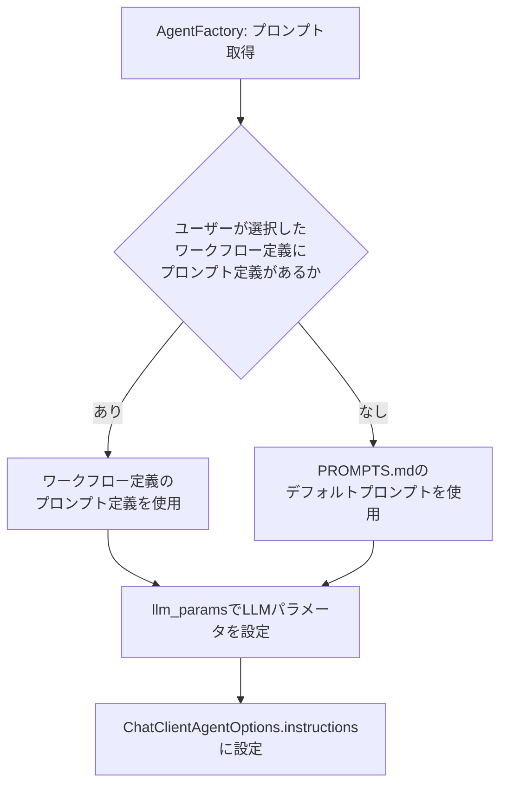

# プロンプト定義ファイル 詳細設計書

## 1. 概要

プロンプト定義ファイルは各エージェントノードで使用するLLMのシステムプロンプトとLLMパラメータ（temperature等）のセットをJSON形式で定義する。`workflow_definitions`テーブルの`prompt_definition`カラム（JSONB型）に保存され、グラフ定義・エージェント定義と1セットで管理される。

`AgentFactory`がこのJSONをパースし、`ConfigurableAgent`生成時に`AgentNodeConfig.prompt_id`をキーとして対応するプロンプトとLLMパラメータを取得・設定する。

## 2. DBへの保存形式

`workflow_definitions`テーブルの`prompt_definition`カラムにJSONBとして保存する。

| カラム | 型 | 説明 |
|-------|------|------|
| prompt_definition | JSONB NOT NULL | プロンプト定義JSON（本仕様で定義する形式） |

グラフ定義・エージェント定義・プロンプト定義は同一テーブルの同一レコードに格納し、常に1セットで取得・更新する。

## 3. JSON形式の仕様

### 3.1 トップレベル構造

プロンプト定義は以下のトップレベルフィールドを持つJSONオブジェクトである。

| フィールド | 型 | 必須 | 説明 |
|-----------|------|------|------|
| `version` | 文字列 | 必須 | 定義フォーマットバージョン（例: "1.0"） |
| `default_llm_params` | オブジェクト | 任意 | 全エージェント共通のデフォルトLLMパラメータ（各エージェント定義で上書き可能） |
| `prompts` | オブジェクト配列 | 必須 | 各エージェントのプロンプト定義配列（後述） |

### 3.2 デフォルトLLMパラメータ（default_llm_params）

`default_llm_params`は全エージェントに適用されるデフォルトのLLMパラメータを定義するオブジェクトである。各エージェント定義の`llm_params`で上書き可能。

| フィールド | 型 | 必須 | 説明 |
|-----------|------|------|------|
| `model` | 文字列 | 任意 | 使用するモデル名（例: "gpt-4o"）。省略時は`user_configs`テーブルの`openai_model`/`ollama_model`/`lmstudio_model`フィールド（`llm_provider`の値に応じて選択）に従う |
| `temperature` | 数値 | 任意 | 生成の多様性（0.0〜2.0、デフォルト: 0.2） |
| `max_tokens` | 整数 | 任意 | 最大生成トークン数（デフォルト: 4096） |
| `top_p` | 数値 | 任意 | nucleus samplingのしきい値（0.0〜1.0、デフォルト: 1.0） |

### 3.3 プロンプト定義（prompts）

`prompts`は各エージェントのシステムプロンプトとLLMパラメータを定義するオブジェクトの配列である。

| フィールド | 型 | 必須 | 説明 |
|-----------|------|------|------|
| `id` | 文字列 | 必須 | プロンプトの一意識別子（エージェント定義の`prompt_id`と一致させる） |
| `description` | 文字列 | 任意 | プロンプトの説明文 |
| `system_prompt` | 文字列 | 必須 | LLMに渡すシステムプロンプト（日本語で記述する） |
| `llm_params` | オブジェクト | 任意 | このエージェント固有のLLMパラメータ（`default_llm_params`を上書き） |

**llm_paramsのフィールド**（`default_llm_params`と同じ構造）:

| フィールド | 型 | 説明 |
|-----------|------|------|
| `model` | 文字列 | 使用するモデル名 |
| `temperature` | 数値 | 生成の多様性（0.0〜2.0） |
| `max_tokens` | 整数 | 最大生成トークン数 |
| `top_p` | 数値 | nucleus samplingのしきい値 |

### 3.4 summaryフィールド要件

`ConfigurableAgent`はすべてのエージェントの応答をJSON形式（`response_format: json_object`）で取得し、JSON応答に含まれる`"summary"`フィールドの値を進捗報告（`llm_response`イベント）に使用する。`"summary"`フィールドが存在しない場合は応答テキストの先頭200文字をフォールバックとして使用する。

このため、**すべてのプロンプト定義の出力形式には`"summary"`フィールドを最後のフィールドとして含める**こと。各エージェントの処理結果を簡潔に示す文字列（目安: 50〜100文字）を設定する。

- Planningエージェント: タスクの概要を示す文字列（例: `"summary": "task_summaryの内容"`）
- Executionエージェント: 実施内容の概要（例: `"summary": "コード生成の作業概要（例: 3ファイルを修正・新規作成して作業完了）"`）
- Reflectionエージェント: 判定結果（例: `"summary": "actionの判定結果（例: proceed・問題なし）"`）
- Reviewエージェント: レビュー結果の概要（例: `"summary": "レビュー完了: X件の指摘（critical: N件, major: N件）"`）

## 4. バリデーション仕様

`DefinitionLoader.validate_prompt_definition(prompt_def, agent_def)`が以下のチェックを実施する。

| チェック項目 | 説明 |
|-----------|------|
| 必須フィールドの存在 | `version`・`prompts`の存在確認 |
| 各プロンプトの必須フィールド | `id`・`system_prompt`の存在確認 |
| エージェント定義との整合性 | エージェント定義で参照されるすべての`prompt_id`について対応するプロンプト定義が存在するか |
| LLMパラメータの値域 | `temperature`は0.0〜2.0、`top_p`は0.0〜1.0の範囲内であるか |
| system_promptの非空確認 | `system_prompt`が空文字でないか |

## 5. プロンプト適用優先順位

LLM呼び出し時のプロンプト決定の優先順位は以下の通り。

