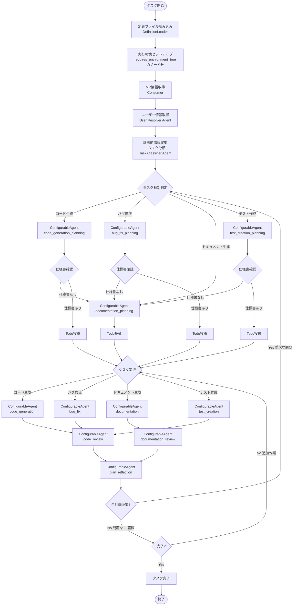
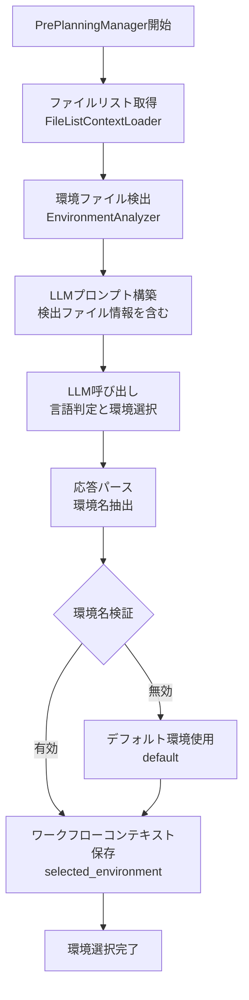
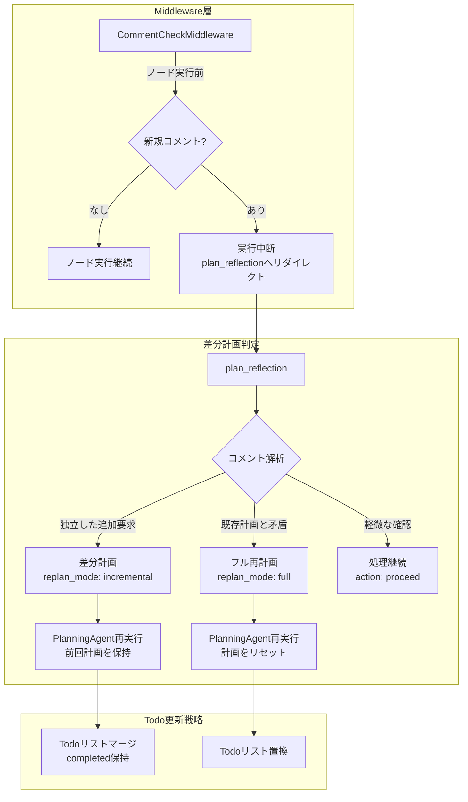
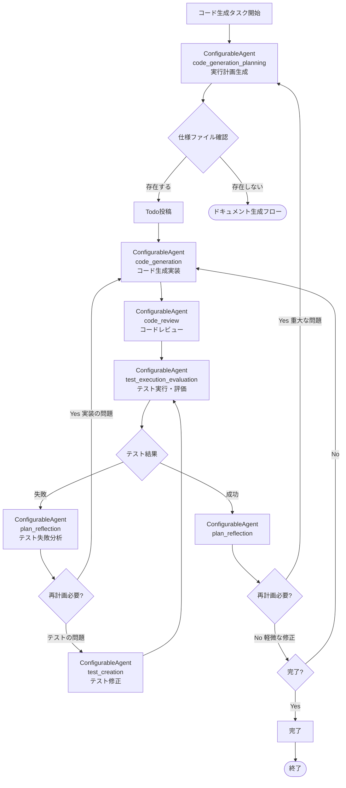
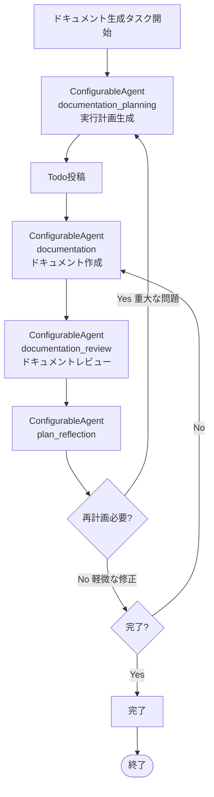
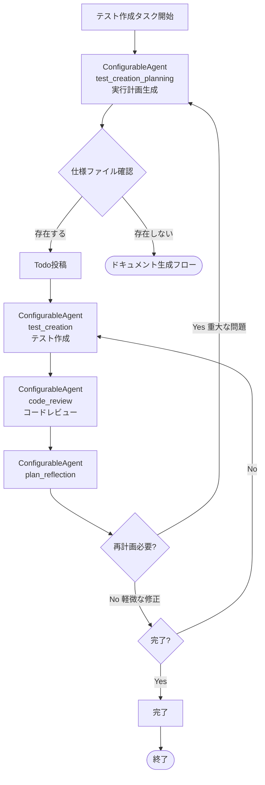

# 標準MR処理フロー詳細設計書

**参考**: [CODE_AGENT_ORCHESTRATOR_SPEC.md](CODE_AGENT_ORCHESTRATOR_SPEC.md) | [GRAPH_DEFINITION_SPEC.md](GRAPH_DEFINITION_SPEC.md) | [AGENT_DEFINITION_SPEC.md](AGENT_DEFINITION_SPEC.md) | [PROMPTS.md](PROMPTS.md)

## 1. 概要

### 1.1 本ドキュメントの目的

本ドキュメントは、GitLab Coding Agentシステムにおける**標準MR処理フロー（standard_mr_processing）**の動作を詳細に説明します。標準MR処理フローは、システムが提供する最も基本的なワークフロープリセットであり、以下の4つのタスク種別に対応します：

- **コード生成**: 新規機能の実装
- **バグ修正**: 既存コードの不具合修正
- **ドキュメント生成**: 仕様書、README、API仕様等の作成
- **テスト作成**: ユニット・統合・E2Eテストの作成

### 1.2 説明範囲

本ドキュメントでは以下を説明します：

- 標準MR処理フローで使用されるエージェント一覧と役割
- MR処理の全体フロー（フェーズ構成と遷移条件）
- 各フェーズの詳細な処理内容
- タスク種別ごとの詳細フロー（4種類）
- 仕様ファイル管理の仕組み

**本ドキュメントで説明しないもの**:
- システムの実装設計（Factory、オブジェクト管理、状態管理等）→ [CODE_AGENT_ORCHESTRATOR_SPEC.md](CODE_AGENT_ORCHESTRATOR_SPEC.md)を参照
- Issue→MR変換フロー → [CODE_AGENT_ORCHESTRATOR_SPEC.md セクション5.0](CODE_AGENT_ORCHESTRATOR_SPEC.md#50-issuemr変換フロー前処理)を参照
- 進捗報告機能 → [CODE_AGENT_ORCHESTRATOR_SPEC.md セクション6](CODE_AGENT_ORCHESTRATOR_SPEC.md#6-進捗報告機能)を参照
- グラフ/エージェント/プロンプト定義の詳細仕様 → 各専用ドキュメントを参照

### 1.3 関連ドキュメント

- **システム全体設計**: [CODE_AGENT_ORCHESTRATOR_SPEC.md](CODE_AGENT_ORCHESTRATOR_SPEC.md)
- **グラフ定義**: [GRAPH_DEFINITION_SPEC.md](GRAPH_DEFINITION_SPEC.md) | [standard_mr_processing_graph.json](definitions/standard_mr_processing_graph.json)
- **エージェント定義**: [AGENT_DEFINITION_SPEC.md](AGENT_DEFINITION_SPEC.md) | [standard_mr_processing_agents.json](definitions/standard_mr_processing_agents.json)
- **プロンプト定義**: [PROMPT_DEFINITION_SPEC.md](PROMPT_DEFINITION_SPEC.md) | [PROMPTS.md](PROMPTS.md) | [standard_mr_processing_prompts.json](definitions/standard_mr_processing_prompts.json)

---

## 2. エージェント構成

すべてのエージェントノードは同一の`ConfigurableAgent`クラスで実装される。エージェント定義IDによって動作が決まる。

| エージェント定義ID | 役割 | 入力コンテキストキー | 出力コンテキストキー |
|--------------|------|------|------|
| task_classifier | タスク分類 | task_context | classification_result |
| code_generation_planning | コード生成タスクの実行計画生成 | task_context, classification_result | plan_result, todo_list |
| bug_fix_planning | バグ修正タスクの実行計画生成 | task_context, classification_result | plan_result, todo_list |
| test_creation_planning | テスト作成タスクの実行計画生成 | task_context, classification_result | plan_result, todo_list |
| documentation_planning | ドキュメント生成タスクの実行計画生成 | task_context, classification_result | plan_result, todo_list |
| plan_reflection | プラン検証・改善 | plan_result, todo_list, task_context | reflection_result |
| code_generation | コード生成実装 | plan_result, task_context | execution_result |
| bug_fix | バグ修正実装 | plan_result, task_context | execution_result |
| documentation | ドキュメント作成 | plan_result, task_context | execution_result |
| test_creation | テスト作成 | plan_result, task_context | execution_result |
| test_execution_evaluation | テスト実行・評価 | execution_result, task_context | review_result |
| code_review | コードレビュー実施 | execution_result, task_context | review_result |
| documentation_review | ドキュメントレビュー実施 | execution_result, task_context | review_result |

### 2.1 共通実装ルール

**プロンプト管理**:
- 各エージェントノードのデフォルトプロンプト詳細は[PROMPTS.md](PROMPTS.md)および[プロンプト定義ファイル](PROMPT_DEFINITION_SPEC.md)を参照
- プロンプト定義ファイルはユーザーごとに選択・カスタマイズ可能（`workflow_definitions`テーブルで管理）
- プロンプト取得優先順位:
  1. ユーザーが選択した`workflow_definitions`内のプロンプト定義
  2. [PROMPTS.md](PROMPTS.md)のデフォルトプロンプト
- **システムプリセットのプロンプト定義例**: [standard_mr_processing_prompts.json](definitions/standard_mr_processing_prompts.json)
- LLM呼び出し時には、プロンプト冒頭にAGENTS.mdの内容を含める

**プロンプト設定実装**:
- `AgentFactory`が`ConfigurableAgent`生成時にプロンプト定義ファイルから対応するプロンプトを取得する
- `ChatClientAgentOptions.instructions`にプロンプトを設定する

---

## 3. MR処理の全体フロー

**Agent Frameworkワークフロー実装**:
- グラフ定義ファイルに定義されたフローに従い、`WorkflowBuilder`でノードをステップとして登録する
- 各ノードは同一の`ConfigurableAgent`クラスで実装し、エージェント定義ファイルの設定によって動作を制御する
- `IWorkflowContext`でステップ間のデータ（プラン、実行結果等）を共有する
- Agent FrameworkのGraph-based Workflows機能を使用して分岐とループを実現する
- グラフ定義ファイルで`requires_environment: true`が設定されたノードに対しては、ワークフロー開始前にDocker実行環境を準備する

**注**: Issue→MR変換後、作成されたMRは次回のワークフロー実行時に以下のフローで処理される。グラフ内の各ノード（Code Generation Planning Agent等）はすべて`ConfigurableAgent`の同一クラスであり、グラフ定義ファイル・エージェント定義ファイル・プロンプト定義ファイルによって動作が決まる。



### 3.1 主要ノード構成

| フェーズ | エージェント定義ID | 目的 |
|---------|---------------|------|
| 定義読み込み | DefinitionLoader | グラフ/エージェント/プロンプト定義をロード |
| 環境セットアップ | EnvironmentSetupExecutor | requires_environment=trueノード分の環境を準備 |
| Issue/MR取得 | Consumer | RabbitMQからタスクデキュー |
| ユーザー情報取得 | User Resolver Agent | OpenAI APIキー・LLM設定取得 |
| 計画前情報収集 | task_classifier | タスク種別判定（4種類） |
| 計画 | code_generation_planning / bug_fix_planning / test_creation_planning / documentation_planning | タスク種別別実行プラン生成 |
| 実行 | code_generation / bug_fix / documentation / test_creation | タスク実装 |
| レビュー | code_review / documentation_review | 品質確認 |
| テスト実行・評価 | test_execution_evaluation | テスト実行・結果評価（コード生成/バグ修正のみ） |
| リフレクション | plan_reflection | 結果評価・再計画判断 |

### 3.2 重要なフロー特性

1. **同一クラスによる実装**: すべてのグラフノードは`ConfigurableAgent`クラスで実装し、エージェント定義IDによって動作が異なる
2. **設定ベースの柔軟性**: グラフ定義・エージェント定義・プロンプト定義を変更することでコード変更なしにフローを変更可能
3. **仕様ファイル必須（コード生成系）**: コード生成、バグ修正、テスト作成で仕様ファイルがなければドキュメント生成計画を立案し、仕様書作成後にタスク完了
4. **自動レビュー**: 実行後に必ずレビューエージェントが品質確認（ユーザー承認不要）
5. **再計画ループ**: レビューで重大な問題があれば計画フェーズに戻る
6. **複数環境サポート**: グラフ定義で`requires_environment: true`のノードに対してDocker環境を事前準備

---

## 4. フェーズ詳細

### 4.1 計画前情報収集フェーズ

**目的**: タスク種別を判定し、計画に必要な情報を収集し、実行環境を選択する

**使用エージェント**: 
- `ConfigurableAgent`（エージェント定義: `task_classifier`）
- `PrePlanningManager`（計画前情報収集・環境選択）

**実行内容**:
1. Issue/MR内容の解析
   - タイトル、説明文、ラベルの分析
   - 添付ファイル、コメントの確認
2. タスク種別の判定
   - **コード生成**: 新規機能実装、新規ファイル作成の要求
   - **バグ修正**: エラーメッセージ、スタックトレース、再現手順が含まれる
   - **ドキュメント生成**: README、API仕様、運用手順等のドキュメント要求
   - **テスト作成**: テストコード、テストケース追加の要求
3. リポジトリ構造の把握
4. 関連ファイルの特定
5. **環境情報の収集と実行環境の選択**（PrePlanningManager）:
   - EnvironmentAnalyzerを使用して環境構築関連ファイルを検出
   - 検出されたファイル情報をLLMに渡してプロジェクト言語を判定
   - LLMが適切な環境名（python, miniforge, node, default）を選択
   - 選択された環境名をワークフローコンテキストに保存

**環境選択の処理フロー**:



**LLMへのプロンプト内容**:
- 検出された環境ファイルの一覧（requirements.txt, package.json等）
- 各ファイルの種別（python, node, conda等）
- 利用可能な環境名の一覧（python, miniforge, node, default）
- 判定基準（複数言語の場合の優先順位等）

**出力**:
- `selected_environment`: 選択された環境名（python, miniforge, node, default）
- `environment_detection_details`: 検出されたファイル情報と判定理由
- `classification_result`: タスク種別の判定結果

**プロンプト詳細**: [PROMPTS.md セクション1](PROMPTS.md#1-task-classifier-agent) および [プロンプト定義ファイル](definitions/standard_mr_processing_prompts.json)を参照

### 4.2 計画フェーズ

**目的**: タスク種別に応じた実行可能なアクションプランを生成する

**使用エージェント**: `ConfigurableAgent`（エージェント定義: `code_generation_planning` / `bug_fix_planning` / `test_creation_planning` / `documentation_planning`）

**実行内容**:
1. 目標の明確化 (Goal Understanding)
2. タスク分解 (Task Decomposition)
3. アクション系列生成 (Action Sequence Generation)
4. **Todoリストの作成**: `create_todo_list` ツールで構造化
5. **仕様ファイル確認**: 
   - コード生成系タスク（バグ修正、テスト作成）の場合、関連する仕様/設計ファイル（Markdown）の存在確認
   - ファイルパス: `docs/SPEC_*.md`, `docs/DESIGN_*.md`, `SPECIFICATION.md` 等
6. 依存関係の定義

**出力形式**: 以下の情報を含むJSONオブジェクトを返す
- `goal`: 目標の明確な記述
- `task_type`: タスク種別（code_generation / bug_fix / documentation / test_creation）
- `spec_file_path`: 仕様ファイルのパス
- `spec_file_exists`: 仕様ファイルの存在可否（true/false）
- `transition_to_doc_generation`: ドキュメント生成への遷移が必要か（true/false）
- `success_criteria`: 完了基準のリスト
- `subtasks`: サブタスクの一覧（id, description, dependencies）
- `actions`: 実行アクションの一覧（action_id, task_id, agent, tool, purpose）

**仕様ファイルがない場合の処理**:
- コード生成系タスク（`code_generation`, `bug_fix`, `test_creation`）で `spec_file_exists: false` の場合
- `documentation_planning`エージェント定義を使用したドキュメント生成のための計画を立案
- `documentation`エージェント定義 → `documentation_review`エージェント定義 で仕様書を作成
- `plan_reflection`エージェント定義で問題があれば再計画
- 問題なければ仕様書作成完了で終了（コード生成/バグ修正/テスト作成は実行しない）

### 4.3 実行フェーズ

**目的**: 計画されたアクションを実行する

**使用エージェント**: `ConfigurableAgent`（エージェント定義: `code_generation` / `bug_fix` / `documentation` / `test_creation`）

**実行内容**:
1. タスク種別別実行
   - **`code_generation`エージェント定義**: 新規コード生成
   - **`bug_fix`エージェント定義**: バグ修正実装
   - **`documentation`エージェント定義**: ドキュメント作成
   - **`test_creation`エージェント定義**: テストコード作成
2. **進捗報告** (各ステップでMRにコメント投稿)
   - 現在のフローステータスをMRにコメント
   - LLMの応答をMRコメントとして投稿
   - エラー発生時の詳細情報もコメントで通知
3. 結果記録
   - 実行結果のコンテキスト保存
   - **Todo状態更新**: `update_todo_status` ツールで更新
   - **GitLabへの進捗同期**: `sync_to_gitlab` ツールで反映

**注意**: LLMは直接GitLab APIを呼び出すことはしません。LLMの応答（コード生成結果、レビューコメント等）はシステム側が処理し、GitLab API経由でIssue/MRにコメントとして投稿します。

**リトライポリシー**:
- HTTP 5xx エラー: 3回リトライ (指数バックオフ)
- ツール実行エラー: 2回リトライ
- LLM APIエラー: 3回リトライ

### 4.4 レビューフェーズ

**目的**: 実装の品質を確認する

**使用エージェント**: Code Review Agent / Documentation Review Agent

**実行内容**:
1. **タスク種別による分岐**
   - コード生成・バグ修正・テスト作成 → Code Review Agent
   - ドキュメント生成 → Documentation Review Agent
2. **Code Review Agentの場合**
   - コード品質チェック（規約準拠、命名規則）
   - ロジックレビュー（バグ、パフォーマンス）
   - テストカバレッジ確認
   - セキュリティリスク確認
   - 仕様書との整合性確認
3. **Documentation Review Agentの場合**
   - 内容の正確性
   - 構造と可読性
   - 完全性
   - コードとの整合性
4. **レビュー結果の判定**
   - **問題なし**: テスト実行・評価フェーズへ（コード生成・バグ修正の場合）またはリフレクションへ（ドキュメント生成・テスト作成の場合）
   - **軽微な問題**: リフレクションで修正アクション生成
   - **重大な問題**: リフレクションで再計画判断

### 4.5 テスト実行・評価フェーズ（コード生成・バグ修正のみ）

**目的**: 実装したコードの動作を検証し、テスト結果を評価する

**使用エージェント**: Test Execution & Evaluation Agent

**適用タスク**: コード生成、バグ修正（ドキュメント生成、テスト作成では実行しない）

**実行内容**:
1. **テスト環境のセットアップ**
   - Docker環境の準備
   - 依存関係のインストール
   - テストデータの準備
2. **テストコードの実行**
   - 既存のテストコードを実行（ユニット、統合、E2E）
   - バグ修正の場合は回帰テストを重点的に実施
   - テスト実行時間の測定
3. **テスト結果の収集**
   - 成功/失敗の判定
   - カバレッジ情報の取得
   - エラーメッセージ、スタックトレースの収集
4. **テスト結果の評価**
   - **成功率**: 全テスト成功 → リフレクションフェーズへ
   - **失敗時**: 失敗原因の分析
     - 実装の問題（バグ、ロジックエラー）→ 実装フェーズに戻って修正
     - テストの問題（テストケースの誤り）→ Test Creation Agentでテスト修正
   - **カバレッジ**: 80%以上を目標、不足時は追加テスト作成を提案
5. **テスト結果レポートの生成**
   - GitLabにコメント投稿（テスト結果サマリ、カバレッジ情報）
   - 失敗時は詳細な原因と修正提案を記載
6. **結果の記録**
   - テスト結果をコンテキストに保存
   - Todo状態更新

**分岐ロジック**:
- **テスト成功** → リフレクションフェーズへ
- **テスト失敗（実装の問題）** → 実行フェーズへ（コード修正）
- **テスト失敗（テストの問題）** → テスト修正後、再度テスト実行

### 4.6 リフレクションフェーズ

**目的**: レビュー結果を評価し、再計画の必要性を判断する

**使用エージェント**: `ConfigurableAgent`（エージェント定義: `plan_reflection`）

**実行タイミング**:
- レビューで問題が検出された時
- アクション失敗時
- ユーザーコメント受信時

**評価項目**:
- レビューコメントの重大度
- 修正の複雑さ
- 計画との乖離
- 代替アプローチの検討

**出力形式**: 以下の情報を含むJSONオブジェクトを返す（`reflection`キー配下）
- `status`: 評価結果（success / needs_revision / needs_replan）
- `review_issues`: レビュー指摘の一覧（severity: critical/major/minor, description, suggestion）
- `plan_revision_needed`: 計画修正が必要か（true/false）
- `revision_actions`: 修正アクションの一覧（action_id, purpose, agent）
- `replan_reason`: 再計画が必要な理由（needs_replanの場合）

**分岐ロジック**:
- `success` → 完了処理へ
- `needs_revision` (軽微な問題) → 実行フェーズへ（修正アクション）
- `needs_replan` (重大な問題) → 計画フェーズへ（再計画ループ）

**再計画判断基準**:
- **needs_replan**: アーキテクチャの根本的な問題、仕様との大幅な乖離、セキュリティの重大な欠陥
- **needs_revision**: コーディング規約違反、軽微なバグ、ドキュメントの不備

### 4.7 差分計画パターン（ユーザーコメント対応）

**目的**: ワークフロー実行中にユーザーが新規コメントを追加した場合、その内容を既存計画に反映する

**実装アプローチ**: Middleware による透過的なコメント監視 + 差分計画パターン

**アーキテクチャ**:



#### 4.7.1 Middleware実装の特徴

- **透過的**: グラフ構造を汚さず、ビジネスロジックに集中できる
- **宣言的**: ノードmetadataで`check_comments_before: true`と指定するのみ
- **一元管理**: コメントチェックロジックが1箇所に集約され保守性が高い
- **柔軟な適用**: 必要なノードにのみ適用可能

#### 4.7.2 コンテキストキーの拡張

| キー | 内容 | 設定タイミング |
|------|------|-------------|
| `previous_plan_result` | 前回の計画内容 | 再計画時にWorkflowFactoryが`plan_result`をコピー |
| `replan_reason` | 再計画理由 | `reflection_result.replan_reason`から抽出 |
| `user_new_comments` | 新規コメント配列 | CommentCheckMiddlewareが検出 |
| `replan_mode` | 再計画モード（full/incremental） | plan_reflectionが判定 |
| `plan_history` | 計画履歴（オプション） | 複数回の再計画に対応 |

#### 4.7.3 処理フロー

1. **Middleware介入**: ノード実行前にCommentCheckMiddlewareが自動的に新規コメントをチェック（対象ノードのmetadata.check_comments_before: trueの場合のみ）
2. **コンテキスト追加**: 新規コメントがあれば`user_new_comments`キーに格納
3. **実行中断とリダイレクト**: 新規コメント検出時は現在のノード実行を中断し、`plan_reflection`へリダイレクト
4. **差分計画判定**: `plan_reflection`エージェントが新規コメントを解析
   - **独立した追加要求**: `replan_mode: incremental`で差分計画
   - **既存計画と矛盾**: `replan_mode: full`でフル再計画
   - **軽微な確認**: `action: proceed`で処理継続
5. **計画再実行**: PlanningAgentが`previous_plan_result`と`user_new_comments`を受け取って差分計画
6. **Todoリスト更新**:
   - **incremental**: 既存Todoリスト（completed/in-progressを保持）に新規Todoを追加
   - **full**: Todoリストを完全に置き換え

#### 4.7.4 reflection_result出力形式の拡張

```json
{
  "reflection_result": {
    "status": "needs_replan",
    "action": "revise_plan",
    "replan_mode": "incremental",
    "replan_reason": "User requested additional error handling for edge case Y",
    "affected_todos": [3, 5],
    "new_requirements": [
      {
        "type": "feature_addition",
        "description": "Add validation for null inputs",
        "priority": "high",
        "independent_from_existing": true
      }
    ],
    "conflicts": []
  }
}
```

#### 4.7.5 グラフ定義での実装

- Planningノード群に`metadata.check_comments_before: true`を追加
- Plan Reflectionノードに`metadata.check_comments_before: true`を追加
- Executionノード群に`metadata.check_comments_before: true`を追加（必要に応じて）
- 明示的な`CommentMonitorExecutor`ノードは不要

#### 4.7.6 エージェント定義での実装

- 全PlanningAgentの`input_keys`に`["previous_plan_result", "replan_reason", "user_new_comments", "delta_requirements"]`を追加
- `plan_reflection`の`output_keys`に`replan_mode`, `delta_requirements`を追加
- `metadata.todo_list_strategy`で更新戦略（merge/replace）を指定

#### 4.7.7 プロンプト定義での実装

- PlanningAgentのシステムプロンプトに再計画時の追加指示を記載
- `plan_reflection`のシステムプロンプトに差分計画判定の指示を追加

#### 4.7.8 利点

- **グラフがシンプル**: ビジネスロジックに集中、横断的関心事は分離
- **保守性向上**: コメントチェックロジックが一元管理される
- **既存作業を活用**: 完了済みTodoを保持し、差分のみ追加
- **柔軟な対応**: 差分/フル/継続を状況に応じてLLMが判断
- **適用漏れ防止**: metadataで宣言的に指定するため明確

詳細な実装方法は[CODE_AGENT_ORCHESTRATOR_SPEC.md セクション8.9 Middleware機構](CODE_AGENT_ORCHESTRATOR_SPEC.md#89-middleware機構)を参照。

---

## 5. タスク種別別詳細フロー

### 5.1 コード生成フロー



**フロー詳細**:
1. `code_generation_planning`エージェント定義のConfigurableAgentが実行計画を生成
2. 関連する仕様ファイルの存在確認
3. **仕様ファイルがない場合**:
   - `documentation_planning`エージェント定義のConfigurableAgentがドキュメント生成計画を立案
   - `documentation`エージェント定義のConfigurableAgentが仕様書を作成
   - `documentation_review`エージェント定義のConfigurableAgentが自動レビュー（ユーザー承認不要）
   - `plan_reflection`エージェント定義のConfigurableAgentで問題があれば再計画（ドキュメント生成）
   - 問題なければ仕様書作成完了で終了（コード生成は実行しない）
4. **仕様ファイルがある場合**:
   - `code_generation`エージェント定義のConfigurableAgentが新規コード生成
   - `code_review`エージェント定義のConfigurableAgentがコードレビュー（仕様書との整合性を含む）
   - **`test_execution_evaluation`エージェント定義のConfigurableAgentがテスト実行・評価**
     - 既存のテストコードを実行（ユニット、統合、E2E）
     - テスト結果を評価（成功率、カバレッジ、失敗原因）
     - **テスト失敗時**: `plan_reflection`エージェント定義で原因分析
       - 実装の問題 → `code_generation`エージェント定義に戻って修正
       - テストの問題 → `test_creation`エージェント定義でテスト修正
     - **テスト成功時**: `plan_reflection`フェーズへ進む
   - `plan_reflection`エージェント定義で問題を評価
     - 重大な問題（アーキテクチャ、仕様乖離）→ 再計画
     - 軽微な修正（コーディング規約）→ 修正後完了チェック
   - 問題なければ完了

### 5.2 バグ修正フロー


**フロー詳細**:
1. `bug_fix_planning`エージェント定義のConfigurableAgentが実行計画を生成
2. 関連する仕様ファイル（バグ修正対象機能の仕様）の存在確認
3. **仕様ファイルがない場合**:
   - `documentation_planning`エージェント定義のConfigurableAgentがドキュメント生成計画を立案
   - `documentation`エージェント定義のConfigurableAgentが仕様書を作成
   - `documentation_review`エージェント定義のConfigurableAgentが自動レビュー（ユーザー承認不要）
   - `plan_reflection`エージェント定義のConfigurableAgentで問題があれば再計画（ドキュメント生成）
   - 問題なければ仕様書作成完了で終了（バグ修正は実行しない）
4. **仕様ファイルがある場合**:
   - `bug_fix`エージェント定義のConfigurableAgentがバグ修正を実装
   - `code_review`エージェント定義のConfigurableAgentがコードレビュー（仕様書との整合性を含む）
   - **`test_execution_evaluation`エージェント定義のConfigurableAgentがテスト実行・評価**
     - 既存のテストコードを実行（回帰テスト含む）
     - テスト結果を評価（バグ修正の検証、副作用の検出）
     - **テスト失敗時**: `plan_reflection`エージェント定義で原因分析
       - 修正の問題（バグが残っている、新たなバグ）→ `bug_fix`エージェント定義に戻って修正
       - テストの問題（テストケースの誤り）→ `test_creation`エージェント定義でテスト修正
     - **テスト成功時**: `plan_reflection`フェーズへ進む
   - `plan_reflection`エージェント定義で問題を評価
     - 重大な問題（根本原因の誤認識）→ 再計画
     - 軽微な修正（コーディング規約）→ 修正後完了チェック
   - 問題なければ完了

### 5.3 ドキュメント生成フロー



**フロー詳細**:
1. `documentation_planning`エージェント定義のConfigurableAgentが実行計画を生成
2. `documentation`エージェント定義のConfigurableAgentがドキュメントを作成（README、API仕様、運用手順、仕様書等）
3. `documentation_review`エージェント定義のConfigurableAgentが自動レビュー（正確性、構造、完全性）
4. `plan_reflection`エージェント定義のConfigurableAgentで問題を評価
   - 重大な問題（技術的誤り、構造の欠陥）→ 再計画
   - 軽微な修正（表記ゆれ、リンク切れ）→ 修正後完了チェック
5. 問題なければ完了

**注意**: ドキュメント生成タスクでは仕様ファイル確認は不要（作成するのがドキュメント自体のため）

### 5.4 テスト作成フロー



**フロー詳細**:
1. `test_creation_planning`エージェント定義のConfigurableAgentが実行計画を生成
2. テスト対象コードの仕様ファイルの存在確認
3. **仕様ファイルがない場合**:
   - `documentation_planning`エージェント定義のConfigurableAgentがドキュメント生成計画を立案
   - `documentation`エージェント定義のConfigurableAgentが仕様書を作成
   - `documentation_review`エージェント定義のConfigurableAgentが自動レビュー（ユーザー承認不要）
   - `plan_reflection`エージェント定義のConfigurableAgentで問題があれば再計画（ドキュメント生成）
   - 問題なければ仕様書作成完了で終了（テスト作成は実行しない）
4. **仕様ファイルがある場合**:
   - `test_creation`エージェント定義のConfigurableAgentがテストコードを作成（ユニット/統合/E2E）
   - `code_review`エージェント定義のConfigurableAgentがテストコードをレビュー（網羅性、品質、仕様書との整合性）
   - `plan_reflection`エージェント定義のConfigurableAgentで問題を評価
     - 重大な問題（テスト戦略の誤り）→ 再計画
     - 軽微な修正（テストケースの追加）→ 修正後完了チェック
   - 問題なければ完了

---

## 6. 仕様ファイル管理

### 6.1 仕様ファイル命名規則

コード生成系タスク（コード生成、バグ修正、テスト作成）では、以下の命名規則で仕様ファイルを探索：

```
docs/SPEC_<機能名>.md
docs/DESIGN_<機能名>.md
docs/specifications/<機能名>.md
SPECIFICATION.md
README.md (関連セクション)
```

**例**:
- ユーザー認証機能 → `docs/SPEC_USER_AUTH.md`
- API設計 → `docs/DESIGN_API.md`
- データベース → `docs/SPEC_DATABASE.md`

### 6.2 仕様ファイル作成テンプレート

Documentation Agentが仕様を作成する際のテンプレート：

**セクション構成**:
1. **概要**: 機能の目的と概要
2. **要件**: 機能要件、非機能要件
3. **設計**: アーキテクチャ図（mermaid）、データモデル、インターフェース
4. **実装詳細**: 具体的な処理フロー、アルゴリズム
5. **テスト方針**: テストケース、カバレッジ目標

**アーキテクチャ図の例**:
- mermaid形式のフローチャート、シーケンス図、クラス図を使用
- コンポーネント間の関係性を明示

### 6.3 自動レビュープロセス

仕様ファイル作成後の自動レビューフロー：

1. Documentation Agentが仕様を作成
2. Documentation Review Agentが自動レビュー
   - 内容の正確性（技術的な誤りがないか）
   - 構造の妥当性（見出し階層、セクション構成）
   - 完全性（必要な情報が網羅されているか）
   - コードとの整合性（既存コードとの矛盾がないか）
3. リフレクションで問題を評価
   - **重大な問題**: 技術的誤り、仕様の矛盾 → 再計画（ドキュメント生成計画へ戻る）
   - **軽微な問題**: 表記ゆれ、構造の改善 → 修正後に元のタスクへ復帰
   - **問題なし**: 元のタスク（コード生成/バグ修正/テスト作成）へ復帰
4. 元のタスクの計画フェーズに戻り、作成した仕様書を使用して再計画

**ユーザー承認は不要**: Documentation Review Agentの自動レビューのみで判断し、即座に次フェーズへ進む

---

## 7. まとめ

本ドキュメントでは、標準MR処理フロー（standard_mr_processing）の動作を詳細に説明しました。

### 7.1 主要な特徴

1. **4つのタスク種別対応**: コード生成、バグ修正、ドキュメント生成、テスト作成
2. **設定ベースの柔軟性**: グラフ/エージェント/プロンプト定義の変更でフロー変更が可能
3. **仕様ファイル必須**: コード生成系タスクでは仕様ファイルがない場合、自動的にドキュメント生成フローに遷移
4. **自動レビュー**: ユーザー承認なしで品質確認を実施
5. **再計画ループ**: 重大な問題が発生した場合は計画フェーズに戻る
6. **差分計画パターン**: ユーザーコメント対応時に既存作業を保持しながら差分のみ追加

### 7.2 重要なポイント

- すべてのエージェントノードは`ConfigurableAgent`クラスで統一実装
- エージェント定義IDによって動作が決定される
- グラフ定義・エージェント定義・プロンプト定義の3点セットで1つのワークフローを構成
- ユーザーごとに定義をカスタマイズ可能

### 7.3 関連ドキュメント

実装設計の詳細については以下のドキュメントを参照してください：

- **システム全体設計**: [CODE_AGENT_ORCHESTRATOR_SPEC.md](CODE_AGENT_ORCHESTRATOR_SPEC.md)
- **グラフ定義**: [GRAPH_DEFINITION_SPEC.md](GRAPH_DEFINITION_SPEC.md)
- **エージェント定義**: [AGENT_DEFINITION_SPEC.md](AGENT_DEFINITION_SPEC.md)
- **プロンプト定義**: [PROMPT_DEFINITION_SPEC.md](PROMPT_DEFINITION_SPEC.md) | [PROMPTS.md](PROMPTS.md)
