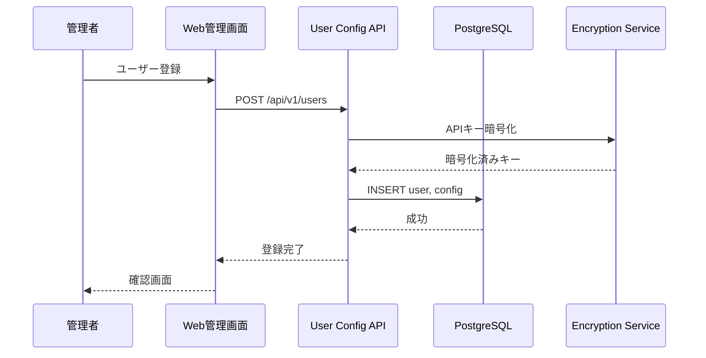

# ユーザー管理システム 詳細設計書

## 1. 概要

Issue/MRの作成者メールアドレスをキーとして、ユーザーごとのOpenAI APIキーと設定を管理する。これにより、複数ユーザーが同一エージェントシステムを利用しながら、各自のAPIキーとコストを分離できる。

## 2. ユーザー登録フロー

## 3. データベース設計

### 3.1 users テーブル

| カラム | 型 | 制約 | 説明 |
|-------|------|------|------|
| id | INTEGER | PK, AUTO | ユーザーID |
| email | TEXT | UNIQUE, NOT NULL | メールアドレス |
| display_name | TEXT | | 表示名 |
| is_active | BOOLEAN | DEFAULT true | アクティブフラグ |
| created_at | TIMESTAMP | NOT NULL | 作成日時 |
| updated_at | TIMESTAMP | | 更新日時 |

### 3.2 user_configs テーブル

| カラム | 型 | 制約 | 説明 |
|-------|------|------|------|
| id | INTEGER | PK, AUTO | 設定ID |
| user_id | INTEGER | FK(users.id), UNIQUE | ユーザーID |
| llm_provider | TEXT | NOT NULL | LLMプロバイダ |
| openai_api_key_encrypted | TEXT | | 暗号化済みAPIキー |
| openai_model | TEXT | | 使用モデル |
| ollama_endpoint | TEXT | | Ollamaエンドポイント |
| ollama_model | TEXT | | Ollamaモデル |
| lmstudio_base_url | TEXT | | LM StudioベースURL |
| lmstudio_model | TEXT | | LM Studioモデル |
| system_prompt_override | TEXT | | カスタムシステムプロンプト（非推奨、agent_prompt_overridesテーブル使用推奨） |
| created_at | TIMESTAMP | NOT NULL | 作成日時 |
| updated_at | TIMESTAMP | | 更新日時 |

### 3.3 agent_prompt_overrides テーブル

エージェントごとのプロンプト上書き設定を管理する。ユーザーは各エージェントのプロンプトを個別にカスタマイズできる。

| カラム | 型 | 制約 | 説明 |
|-------|------|------|------|
| id | INTEGER | PK, AUTO | ID |
| user_id | INTEGER | FK(users.id), NOT NULL | ユーザーID |
| agent_name | TEXT | NOT NULL | エージェント名（task_classifier, code_generation_planning等） |
| prompt_override | TEXT | NOT NULL | カスタムプロンプト（PROMPTS.mdのデフォルトプロンプトを上書き） |
| created_at | TIMESTAMP | NOT NULL | 作成日時 |
| updated_at | TIMESTAMP | | 更新日時 |

**制約**:
- UNIQUE(user_id, agent_name) - 1ユーザーにつき1エージェント1プロンプト

**エージェント名一覧**:
- `task_classifier` - Task Classifier Agent
- `code_generation_planning` - Code Generation Planning Agent
- `bug_fix_planning` - Bug Fix Planning Agent
- `test_creation_planning` - Test Creation Planning Agent
- `documentation_planning` - Documentation Planning Agent
- `plan_reflection` - Plan Reflection Agent
- `code_generation` - Code Generation Agent
- `bug_fix` - Bug Fix Agent
- `documentation` - Documentation Agent
- `test_creation` - Test Creation Agent
- `test_execution_evaluation` - Test Execution & Evaluation Agent
- `code_review` - Code Review Agent
- `documentation_review` - Documentation Review Agent

### 3.4 todos テーブル

| カラム | 型 | 制約 | 説明 |
|-------|------|------|------|
| id | INTEGER | PK, AUTO | Todo ID |
| project_id | TEXT | NOT NULL | GitLabプロジェクトID |
| issue_iid | INTEGER | | Issue IID（NULL許可） |
| mr_iid | INTEGER | | MR IID（NULL許可） |
| parent_todo_id | INTEGER | FK(todos.id) | 親TodoのID（階層構造） |
| title | TEXT | NOT NULL | Todoのタイトル |
| description | TEXT | | Todoの詳細説明 |
| status | TEXT | NOT NULL | 状態（not-started/in-progress/completed/failed） |
| order_index | INTEGER | NOT NULL | 表示順序 |
| created_at | TIMESTAMP | NOT NULL | 作成日時 |
| updated_at | TIMESTAMP | | 更新日時 |
| completed_at | TIMESTAMP | | 完了日時 |

**インデックス**:
- `idx_todos_issue` ON (`project_id`, `issue_iid`)
- `idx_todos_mr` ON (`project_id`, `mr_iid`)
- `idx_todos_parent` ON (`parent_todo_id`)

**制約**:
- CHK: `issue_iid` と `mr_iid` のいずれかが NOT NULL
- CHK: `status` IN ('not-started', 'in-progress', 'completed', 'failed')

### 3.5 workflow_definitions テーブル

グラフ定義・エージェント定義・プロンプト定義のセット（ワークフロープリセット）を管理する。

| カラム | 型 | 制約 | 説明 |
|-------|------|------|------|
| id | INTEGER | PK, AUTO | 定義ID |
| name | TEXT | NOT NULL | プリセット名（例: "標準MR処理"） |
| description | TEXT | | 説明文 |
| graph_definition | JSONB | NOT NULL | グラフ定義（ノード・エッジ・条件分岐） |
| agent_definition | JSONB | NOT NULL | エージェント定義（各ノードのエージェント設定・ステップ間データ定義） |
| prompt_definition | JSONB | NOT NULL | プロンプト定義（各エージェントのシステムプロンプト・LLMパラメータ） |
| is_preset | BOOLEAN | DEFAULT false | システムプリセットフラグ（true=システム提供、false=ユーザー作成） |
| created_by | INTEGER | FK(users.id) | 作成者ユーザーID（NULLはシステム作成） |
| created_at | TIMESTAMP | NOT NULL | 作成日時 |
| updated_at | TIMESTAMP | | 更新日時 |

**制約**:
- システムプリセット（is_preset=true）はユーザーによる削除・変更不可

**システム提供プリセット一覧**:
- `standard_mr_processing` - 標準MR処理（デフォルト）
- `multi_codegen_mr_processing` - コード生成を複数モデル・温度設定で並列実行

### 3.6 user_workflow_settings テーブル

ユーザーごとのワークフロー定義選択を管理する。

| カラム | 型 | 制約 | 説明 |
|-------|------|------|------|
| id | INTEGER | PK, AUTO | 設定ID |
| user_id | INTEGER | FK(users.id), UNIQUE | ユーザーID |
| workflow_definition_id | INTEGER | FK(workflow_definitions.id), NOT NULL | 使用するワークフロー定義ID |
| created_at | TIMESTAMP | NOT NULL | 作成日時 |
| updated_at | TIMESTAMP | | 更新日時 |

**制約**:
- UNIQUE(user_id) - 1ユーザーにつき1つのワークフロー設定

### 3.7 token_usage テーブル

ユーザー別のLLMトークン使用量を記録する。

| カラム | 型 | 制約 | 説明 |
|-------|------|------|------|
| id | SERIAL | PK | 統計ID |
| user_id | INTEGER | FK(users.id), NOT NULL | ユーザーID |
| task_uuid | TEXT | NOT NULL | タスクUUID |
| prompt_tokens | INTEGER | NOT NULL DEFAULT 0 | プロンプトトークン数 |
| completion_tokens | INTEGER | NOT NULL DEFAULT 0 | 応答トークン数 |
| total_tokens | INTEGER | NOT NULL DEFAULT 0 | 合計トークン数 |
| recorded_at | TIMESTAMP | NOT NULL DEFAULT NOW() | 記録日時 |

**インデックス**:
- `idx_token_usage_user_id` ON (user_id)
- `idx_token_usage_task_uuid` ON (task_uuid)

## 4. APIキー暗号化

- **暗号化方式**: AES-256-GCM
- **キー管理**: 環境変数 `ENCRYPTION_KEY` で管理
- **暗号化範囲**: OpenAI APIキーのみ
- **復号化タイミング**: Consumer実行時にメモリ内で復号化

## 5. User Config API

User Config APIはユーザーごとのOpenAI APIキーとLLM設定を管理する。ユーザーの登録、更新、設定取得を行う。

### 5.1 ユーザー管理エンドポイント

**GET /api/v1/config/{email}**
- Purpose: メールアドレスからユーザー設定を取得（OpenAI APIキー等）
- Authentication: Bearer Token
- Response: ユーザー設定（OpenAI APIキー復号化済み）

**POST /api/v1/users**
- Purpose: 新規ユーザー登録
- Authentication: Bearer Token (Admin)
- Body: ユーザー情報とLLM設定

**PUT /api/v1/users/{user_id}**
- Purpose: ユーザー設定更新
- Authentication: Bearer Token
- Body: 更新する設定項目

**GET /api/v1/users**
- Purpose: ユーザー一覧取得
- Authentication: Bearer Token (Admin)
- Response: ユーザーリスト

### 5.2 プロンプト管理エンドポイント

**GET /api/v1/users/{user_id}/prompt_overrides**
- Purpose: ユーザーのプロンプト上書き設定を取得
- Authentication: Bearer Token
- Response: エージェント名とカスタムプロンプトのリスト

**PUT /api/v1/users/{user_id}/prompt_overrides/{agent_name}**
- Purpose: 特定エージェントのプロンプトを上書き
- Authentication: Bearer Token
- Body: `{"prompt_override": "カスタムプロンプト"}`
- Response: 更新されたプロンプト設定

**DELETE /api/v1/users/{user_id}/prompt_overrides/{agent_name}**
- Purpose: プロンプト上書きを削除（デフォルトに戻す）
- Authentication: Bearer Token
- Response: 削除成功メッセージ

### 5.3 ワークフロー定義管理エンドポイント

**GET /api/v1/workflow_definitions**
- Purpose: ワークフロー定義一覧取得（システムプリセット＋ユーザー作成）
- Authentication: Bearer Token
- Response: ワークフロー定義リスト（id, name, description, is_preset）

**GET /api/v1/workflow_definitions/{definition_id}**
- Purpose: ワークフロー定義詳細取得（グラフ定義・エージェント定義・プロンプト定義を含む）
- Authentication: Bearer Token
- Response: ワークフロー定義の全フィールド

**POST /api/v1/workflow_definitions**
- Purpose: ユーザー独自のワークフロー定義を新規作成
- Authentication: Bearer Token
- Body: name, description, graph_definition, agent_definition, prompt_definition
- Response: 作成されたワークフロー定義

**PUT /api/v1/workflow_definitions/{definition_id}**
- Purpose: ユーザー作成のワークフロー定義を更新（システムプリセットは更新不可）
- Authentication: Bearer Token
- Body: 更新する項目（name/description/graph_definition/agent_definition/prompt_definition）
- Response: 更新されたワークフロー定義

**DELETE /api/v1/workflow_definitions/{definition_id}**
- Purpose: ユーザー作成のワークフロー定義を削除（システムプリセットは削除不可）
- Authentication: Bearer Token
- Response: 削除成功メッセージ

### 5.4 ユーザー別ワークフロー設定エンドポイント

**GET /api/v1/users/{user_id}/workflow_setting**
- Purpose: ユーザーの現在選択中のワークフロー定義を取得
- Authentication: Bearer Token
- Response: 選択中のワークフロー定義ID・名前

**PUT /api/v1/users/{user_id}/workflow_setting**
- Purpose: ユーザーが使用するワークフロー定義を選択・変更
- Authentication: Bearer Token
- Body: `{"workflow_definition_id": 1}`
- Response: 更新されたワークフロー設定

## 6. Web管理画面

Streamlitベースの管理画面を提供：

- **ダッシュボード**: 登録ユーザー数、アクティブタスク数
- **ユーザー管理**: ユーザーCRUD操作
- **設定管理**: LLM設定の編集
- **プロンプト管理**: エージェントごとのプロンプト上書き編集（全13エージェント対応）
- **ワークフロー管理**: ワークフロー定義の選択・カスタマイズ（グラフ定義・エージェント定義・プロンプト定義の編集）
- **トークン使用量**: ユーザー別トークン消費統計

## 7. ユーザー別トークン統計処理

各タスク実行時のトークン消費を記録し、ユーザー別の累計を管理する。

**実装方法**: Agent Frameworkの[Filters機能](https://learn.microsoft.com/en-us/semantic-kernel/concepts/enterprise-readiness/filters?pivots=programming-language-python)を使用して、すべての[`ChatCompletionAgent`](https://learn.microsoft.com/en-us/semantic-kernel/frameworks/agent/agent-chat?pivots=programming-language-python)呼び出しをインターセプトし、トークン消費を記録する。

### 7.1 実装モジュール

**TokenUsageMiddleware**（Agent Framework [Filters](https://learn.microsoft.com/en-us/semantic-kernel/concepts/enterprise-readiness/filters?pivots=programming-language-python)）:
- すべての[`ChatCompletionAgent`](https://learn.microsoft.com/en-us/semantic-kernel/frameworks/agent/agent-chat?pivots=programming-language-python)呼び出しの前後で実行される
- [`ChatCompletionAgent`](https://learn.microsoft.com/en-us/semantic-kernel/frameworks/agent/agent-chat?pivots=programming-language-python)のレスポンスからトークン情報（`prompt_tokens`、`completion_tokens`、`total_tokens`）を取得
- ワークフローコンテキストから`user_id`と`task_uuid`を取得
- PostgreSQLの`token_usage`テーブルに記録
- Observability機能（[OpenTelemetry](https://learn.microsoft.com/en-us/semantic-kernel/concepts/enterprise-readiness/observability/?pivots=programming-language-python)）と統合し、メトリクスとして送信

**WorkflowOrchestrator**での統合:
- ワークフローを構築する際に`TokenUsageMiddleware`を登録
- すべてのワークフロー実行で自動的にトークン統計が記録される

### 7.2 Web管理画面での表示

Web管理画面では、ユーザー別のトークン使用量の累計・推移を確認できるダッシュボードを提供する。

---
