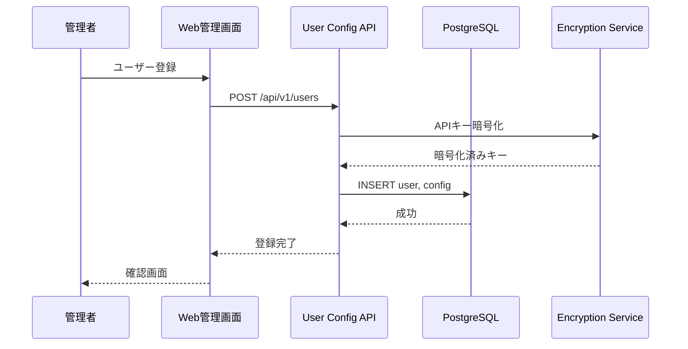
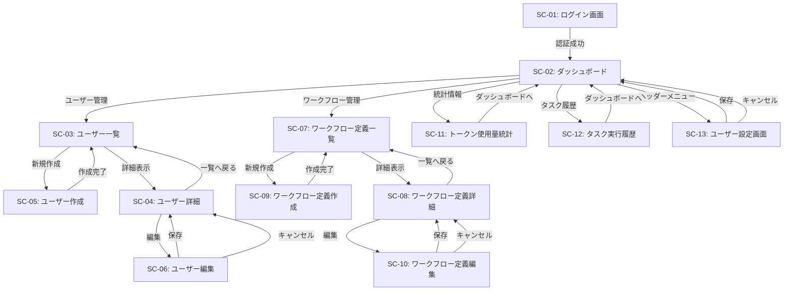

# ユーザー管理システム 詳細設計書

## 1. 概要

Issue/MRの作成者メールアドレスをキーとして、ユーザーごとのOpenAI APIキーと設定を管理する。これにより、複数ユーザーが同一エージェントシステムを利用しながら、各自のAPIキーとコストを分離できる。

## 2. ユーザー登録フロー



## 3. データベース設計

### 3.1 users テーブル

| カラム | 型 | 制約 | 説明 |
|-------|------|------|------|
| id | INTEGER | PK, AUTO | ユーザーID |
| email | TEXT | UNIQUE, NOT NULL | メールアドレス |
| display_name | TEXT | | 表示名 |
| is_active | BOOLEAN | DEFAULT true | アクティブフラグ |
| created_at | TIMESTAMP | NOT NULL | 作成日時 |
| updated_at | TIMESTAMP | | 更新日時 |

### 3.2 user_configs テーブル

ユーザーごとのLLM設定とコンテキスト圧縮設定を管理する。

| カラム | 型 | 制約 | 説明 |
|-------|------|------|------|
| user_email | TEXT | PRIMARY KEY | ユーザーメールアドレス（外部キー） |
| llm_provider | TEXT | NOT NULL DEFAULT 'openai' | LLMプロバイダ（openai/ollama/lmstudio） |
| api_key_encrypted | TEXT | | APIキー（AES-256-GCM暗号化済み） |
| model_name | TEXT | NOT NULL DEFAULT 'gpt-4o' | 使用モデル名 |
| temperature | REAL | NOT NULL DEFAULT 0.2 | LLM温度パラメータ |
| max_tokens | INTEGER | NOT NULL DEFAULT 4096 | 最大トークン数 |
| top_p | REAL | NOT NULL DEFAULT 1.0 | Top-pサンプリングパラメータ |
| frequency_penalty | REAL | NOT NULL DEFAULT 0.0 | 頻度ペナルティ |
| presence_penalty | REAL | NOT NULL DEFAULT 0.0 | 存在ペナルティ |
| base_url | TEXT | | カスタムエンドポイントURL（Ollama/LM Studio用） |
| timeout | INTEGER | NOT NULL DEFAULT 120 | API呼び出しタイムアウト（秒） |
| context_compression_enabled | BOOLEAN | NOT NULL DEFAULT true | コンテキスト圧縮を有効化するか |
| token_threshold | INTEGER | | 圧縮を開始するトークン数の閾値（NULL=モデル推奨値を使用） |
| keep_recent_messages | INTEGER | NOT NULL DEFAULT 10 | 最新から保持するメッセージ数 |
| min_to_compress | INTEGER | NOT NULL DEFAULT 5 | 圧縮する最小メッセージ数 |
| min_compression_ratio | REAL | NOT NULL DEFAULT 0.8 | 圧縮率の最小値（0.8=20%削減） |
| created_at | TIMESTAMP | NOT NULL DEFAULT CURRENT_TIMESTAMP | 設定作成日時 |
| updated_at | TIMESTAMP | DEFAULT CURRENT_TIMESTAMP | 最終更新日時 |

**外部キー制約**:
- `FOREIGN KEY (user_email) REFERENCES users(email) ON DELETE CASCADE` - ユーザー削除時に設定も削除

**インデックス**:
- `PRIMARY KEY (user_email)`
- `idx_user_configs_provider` ON (llm_provider) - プロバイダ別統計取得用

**備考**:
- api_key_encryptedは環境変数ENCRYPTION_KEYで暗号化される
- llm_providerの有効値: 'openai', 'ollama', 'lmstudio'
- base_urlはollama/lmstudioの場合のみ必須、openaiの場合はNULL許容
- temperatureは0.0〜2.0の範囲、max_tokensは1〜32000の範囲
- context_compression_enabled=falseの場合、ユーザーのタスクでコンテキスト圧縮処理をスキップ
- token_thresholdがNULLの場合、model_nameに基づくモデル推奨値を自動適用（例: gpt-4o→90,000、gpt-4→5,600）
- keep_recent_messages、min_to_compress、min_compression_ratioはコンテキスト圧縮の詳細パラメータでユーザーがカスタマイズ可能
- **圧縮設定の検証範囲**: token_threshold (1,000〜150,000)、keep_recent_messages (1〜50)、min_to_compress (1〜20)、min_compression_ratio (0.5〜0.95)

**プロンプトカスタマイズについて**:
ユーザーがプロンプトをカスタマイズしたい場合は、システムプリセット（standard_mr_processing等）をベースにユーザー独自のワークフロー定義を作成し、その`prompt_definition`（JSONB）内のプロンプトテキストを変更する。Web管理画面の「ワークフロー定義作成」機能でプリセットを複製し、エージェント別にプロンプトを編集できる。

### 3.3 todos テーブル

| カラム | 型 | 制約 | 説明 |
|-------|------|------|------|
| id | INTEGER | PK, AUTO | Todo ID |
| project_id | TEXT | NOT NULL | GitLabプロジェクトID |
| issue_iid | INTEGER | | Issue IID（NULL許可） |
| mr_iid | INTEGER | | MR IID（NULL許可） |
| parent_todo_id | INTEGER | FK(todos.id) | 親TodoのID（階層構造） |
| title | TEXT | NOT NULL | Todoのタイトル |
| description | TEXT | | Todoの詳細説明 |
| status | TEXT | NOT NULL | 状態（not-started/in-progress/completed/failed） |
| order_index | INTEGER | NOT NULL | 表示順序 |
| created_at | TIMESTAMP | NOT NULL | 作成日時 |
| updated_at | TIMESTAMP | | 更新日時 |
| completed_at | TIMESTAMP | | 完了日時 |

**インデックス**:
- `idx_todos_issue` ON (`project_id`, `issue_iid`)
- `idx_todos_mr` ON (`project_id`, `mr_iid`)
- `idx_todos_parent` ON (`parent_todo_id`)

**制約**:
- CHK: `issue_iid` と `mr_iid` のいずれかが NOT NULL
- CHK: `status` IN ('not-started', 'in-progress', 'completed', 'failed')

### 3.5 workflow_definitions テーブル

グラフ定義・エージェント定義・プロンプト定義のセット（ワークフロープリセット）を管理する。

| カラム | 型 | 制約 | 説明 |
|-------|------|------|------|
| id | INTEGER | PK, AUTO | 定義ID |
| name | TEXT | NOT NULL | プリセット名（例: "標準MR処理"） |
| description | TEXT | | 説明文 |
| graph_definition | JSONB | NOT NULL | グラフ定義（ノード・エッジ・条件分岐） |
| agent_definition | JSONB | NOT NULL | エージェント定義（各ノードのエージェント設定・ステップ間データ定義） |
| prompt_definition | JSONB | NOT NULL | プロンプト定義（各エージェントのシステムプロンプト・LLMパラメータ） |
| is_preset | BOOLEAN | DEFAULT false | システムプリセットフラグ（true=システム提供、false=ユーザー作成） |
| created_by | INTEGER | FK(users.id) | 作成者ユーザーID（NULLはシステム作成） |
| created_at | TIMESTAMP | NOT NULL | 作成日時 |
| updated_at | TIMESTAMP | | 更新日時 |

**制約**:
- システムプリセット（is_preset=true）はユーザーによる削除・変更不可

**システム提供プリセット一覧**:
- `standard_mr_processing` - 標準MR処理（デフォルト）
- `multi_codegen_mr_processing` - コード生成を複数モデル・温度設定で並列実行

### 3.6 user_workflow_settings テーブル

ユーザーごとのワークフロー定義選択を管理する。

| カラム | 型 | 制約 | 説明 |
|-------|------|------|------|
| id | INTEGER | PK, AUTO | 設定ID |
| user_id | INTEGER | FK(users.id), UNIQUE | ユーザーID |
| workflow_definition_id | INTEGER | FK(workflow_definitions.id), NOT NULL | 使用するワークフロー定義ID |
| created_at | TIMESTAMP | NOT NULL | 作成日時 |
| updated_at | TIMESTAMP | | 更新日時 |

**制約**:
- UNIQUE(user_id) - 1ユーザーにつき1つのワークフロー設定

### 3.7 token_usage テーブル

ユーザー別のLLMトークン使用量を記録する。

| カラム | 型 | 制約 | 説明 |
|-------|------|------|------|
| id | SERIAL | PK | 統計ID |
| user_id | INTEGER | FK(users.id), NOT NULL | ユーザーID |
| task_uuid | TEXT | NOT NULL | タスクUUID |
| prompt_tokens | INTEGER | NOT NULL DEFAULT 0 | プロンプトトークン数 |
| completion_tokens | INTEGER | NOT NULL DEFAULT 0 | 応答トークン数 |
| total_tokens | INTEGER | NOT NULL DEFAULT 0 | 合計トークン数 |
| recorded_at | TIMESTAMP | NOT NULL DEFAULT NOW() | 記録日時 |

**インデックス**:
- `idx_token_usage_user_id` ON (user_id)
- `idx_token_usage_task_uuid` ON (task_uuid)

## 4. APIキー暗号化

- **暗号化方式**: AES-256-GCM
- **キー管理**: 環境変数 `ENCRYPTION_KEY` で管理
- **暗号化範囲**: OpenAI APIキーのみ
- **復号化タイミング**: Consumer実行時にメモリ内で復号化

## 5. User Config API

User Config APIはユーザーごとのLLM設定とコンテキスト圧縮設定を管理する。ユーザーの登録、更新、設定取得を行う。

### 5.1 ユーザー管理エンドポイント

**GET /api/v1/config/{email}**
- Purpose: メールアドレスからユーザー設定を取得（LLM設定とコンテキスト圧縮設定）
- Authentication: Bearer Token
- Response: ユーザー設定（APIキー復号化済み、すべての設定項目を含む）

**POST /api/v1/users**
- Purpose: 新規ユーザー登録
- Authentication: Bearer Token (Admin)
- Body: ユーザー情報とLLM設定（圧縮設定は任意、未指定の場合はデフォルト値が適用される）
- Validation: 圧縮設定パラメータは検証範囲内であることを確認（token_threshold: 1,000〜150,000、keep_recent_messages: 1〜50、min_to_compress: 1〜20、min_compression_ratio: 0.5〜0.95）

**PUT /api/v1/users/{email}**
- Purpose: ユーザー設定更新（LLM設定およびコンテキスト圧縮設定）
- Authentication: Bearer Token
- Body: 更新する設定項目（llm_provider、model_name、temperature、max_tokens、context_compression_enabled、token_threshold、keep_recent_messages、min_to_compress、min_compression_ratio等）
- Validation: 圧縮設定パラメータは検証範囲内であることを確認
- Note: token_thresholdをNULLに設定すると、model_nameに基づくモデル推奨値が自動適用される

**GET /api/v1/users**
- Purpose: ユーザー一覧取得
- Authentication: Bearer Token (Admin)
- Response: ユーザーリスト

### 5.2 ワークフロー定義管理エンドポイント

**GET /api/v1/workflow_definitions**
- Purpose: ワークフロー定義一覧取得（システムプリセット＋ユーザー作成）
- Authentication: Bearer Token
- Response: ワークフロー定義リスト（id, name, description, is_preset）

**GET /api/v1/workflow_definitions/{definition_id}**
- Purpose: ワークフロー定義詳細取得（グラフ定義・エージェント定義・プロンプト定義を含む）
- Authentication: Bearer Token
- Response: ワークフロー定義の全フィールド

**POST /api/v1/workflow_definitions**
- Purpose: ユーザー独自のワークフロー定義を新規作成
- Authentication: Bearer Token
- Body: name, description, graph_definition, agent_definition, prompt_definition
- Response: 作成されたワークフロー定義

**PUT /api/v1/workflow_definitions/{definition_id}**
- Purpose: ユーザー作成のワークフロー定義を更新（システムプリセットは更新不可）
- Authentication: Bearer Token
- Body: 更新する項目（name/description/graph_definition/agent_definition/prompt_definition）
- Response: 更新されたワークフロー定義

**DELETE /api/v1/workflow_definitions/{definition_id}**
- Purpose: ユーザー作成のワークフロー定義を削除（システムプリセットは削除不可）
- Authentication: Bearer Token
- Response: 削除成功メッセージ

### 5.4 ユーザー別ワークフロー設定エンドポイント

**GET /api/v1/users/{user_id}/workflow_setting**
- Purpose: ユーザーの現在選択中のワークフロー定義を取得
- Authentication: Bearer Token
- Response: 選択中のワークフロー定義ID・名前

**PUT /api/v1/users/{user_id}/workflow_setting**
- Purpose: ユーザーが使用するワークフロー定義を選択・変更
- Authentication: Bearer Token
- Body: `{"workflow_definition_id": 1}`
- Response: 更新されたワークフロー設定

## 6. Web管理画面

Streamlitベースの管理画面を提供：

- **ダッシュボード**: 登録ユーザー数、アクティブタスク数
- **ユーザー管理**: ユーザーCRUD操作
- **設定管理**: LLM設定の編集
- **プロンプト管理**: エージェントごとのプロンプト上書き編集（全13エージェント対応）
- **ワークフロー管理**: ワークフロー定義の選択・カスタマイズ（グラフ定義・エージェント定義・プロンプト定義の編集）
- **トークン使用量**: ユーザー別トークン消費統計

## 7. ユーザー別トークン統計処理

各タスク実行時のトークン消費を記録し、ユーザー別の累計を管理する。

**実装方法**: Agent Frameworkの[Filters機能](https://learn.microsoft.com/en-us/semantic-kernel/concepts/enterprise-readiness/filters?pivots=programming-language-python)を使用して、すべての[`ChatCompletionAgent`](https://learn.microsoft.com/en-us/semantic-kernel/frameworks/agent/agent-chat?pivots=programming-language-python)呼び出しをインターセプトし、トークン消費を記録する。

### 7.1 実装モジュール

**TokenUsageMiddleware**（Agent Framework [Filters](https://learn.microsoft.com/en-us/semantic-kernel/concepts/enterprise-readiness/filters?pivots=programming-language-python)）:
- すべての[`ChatCompletionAgent`](https://learn.microsoft.com/en-us/semantic-kernel/frameworks/agent/agent-chat?pivots=programming-language-python)呼び出しの前後で実行される
- [`ChatCompletionAgent`](https://learn.microsoft.com/en-us/semantic-kernel/frameworks/agent/agent-chat?pivots=programming-language-python)のレスポンスからトークン情報（`prompt_tokens`、`completion_tokens`、`total_tokens`）を取得
- ワークフローコンテキストから`user_id`と`task_uuid`を取得
- PostgreSQLの`token_usage`テーブルに記録
- Observability機能（[OpenTelemetry](https://learn.microsoft.com/en-us/semantic-kernel/concepts/enterprise-readiness/observability/?pivots=programming-language-python)）と統合し、メトリクスとして送信

**WorkflowOrchestrator**での統合:
- ワークフローを構築する際に`TokenUsageMiddleware`を登録
- すべてのワークフロー実行で自動的にトークン統計が記録される

### 7.2 Web管理画面での表示

Web管理画面では、ユーザー別のトークン使用量の累計・推移を確認できるダッシュボードを提供する。

---

## 8. Web管理画面の詳細設計

### 8.1 技術スタック

- **フロントエンド**: Vue.js 3 + TypeScript
- **UIフレームワーク**: Vuetify 3
- **状態管理**: Pinia
- **ルーティング**: Vue Router
- **HTTPクライアント**: Axios
- **バックエンド**: FastAPI (Python 3.11+)
- **認証**: JWT (JSON Web Token)

### 8.2 画面一覧

| 画面ID | 画面名 | URL | 説明 |
|--------|--------|-----|------|
| SC-01 | ログイン画面 | `/login` | 管理者認証 |
| SC-02 | ダッシュボード | `/` | システム概要・統計情報表示 |
| SC-03 | ユーザー一覧 | `/users` | 登録ユーザー一覧・検索・フィルタ |
| SC-04 | ユーザー詳細 | `/users/:id` | ユーザー情報・設定確認 |
| SC-05 | ユーザー作成 | `/users/new` | 新規ユーザー登録 |
| SC-06 | ユーザー編集 | `/users/:id/edit` | ユーザー情報・LLM設定編集 |
| SC-07 | ワークフロー定義一覧 | `/workflows` | システムプリセット・ユーザー作成ワークフロー一覧 |
| SC-08 | ワークフロー定義詳細 | `/workflows/:id` | グラフ定義・エージェント定義・プロンプト定義の閲覧 |
| SC-09 | ワークフロー定義作成 | `/workflows/new` | 新規ワークフロー定義作成 |
| SC-10 | ワークフロー定義編集 | `/workflows/:id/edit` | ワークフロー定義編集（ユーザー作成のみ） |
| SC-11 | トークン使用量統計 | `/statistics/tokens` | ユーザー別トークン消費統計・グラフ表示 |
| SC-12 | タスク実行履歴 | `/tasks` | タスク実行履歴一覧・ステータス確認 |
| SC-13 | ユーザー設定画面 | `/settings` | ユーザー自身のLLM設定とコンテキスト圧縮設定の変更。GET /api/v1/config/{email}で設定取得、PUT /api/v1/users/{email}で設定更新 |

### 8.3 画面遷移図



### 8.4 ワイヤーフレーム

#### SC-01: ログイン画面

```
┌─────────────────────────────────────────────────────────┐
│                                                         │
│                 ┌─────────────────────┐                 │
│                 │   Coding Agent      │                 │
│                 │   管理画面          │                 │
│                 └─────────────────────┘                 │
│                                                         │
│          ┌───────────────────────────────┐              │
│          │  メールアドレス                │              │
│          │  [__________________]         │              │
│          │                               │              │
│          │  パスワード                   │              │
│          │  [__________________]         │              │
│          │                               │              │
│          │     [ ログイン ]              │              │
│          └───────────────────────────────┘              │
│                                                         │
└─────────────────────────────────────────────────────────┘
```

#### SC-02: ダッシュボード

```
┌─────────────────────────────────────────────────────────┐
│ ≡ Coding Agent 管理画面              [admin@example.com]│
├─────────────────────────────────────────────────────────┤
│ [ダッシュボード] [ユーザー] [ワークフロー] [統計] [タスク]│
├─────────────────────────────────────────────────────────┤
│                                                         │
│  システム概要                                           │
│  ┌──────────────┐ ┌──────────────┐ ┌──────────────┐   │
│  │ 登録ユーザー │ │ 実行中タスク │ │ 今月のトークン│   │
│  │     24       │ │      3       │ │   1.2M       │   │
│  └──────────────┘ └──────────────┘ └──────────────┘   │
│                                                         │
│  最近の活動                                             │
│  ┌───────────────────────────────────────────────┐     │
│  │ 2026-03-08 14:30  user1@ex.com  コード生成完了│     │
│  │ 2026-03-08 13:15  user2@ex.com  バグ修正実行中│     │
│  │ 2026-03-08 11:45  user3@ex.com  テスト作成完了│     │
│  └───────────────────────────────────────────────┘     │
│                                                         │
│  トークン使用量推移（直近7日間）                         │
│  ┌───────────────────────────────────────────────┐     │
│  │     ▁▃▄▆███▅▃▂                                │     │
│  │ 200K ─────────────────────────              │     │
│  │   0K ─────────────────────────              │     │
│  │      Mon Tue Wed Thu Fri Sat Sun            │     │
│  └───────────────────────────────────────────────┘     │
│                                                         │
└─────────────────────────────────────────────────────────┘
```

#### SC-03: ユーザー一覧

```
┌─────────────────────────────────────────────────────────┐
│ ≡ Coding Agent 管理画面              [admin@example.com]│
├─────────────────────────────────────────────────────────┤
│ [ダッシュボード] [ユーザー] [ワークフロー] [統計] [タスク]│
├─────────────────────────────────────────────────────────┤
│                                                         │
│  ユーザー一覧                       [ + 新規作成 ]      │
│                                                         │
│  検索: [_______________] [🔍]  フィルタ: [すべて ▼]     │
│                                                         │
│  ┌───────────────────────────────────────────────┐     │
│  │ ID │ メールアドレス    │ 表示名   │ ステータス │     │
│  ├────┼──────────────────┼──────────┼──────────┤     │
│  │ 1  │ user1@example.com│ User One │ アクティブ│     │
│  │ 2  │ user2@example.com│ User Two │ アクティブ│     │
│  │ 3  │ user3@example.com│ User Three│ 停止中  │     │
│  │ 4  │ user4@example.com│ User Four │ アクティブ│     │
│  │ 5  │ user5@example.com│ User Five │ アクティブ│     │
│  └───────────────────────────────────────────────┘     │
│                                                         │
│  ページ: [<] 1 / 3 [>]                                  │
│                                                         │
└─────────────────────────────────────────────────────────┘
```

#### SC-04: ユーザー詳細

```
┌─────────────────────────────────────────────────────────┐
│ ≡ Coding Agent 管理画面              [admin@example.com]│
├─────────────────────────────────────────────────────────┤
│ [ダッシュボード] [ユーザー] [ワークフロー] [統計] [タスク]│
├─────────────────────────────────────────────────────────┤
│                                                         │
│  ← ユーザー一覧へ                                       │
│                                                         │
│  ユーザー詳細                     [ 編集 ] [ 削除 ]     │
│                                                         │
│  ┌──────────────────────────────────────────────┐      │
│  │ 基本情報                                     │      │
│  │                                              │      │
│  │ ID: 1                                        │      │
│  │ メールアドレス: user1@example.com            │      │
│  │ 表示名: User One                             │      │
│  │ ステータス: アクティブ                       │      │
│  │ 登録日: 2026-01-15 10:30:00                  │      │
│  │ 最終更新: 2026-03-01 14:20:00                │      │
│  └──────────────────────────────────────────────┘      │
│                                                         │
│  ┌──────────────────────────────────────────────┐      │
│  │ LLM設定                                      │      │
│  │                                              │      │
│  │ プロバイダ: OpenAI                           │      │
│  │ モデル: gpt-4o                               │      │
│  │ APIキー: sk-proj-**********************      │      │
│  │ Temperature: 0.2                             │      │
│  │ Max Tokens: 4096                             │      │
│  │                                              │      │
│  │ コンテキスト圧縮: 有効                         │      │
│  │ Token Threshold: 90000 (モデル推奨値)       │      │
│  │ 保持メッセージ数: 10                         │      │
│  └──────────────────────────────────────────────┘      │
│                                                         │
│  ┌──────────────────────────────────────────────┐      │
│  │ ワークフロー設定                             │      │
│  │                                              │      │
│  │ 使用中: 標準MR処理 (standard_mr_processing)  │      │
│  │         [ 変更 ]                             │      │
│  └──────────────────────────────────────────────┘      │
│                                                         │
│  ┌──────────────────────────────────────────────┐      │
│  │ トークン使用量（今月）                       │      │
│  │                                              │      │
│  │ Total: 125,000 トークン                      │      │
│  │ Prompt: 80,000 / Completion: 45,000          │      │
│  └──────────────────────────────────────────────┘      │
│                                                         │
└─────────────────────────────────────────────────────────┘
```

#### SC-05: ユーザー作成

```
┌─────────────────────────────────────────────────────────┐
│ ≡ Coding Agent 管理画面              [admin@example.com]│
├─────────────────────────────────────────────────────────┤
│ [ダッシュボード] [ユーザー] [ワークフロー] [統計] [タスク]│
├─────────────────────────────────────────────────────────┤
│                                                         │
│  ← ユーザー一覧へ                                       │
│                                                         │
│  新規ユーザー作成                                       │
│                                                         │
│  ┌──────────────────────────────────────────────┐      │
│  │ 基本情報                                     │      │
│  │                                              │      │
│  │ メールアドレス *                             │      │
│  │ [______________________________]             │      │
│  │                                              │      │
│  │ 表示名                                       │      │
│  │ [______________________________]             │      │
│  │                                              │      │
│  │ ステータス                                   │      │
│  │ ⚫ アクティブ  ⚪ 停止中                      │      │
│  └──────────────────────────────────────────────┘      │
│                                                         │
│  ┌──────────────────────────────────────────────┐      │
│  │ LLM設定                                      │      │
│  │                                              │      │
│  │ プロバイダ *                                 │      │
│  │ [OpenAI ▼]                                   │      │
│  │                                              │      │
│  │ OpenAI APIキー *                             │      │
│  │ [______________________________]             │      │
│  │                                              │      │
│  │ モデル                                       │      │
│  │ [gpt-4o ▼]                                   │      │
│  │                                              │      │
│  │ Temperature                                  │      │
│  │ [0.2____________________________]            │      │
│  │                                              │      │
│  │ Max Tokens                                   │      │
│  │ [4096__________________________]             │      │
│  │                                              │      │
│  │ コンテキスト圧縮設定 (高度な設定)              │      │
│  │ ⚫ 圧縮有効  ⚪ 圧縮無効                      │      │
│  │ Token Threshold: [自動 (モデル推奨値) ▼]  │      │
│  │ 最新保持メッセージ数: [10__________]       │      │
│  └──────────────────────────────────────────────┘      │
│                                                         │
│  ┌──────────────────────────────────────────────┐      │
│  │ ワークフロー設定                             │      │
│  │                                              │      │
│  │ ワークフロー定義                             │      │
│  │ [標準MR処理 (standard_mr_processing) ▼]      │      │
│  └──────────────────────────────────────────────┘      │
│                                                         │
│  [ キャンセル ]                       [ 作成 ]          │
│                                                         │
└─────────────────────────────────────────────────────────┘
```

#### SC-06: ユーザー編集

```
┌─────────────────────────────────────────────────────────┐
│ ≡ Coding Agent 管理画面              [admin@example.com]│
├─────────────────────────────────────────────────────────┤
│ [ダッシュボード] [ユーザー] [ワークフロー] [統計] [タスク]│
├─────────────────────────────────────────────────────────┤
│                                                         │
│  ← ユーザー詳細へ                                       │
│                                                         │
│  ユーザー編集: user1@example.com                        │
│                                                         │
│  ┌──────────────────────────────────────────────┐      │
│  │ 基本情報                                     │      │
│  │                                              │      │
│  │ メールアドレス (変更不可)                    │      │
│  │ [user1@example.com______________] (disabled) │      │
│  │                                              │      │
│  │ 表示名                                       │      │
│  │ [User One______________________]             │      │
│  │                                              │      │
│  │ ステータス                                   │      │
│  │ ⚫ アクティブ  ⚪ 停止中                      │      │
│  └──────────────────────────────────────────────┘      │
│                                                         │
│  ┌──────────────────────────────────────────────┐      │
│  │ LLM設定                                      │      │
│  │                                              │      │
│  │ プロバイダ                                   │      │
│  │ [OpenAI ▼]                                   │      │
│  │                                              │      │
│  │ OpenAI APIキー                               │      │
│  │ [sk-proj-**********************]             │      │
│  │ [ APIキーを変更 ]                            │      │
│  │                                              │      │
│  │ モデル                                       │      │
│  │ [gpt-4o ▼]                                   │      │
│  │                                              │      │
│  │ Temperature                                  │      │
│  │ [0.2____________________________]            │      │
│  │                                              │      │
│  │ Max Tokens                                   │      │
│  │ [4096__________________________]             │      │
│  │                                              │      │
│  │ コンテキスト圧縮設定 (高度な設定)              │      │
│  │ ⚫ 圧縮有効  ⚪ 圧縮無効                      │      │
│  │ Token Threshold: [自動 (モデル推奨値) ▼]  │      │
│  │ 最新保持メッセージ数: [10__________]       │      │
│  └──────────────────────────────────────────────┘      │
│                                                         │
│  ┌──────────────────────────────────────────────┐      │
│  │ ワークフロー設定                             │      │
│  │                                              │      │
│  │ ワークフロー定義                             │      │
│  │ [標準MR処理 (standard_mr_processing) ▼]      │      │
│  └──────────────────────────────────────────────┘      │
│                                                         │
│  [ キャンセル ]                       [ 保存 ]          │
│                                                         │
└─────────────────────────────────────────────────────────┘
```

#### SC-07: ワークフロー定義一覧

```
┌─────────────────────────────────────────────────────────┐
│ ≡ Coding Agent 管理画面              [admin@example.com]│
├─────────────────────────────────────────────────────────┤
│ [ダッシュボード] [ユーザー] [ワークフロー] [統計] [タスク]│
├─────────────────────────────────────────────────────────┤
│                                                         │
│  ワークフロー定義一覧                 [ + 新規作成 ]    │
│                                                         │
│  システムプリセット                                     │
│  ┌───────────────────────────────────────────────┐     │
│  │ 🔒 標準MR処理                                 │     │
│  │    standard_mr_processing                    │     │
│  │    コード生成・バグ修正・テスト作成・ドキュメント│     │
│  │    [ 詳細 ]                                  │     │
│  ├───────────────────────────────────────────────┤     │
│  │ 🔒 複数コード生成並列処理                     │     │
│  │    multi_codegen_mr_processing               │     │
│  │    3種類のモデル設定で並列実行               │     │
│  │    [ 詳細 ]                                  │     │
│  └───────────────────────────────────────────────┘     │
│                                                         │
│  ユーザー作成ワークフロー                               │
│  ┌───────────────────────────────────────────────┐     │
│  │ 📝 カスタムコード生成                         │     │
│  │    custom_codegen_workflow_1                 │     │
│  │    作成者: admin@example.com                 │     │
│  │    [ 詳細 ] [ 編集 ] [ 削除 ]                │     │
│  ├───────────────────────────────────────────────┤     │
│  │ 📝 ドキュメント専用フロー                     │     │
│  │    documentation_only_workflow               │     │
│  │    作成者: admin@example.com                 │     │
│  │    [ 詳細 ] [ 編集 ] [ 削除 ]                │     │
│  └───────────────────────────────────────────────┘     │
│                                                         │
└─────────────────────────────────────────────────────────┘
```

#### SC-08: ワークフロー定義詳細

```
┌─────────────────────────────────────────────────────────┐
│ ≡ Coding Agent 管理画面              [admin@example.com]│
├─────────────────────────────────────────────────────────┤
│ [ダッシュボード] [ユーザー] [ワークフロー] [統計] [タスク]│
├─────────────────────────────────────────────────────────┤
│                                                         │
│  ← ワークフロー定義一覧へ                               │
│                                                         │
│  ワークフロー定義詳細          🔒 システムプリセット    │
│                                                         │
│  ┌──────────────────────────────────────────────┐      │
│  │ 基本情報                                     │      │
│  │                                              │      │
│  │ ID: 1                                        │      │
│  │ 名前: 標準MR処理                             │      │
│  │ 定義ID: standard_mr_processing               │      │
│  │ 説明: コード生成・バグ修正・テスト作成・     │      │
│  │       ドキュメント生成の4タスクに対応        │      │
│  │ タイプ: システムプリセット                   │      │
│  └──────────────────────────────────────────────┘      │
│                                                         │
│  ┌──────────────────────────────────────────────┐      │
│  │ グラフ定義                   [ JSONを表示 ]  │      │
│  │                                              │      │
│  │  entry_node: user_resolve                    │      │
│  │  nodes: 17個                                 │      │
│  │  edges: 24個                                 │      │
│  │                                              │      │
│  │  グラフ可視化（簡略版）:                    │      │
│  │  ```mermaid                                  │      │
│  │  flowchart TD                                │      │
│  │    Start([user_resolve]) --> Classify       │      │
│  │    Classify[task_classifier] --> Planning   │      │
│  │    Planning[xx_planning] --> Reflect        │      │
│  │    Reflect[plan_reflection] --> Exec        │      │
│  │    Exec[xx_execution] --> Review            │      │
│  │    Review[xx_review] --> TestEval           │      │
│  │    TestEval[test_execution_evaluation]      │      │
│  │    TestEval --> End([publish_result])       │      │
│  │  ```                                         │      │
│  └──────────────────────────────────────────────┘      │
│                                                         │
│  ┌──────────────────────────────────────────────┐      │
│  │ エージェント定義             [ JSONを表示 ]  │      │
│  │                                              │      │
│  │  agents: 13個                                │      │
│  │  - task_classifier                           │      │
│  │  - code_generation_planning                  │      │
│  │  - bug_fix_planning                          │      │
│  │  - (他10個)                                  │      │
│  └──────────────────────────────────────────────┘      │
│                                                         │
│  ┌──────────────────────────────────────────────┐      │
│  │ プロンプト定義               [ JSONを表示 ]  │      │
│  │                                              │      │
│  │  prompts: 13個                               │      │
│  │  default_llm_params:                         │      │
│  │    model: gpt-4o                             │      │
│  │    temperature: 0.2                          │      │
│  │    max_tokens: 4096                          │      │
│  └──────────────────────────────────────────────┘      │
│                                                         │
└─────────────────────────────────────────────────────────┘
```

#### SC-09: ワークフロー定義作成

```
┌─────────────────────────────────────────────────────────┐
│ ≡ Coding Agent 管理画面              [admin@example.com]│
├─────────────────────────────────────────────────────────┤
│ [ダッシュボード] [ユーザー] [ワークフロー] [統計] [タスク]│
├─────────────────────────────────────────────────────────┤
│                                                         │
│  ← ワークフロー定義一覧へ                               │
│                                                         │
│  新規ワークフロー定義作成                               │
│                                                         │
│  ┌──────────────────────────────────────────────┐      │
│  │ 基本情報                                     │      │
│  │                                              │      │
│  │ 名前 *                                       │      │
│  │ [______________________________]             │      │
│  │                                              │      │
│  │ 説明                                         │      │
│  │ [______________________________]             │      │
│  │ [______________________________]             │      │
│  │ [______________________________]             │      │
│  └──────────────────────────────────────────────┘      │
│                                                         │
│  ┌──────────────────────────────────────────────┐      │
│  │ グラフ定義 *                                 │      │
│  │                                              │      │
│  │ [ システムプリセットから複製 ▼]              │      │
│  │                                              │      │
│  │ JSON Editor:                                 │      │
│  │ ┌──────────────────────────────────────┐     │      │
│  │ │ {                                    │     │      │
│  │ │   "version": "1.0",                  │     │      │
│  │ │   "name": "...",                     │     │      │
│  │ │   "nodes": [...],                    │     │      │
│  │ │   "edges": [...]                     │     │      │
│  │ │ }                                    │     │      │
│  │ └──────────────────────────────────────┘     │      │
│  └──────────────────────────────────────────────┘      │
│                                                         │
│  ┌──────────────────────────────────────────────┐      │
│  │ エージェント定義 *                           │      │
│  │ [JSON Editor...]                             │      │
│  └──────────────────────────────────────────────┘      │
│                                                         │
│  ┌──────────────────────────────────────────────┐      │
│  │ プロンプト定義 *                             │      │
│  │ [JSON Editor...]                             │      │
│  └──────────────────────────────────────────────┘      │
│                                                         │
│  [ キャンセル ]                       [ 作成 ]          │
│                                                         │
└─────────────────────────────────────────────────────────┘
```

#### SC-10: ワークフロー定義編集

```
┌─────────────────────────────────────────────────────────┐
│ ≡ Coding Agent 管理画面              [admin@example.com]│
├─────────────────────────────────────────────────────────┤
│ [ダッシュボード] [ユーザー] [ワークフロー] [統計] [タスク]│
├─────────────────────────────────────────────────────────┤
│                                                         │
│  ← ワークフロー定義詳細へ                               │
│                                                         │
│  ワークフロー定義編集: カスタムコード生成               │
│                                                         │
│  ┌──────────────────────────────────────────────┐      │
│  │ 基本情報                                     │      │
│  │                                              │      │
│  │ 名前 *                                       │      │
│  │ [カスタムコード生成______________]           │      │
│  │                                              │      │
│  │ 説明                                         │      │
│  │ [独自のコード生成ワークフロー____]           │      │
│  │ [カスタマイズしたプロンプトを使用]           │      │
│  └──────────────────────────────────────────────┘      │
│                                                         │
│  ┌──────────────────────────────────────────────┐      │
│  │ グラフ定義                                   │      │
│  │                                              │      │
│  │ [ 検証 ] [ フォーマット ]                    │      │
│  │                                              │      │
│  │ JSON Editor:                                 │      │
│  │ ┌──────────────────────────────────────┐     │      │
│  │ │ {                                    │     │      │
│  │ │   "version": "1.0",                  │     │      │
│  │ │   "name": "カスタムコード生成",       │     │      │
│  │ │   "nodes": [...],                    │     │      │
│  │ │   "edges": [...]                     │     │      │
│  │ │ }                                    │     │      │
│  │ └──────────────────────────────────────┘     │      │
│  └──────────────────────────────────────────────┘      │
│                                                         │
│  ⚠ 変更を保存すると、このワークフローを使用する         │
│    すべてのユーザーに影響します。                       │
│                                                         │
│  [ キャンセル ]                       [ 保存 ]          │
│                                                         │
└─────────────────────────────────────────────────────────┘
```

#### SC-11: トークン使用量統計

```
┌─────────────────────────────────────────────────────────┐
│ ≡ Coding Agent 管理画面              [admin@example.com]│
├─────────────────────────────────────────────────────────┤
│ [ダッシュボード] [ユーザー] [ワークフロー] [統計] [タスク]│
├─────────────────────────────────────────────────────────┤
│                                                         │
│  トークン使用量統計                                     │
│                                                         │
│  期間: [今月 ▼]  ユーザー: [すべて ▼]  [ 更新 ]        │
│                                                         │
│  ┌──────────────────────────────────────────────┐      │
│  │ 総トークン使用量: 1,245,680                  │      │
│  │ Prompt: 820,450 / Completion: 425,230        │      │
│  └──────────────────────────────────────────────┘      │
│                                                         │
│  トークン使用量推移（日別）                             │
│  ┌───────────────────────────────────────────────┐     │
│  │ 100K│     ▆                                   │     │
│  │     │    ███                                  │     │
│  │  50K│ ▃▅████▆▄▂                               │     │
│  │     │ ██████████▅▃▂                           │     │
│  │   0 └───────────────────────────             │     │
│  │      1  5  10  15  20  25  30  (日)          │     │
│  └───────────────────────────────────────────────┘     │
│                                                         │
│  ユーザー別使用量（上位10名）                           │
│  ┌───────────────────────────────────────────────┐     │
│  │ ユーザー              │ トークン数  │ 割合   │     │
│  ├──────────────────────┼───────────┼────────┤     │
│  │ user1@example.com    │   125,000  │  10.0% │     │
│  │ user2@example.com    │   102,340  │   8.2% │     │
│  │ user3@example.com    │    98,120  │   7.9% │     │
│  │ user4@example.com    │    87,560  │   7.0% │     │
│  │ user5@example.com    │    76,890  │   6.2% │     │
│  └───────────────────────────────────────────────┘     │
│                                                         │
│  タスク種別別使用量                                     │
│  ┌───────────────────────────────────────────────┐     │
│  │ コード生成:    450,000  (36.1%)              │     │
│  │ バグ修正:      320,000  (25.7%)              │     │
│  │ テスト作成:    280,000  (22.5%)              │     │
│  │ ドキュメント:  195,680  (15.7%)              │     │
│  └───────────────────────────────────────────────┘     │
│                                                         │
│  [ CSV エクスポート ]                                   │
│                                                         │
└─────────────────────────────────────────────────────────┘
```

#### SC-12: タスク実行履歴

```
┌─────────────────────────────────────────────────────────┐
│ ≡ Coding Agent 管理画面              [admin@example.com]│
├─────────────────────────────────────────────────────────┤
│ [ダッシュボード] [ユーザー] [ワークフロー] [統計] [タスク]│
├─────────────────────────────────────────────────────────┤
│                                                         │
│  タスク実行履歴                                         │
│                                                         │
│  検索: [___________] [🔍]  ステータス: [すべて ▼]      │
│  期間: [直近7日間 ▼]  ユーザー: [すべて ▼]             │
│                                                         │
│  ┌───────────────────────────────────────────────┐     │
│  │ タスクUUID │ ユーザー │ タイプ │ ステータス │     │
│  ├───────────┼─────────┼────────┼──────────┤     │
│  │ abc12...  │ user1   │ コード生成│ ✓ 完了   │     │
│  │ def34...  │ user2   │ バグ修正  │ 🔄 実行中 │     │
│  │ ghi56...  │ user1   │ テスト作成│ ✓ 完了   │     │
│  │ jkl78...  │ user3   │ ドキュメント│ ✓ 完了 │     │
│  │ mno90...  │ user2   │ コード生成│ ❌ 失敗  │     │
│  └───────────────────────────────────────────────┘     │
│                                                         │
│  ┌───────────────────────────────────────────────┐     │
│  │ 開始日時     │ 終了日時     │ トークン │ 詳細 │     │
│  ├─────────────┼─────────────┼─────────┼─────┤     │
│  │ 03-08 14:30 │ 03-08 14:45 │  12,340  │ [📄] │     │
│  │ 03-08 13:15 │ -           │   8,120  │ [📄] │     │
│  │ 03-08 11:45 │ 03-08 12:05 │  15,670  │ [📄] │     │
│  │ 03-08 10:20 │ 03-08 10:35 │   9,450  │ [📄] │     │
│  │ 03-08 09:30 │ 03-08 09:40 │   7,230  │ [📄] │     │
│  └───────────────────────────────────────────────┘     │
│                                                         │
│  ページ: [<] 1 / 15 [>]                                 │
│                                                         │
└─────────────────────────────────────────────────────────┘
```

#### SC-13: ユーザー設定画面

```
┌─────────────────────────────────────────────────────────┐
│ ≡ Coding Agent                       [user1@example.com]│
├─────────────────────────────────────────────────────────┤
│ [ダッシュボード] [ユーザー] [ワークフロー] [統計] [タスク]│
├─────────────────────────────────────────────────────────┤
│                                                         │
│  ユーザー設定                                           │
│                                                         │
│  ┌──────────────────────────────────────────────┐      │
│  │ 基本情報                                     │      │
│  │                                              │      │
│  │ メールアドレス: user1@example.com (変更不可) │      │
│  │ 表示名: [User One______________________]     │      │
│  └──────────────────────────────────────────────┘      │
│                                                         │
│  ┌──────────────────────────────────────────────┐      │
│  │ LLM設定                                      │      │
│  │                                              │      │
│  │ プロバイダ                                   │      │
│  │ [OpenAI ▼]                                   │      │
│  │                                              │      │
│  │ APIキー                                      │      │
│  │ [sk-proj-**********************]             │      │
│  │ [ APIキーを変更 ]                            │      │
│  │                                              │      │
│  │ モデル                                       │      │
│  │ [gpt-4o ▼]                                   │      │
│  │                                              │      │
│  │ Temperature (0.0-2.0)                        │      │
│  │ [0.2____________________________] 0.2        │      │
│  │                                              │      │
│  │ Max Tokens (1-32000)                         │      │
│  │ [4096__________________________] 4096        │      │
│  └──────────────────────────────────────────────┘      │
│                                                         │
│  ┌──────────────────────────────────────────────┐      │
│  │ コンテキスト圧縮設定 (高度な設定)              │      │
│  │                                              │      │
│  │ ⚫ 圧縮有効  ⚪ 圧縮無効                      │      │
│  │                                              │      │
│  │ Token Threshold                              │      │
│  │ ⚪ 自動 (モデル推奨値: 90,000)                │      │
│  │ ⚫ カスタム: [90000_____________] トークン    │      │
│  │    (1,000〜150,000の範囲で設定)              │      │
│  │                                              │      │
│  │ 最新保持メッセージ数 (1-50)                   │      │
│  │ [10____________________________] 10 件       │      │
│  │                                              │      │
│  │ 最小圧縮メッセージ数 (1-20)                   │      │
│  │ [5_____________________________] 5 件        │      │
│  │                                              │      │
│  │ 最小圧縮率 (0.5-0.95)                         │      │
│  │ [0.8___________________________] 0.8 (20%削減)│      │
│  │                                              │      │
│  │ ℹ️ Token Thresholdを「自動」に設定すると、   │      │
│  │   選択したモデルに応じた推奨値が適用されます。│      │
│  │   gpt-4o: 90,000, gpt-4: 5,600 など         │      │
│  └──────────────────────────────────────────────┘      │
│                                                         │
│  ┌──────────────────────────────────────────────┐      │
│  │ 現在のトークン使用量 (今月)                   │      │
│  │                                              │      │
│  │ Total: 125,000 トークン                      │      │
│  │ Prompt: 80,000 / Completion: 45,000          │      │
│  └──────────────────────────────────────────────┘      │
│                                                         │
│  [ キャンセル ]                       [ 保存 ]          │
│                                                         │
└─────────────────────────────────────────────────────────┘
```

### 8.5 画面共通仕様

#### 8.5.1 レイアウト

- **ヘッダー**: アプリケーション名、ユーザー情報、ログアウトボタン
  - 管理者画面（SC-01〜SC-12）: 「Coding Agent 管理画面」と表示
  - ユーザー設定画面（SC-13）: 「Coding Agent」と表示
  - ユーザー情報をクリックすると、ユーザー設定画面（SC-13）へのリンクを含むドロップダウンメニューが表示される
- **ナビゲーションバー**: 主要メニュー（ダッシュボード、ユーザー、ワークフロー、統計、タスク）
- **メインコンテンツエリア**: 各画面のコンテンツ表示
- **フッター**: バージョン情報、コピーライト

#### 8.5.2 レスポンシブ対応

- デスクトップ（1280px以上）: 全機能表示
- タブレット（768px〜1279px）: ナビゲーションを折りたたみ可能に
- モバイル（767px以下）: ハンバーガーメニュー、テーブルをカード表示

#### 8.5.3 アクセシビリティ

- WCAG 2.1 Level AA準拠
- キーボードナビゲーション対応
- スクリーンリーダー対応
- 適切なカラーコントラスト

#### 8.5.4 エラーハンドリング

- バリデーションエラー: フォーム項目にインラインエラー表示
- APIエラー: トップにトースト通知表示
- ネットワークエラー: リトライボタン付きエラーダイアログ

#### 8.5.5 ローディング表示

- 画面遷移時: プログレスバー
- データ取得中: スケルトンスクリーン
- 長時間処理: プログレスインジケーター + キャンセルボタン

---
