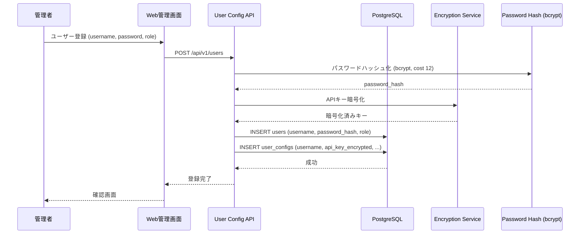
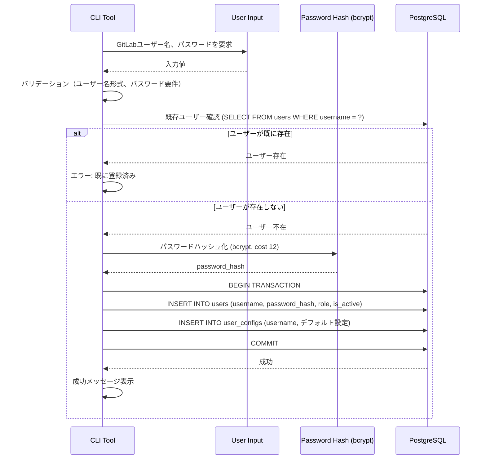
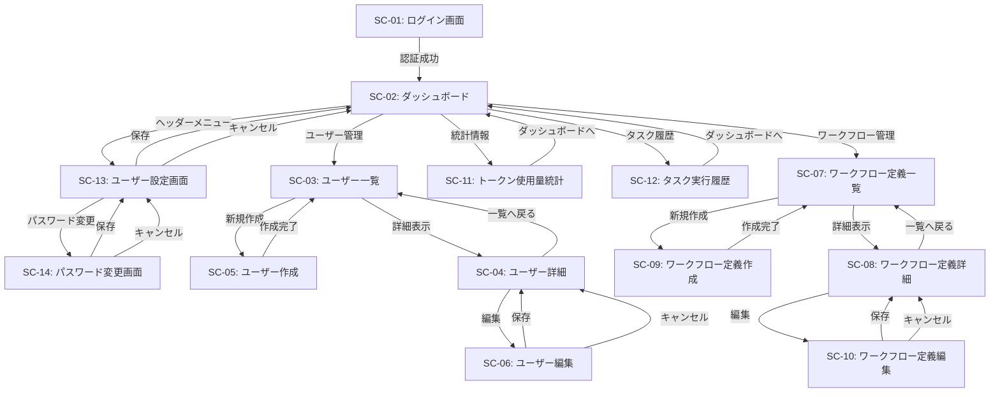

# ユーザー管理システム 詳細設計書

## 1. 概要

Issue/MRの作成者GitLabユーザー名をキーとして、ユーザーごとのOpenAI APIキーと設定を管理する。これにより、複数ユーザーが同一エージェントシステムを利用しながら、各自のAPIキーとコストを分離できる。

## 2. ユーザー登録フロー



## 3. データベース設計

データベースのテーブル定義は[DATABASE_SCHEMA_SPEC.md](DATABASE_SCHEMA_SPEC.md)を参照してください。

### 3.1 ユーザーロール

本システムでは以下の2つのユーザーロールをサポートします：

| ロール | 説明 | 権限 |
|-------|------|------|
| admin | 管理者 | Web管理画面へのフルアクセス。全ユーザーの管理、ワークフロー定義管理、統計情報閲覧、他ユーザーのパスワード代理変更が可能 |
| user | 一般ユーザー | 自分のLLM設定、コンテキスト圧縮設定、学習機能設定の変更、自分のパスワード変更のみ可能。Web管理画面へのアクセス不可 |

**ロールの設定**:
- 初回ユーザー登録時にroleを指定（デフォルトはuser）
- roleの変更は管理者のみが実行可能

### 3.2 パスワード管理

**パスワードハッシュ化**:
- アルゴリズム: bcrypt
- コストファクタ: 12
- パスワードは平文で保存せず、必ずハッシュ化して保存

**パスワード変更権限**:
- ユーザー自身: 自分のパスワードを変更可能（現在のパスワード確認が必要）
- 管理者: 任意のユーザーのパスワードを変更可能（代理変更、現在のパスワード確認不要）

## 4. APIキー暗号化

- **暗号化方式**: AES-256-GCM
- **キー管理**: 環境変数 `ENCRYPTION_KEY` で管理
- **暗号化範囲**: OpenAI APIキーのみ
- **復号化タイミング**: Consumer実行時にメモリ内で復号化

## 5. 初期管理者作成ツール

システムの初回セットアップ時に、コマンドラインから初期管理者ユーザーを作成するためのCLIツールを提供する。

### 5.1 CLIコマンド

```bash
python -m backend.user_management.cli.create_admin
```

または

```bash
python scripts/create_admin.py
```

### 5.2 実行方法

**対話式モード**（推奨）:
```bash
python -m src.cli.create_admin

# 実行すると以下のプロンプトが表示される
Enter admin username: admin
Enter admin username: Administrator
Enter admin password: ********
Confirm password: ********

Creating admin user...
✓ Admin user created successfully
  Username: admin
  Username: Administrator
  Role: admin
```

**環境変数モード**:
```bash
ADMIN_USERNAME=admin \
ADMIN_USERNAME=Administrator \
ADMIN_PASSWORD=SecurePassword123! \
python -m src.cli.create_admin

✓ Admin user created successfully
```

**コマンドライン引数モード**:
```bash
python -m src.cli.create_admin \
  --username admin \
  --username Administrator \
  --password SecurePassword123!

✓ Admin user created successfully
```

### 5.3 処理フロー



### 5.4 バリデーション

- **GitLabユーザー名**: 英数字・ハイフン・アンダースコアのみ使用可能であること
- **ユーザー名**: 1文字以上、255文字以下
- **パスワード**: 
  - 8文字以上
  - 英字（大文字・小文字）を含む
  - 数字を含む
  - 記号を含む
- **既存ユーザーチェック**: 同じGitLabユーザー名のユーザーが存在しないこと

### 5.5 デフォルト設定

初期管理者作成時、user_configsテーブルには以下のデフォルト値が設定される：

| パラメータ | デフォルト値 |
|-----------|-------------|
| llm_provider | openai |
| model_name | gpt-4o |
| temperature | 0.2 |
| max_tokens | 4096 |
| context_compression_enabled | true |
| token_threshold | NULL（モデル推奨値を使用） |
| keep_recent_messages | 10 |
| min_to_compress | 5 |
| min_compression_ratio | 0.8 |

**Note**: APIキーは初期状態ではNULL。管理者は作成後、Web管理画面またはAPIで設定する必要がある。

### 5.6 エラーハンドリング

- **既存ユーザーエラー**: GitLabユーザー名が既に登録されている場合、エラーメッセージを表示して終了
- **バリデーションエラー**: 入力値が要件を満たさない場合、詳細なエラーメッセージを表示して再入力を促す
- **データベース接続エラー**: データベース接続に失敗した場合、接続情報の確認を促すメッセージを表示
- **トランザクションエラー**: INSERT失敗時はROLLBACKし、エラー詳細を表示

### 5.7 セキュリティ考慮事項

- パスワードは画面に表示されない（マスキング）
- パスワードはログに記録されない
- 環境変数モードを使用する場合、実行後は環境変数をunsetすることを推奨
- 本番環境では対話式モードの使用を推奨（環境変数やコマンドライン引数はシェル履歴に残る可能性がある）

## 6. User Config API

User Config APIはユーザーごとのLLM設定とコンテキスト圧縮設定を管理する。ユーザーの登録、更新、設定取得を行う。

### 6.1 ユーザー管理エンドポイント

**GET /api/v1/config/{username}**
- Purpose: GitLabユーザー名からユーザー設定を取得（LLM設定、コンテキスト圧縮設定、学習機能設定）
- Authentication: Bearer Token
- Response: ユーザー設定（APIキー復号化済み、すべての設定項目を含む）

**POST /api/v1/users**
- Purpose: 新規ユーザー登録
- Authentication: Bearer Token (Admin)
- Body: ユーザー情報（username、password、role、is_active）とLLM設定（llm_provider、api_key、model_name、temperature、max_tokens、top_p、frequency_penalty、presence_penalty、base_url、timeout。各項目は任意でデフォルト値が適用される）、コンテキスト圧縮設定（token_threshold、keep_recent_messages、min_to_compress、min_compression_ratio。各項目は任意でデフォルト値が適用される）、学習機能設定（learning_enabled、learning_llm_model、learning_llm_temperature、learning_llm_max_tokens、learning_exclude_bot_comments、learning_only_after_task_start）
- Validation: 
  - パスワードは8文字以上、英数字と記号を含むこと
  - roleは'admin'または'user'のみ
  - 圧縮設定パラメータは検証範囲内であることを確認（token_threshold: 1,000〜150,000、keep_recent_messages: 1〜50、min_to_compress: 1〜20、min_compression_ratio: 0.5〜0.95）
- Note: パスワードはbcryptでハッシュ化して保存（コストファクタ12）

**PUT /api/v1/users/{username}**
- Purpose: ユーザー設定更新（LLM設定およびコンテキスト圧縮設定）
- Authentication: Bearer Token
- Body: 更新する設定項目（llm_provider、model_name、temperature、max_tokens、context_compression_enabled、token_threshold、keep_recent_messages、min_to_compress、min_compression_ratio、username、role、is_active等）
- Validation: 圧縮設定パラメータは検証範囲内であることを確認
- Note: token_thresholdをNULLに設定すると、model_nameに基づくモデル推奨値が自動適用される
- Authorization: 一般ユーザーは自分のLLM設定のみ変更可能、管理者は全ユーザーの設定変更可能

**PUT /api/v1/users/{username}/password**
- Purpose: パスワード変更
- Authentication: Bearer Token
- Body:
  - ユーザー自身が変更する場合: `{"current_password": "...", "new_password": "..."}`
  - 管理者が代理変更する場合: `{"new_password": "..."}`（current_password不要）
- Validation: 
  - 新パスワードは8文字以上、英数字と記号を含むこと
  - ユーザー自身の場合、current_passwordが正しいことを確認
- Authorization: 
  - 一般ユーザーは自分のパスワードのみ変更可能（current_password必須）
  - 管理者は全ユーザーのパスワードを変更可能（current_password不要）

**GET /api/v1/users**
- Purpose: ユーザー一覧取得
- Authentication: Bearer Token (Admin)
- Response: ユーザーリスト（username、role、is_active、created_at）

### 6.2 ワークフロー定義管理エンドポイント

**GET /api/v1/workflow_definitions**
- Purpose: ワークフロー定義一覧取得（システムプリセット＋ユーザー作成）
- Authentication: Bearer Token
- Response: ワークフロー定義リスト（id, name, description, is_preset）

**GET /api/v1/workflow_definitions/{definition_id}**
- Purpose: ワークフロー定義詳細取得（グラフ定義・エージェント定義・プロンプト定義を含む）
- Authentication: Bearer Token
- Response: ワークフロー定義の全フィールド

**POST /api/v1/workflow_definitions**
- Purpose: ユーザー独自のワークフロー定義を新規作成
- Authentication: Bearer Token
- Body: name, display_name, description, graph_definition, agent_definition, prompt_definition
- Response: 作成されたワークフロー定義

**PUT /api/v1/workflow_definitions/{definition_id}**
- Purpose: ユーザー作成のワークフロー定義を更新（システムプリセットは更新不可）
- Authentication: Bearer Token
- Body: 更新する項目（display_name/description/graph_definition/agent_definition/prompt_definition/version/is_active）
- Response: 更新されたワークフロー定義

**DELETE /api/v1/workflow_definitions/{definition_id}**
- Purpose: ユーザー作成のワークフロー定義を削除（システムプリセットは削除不可）
- Authentication: Bearer Token
- Response: 削除成功メッセージ

### 6.3 認証エンドポイント

**POST /api/v1/auth/login**
- Purpose: GitLabユーザー名とパスワードで認証し、JWTアクセストークンを発行する
- Authentication: なし（認証不要）
- Body: `{"username": "...", "password": "..."}`
- Response: `{"access_token": "...", "token_type": "bearer", "expires_in": 86400}`
- エラー: ユーザー名またはパスワードが不正な場合は HTTP 401 を返す

**POST /api/v1/auth/refresh**
- Purpose: 有効なアクセストークンを受け取り、有効期限が更新された新しいアクセストークンを発行する（自動リフレッシュ）
- Authentication: Bearer Token
- Response: `{"access_token": "...", "token_type": "bearer", "expires_in": 86400}`

**JWT仕様**:
- アルゴリズム: HS256
- 有効期限: 24時間（`expires_in`: 86400秒）
- 署名キー: 環境変数 `JWT_SECRET_KEY` で管理

### 6.4 ユーザー別ワークフロー設定エンドポイント

**GET /api/v1/users/{user_id}/workflow_setting**
- Purpose: ユーザーの現在選択中のワークフロー定義を取得
- Authentication: Bearer Token
- Response: 選択中のワークフロー定義ID・名前

**PUT /api/v1/users/{user_id}/workflow_setting**
- Purpose: ユーザーが使用するワークフロー定義を選択・変更
- Authentication: Bearer Token
- Body: `{"workflow_definition_id": 1}`
- Response: 更新されたワークフロー設定

### 6.5 ダッシュボード・統計エンドポイント

**GET /api/v1/dashboard/stats**
- Purpose: ダッシュボード統計情報取得（登録ユーザー数、実行中タスク数、今月トークン使用量、最近のタスク10件）
- Authentication: Bearer Token (Admin)
- Response: `{"user_count": N, "running_task_count": N, "monthly_token_usage": {...}, "recent_tasks": [...]}`

**GET /api/v1/statistics/tokens**
- Purpose: ユーザー別トークン使用量統計
- Authentication: Bearer Token (Admin)
- Query: `username` (optional), `period` (日数, default 30)
- Response: `{"period_days": N, "username_filter": "...", "stats": [...]}`

**GET /api/v1/tasks**
- Purpose: タスク実行履歴一覧取得
- Authentication: Bearer Token (Admin)
- Query: `username` (optional), `status` (optional), `task_type` (optional), `page` (default 1), `per_page` (default 20, max 100)
- Response: `{"page": N, "per_page": N, "tasks": [...]}`

## 7. Web管理画面

Vue.js 3 + FastAPI バックエンドによる管理画面を提供（詳細設計はセクション9参照）：

- **ダッシュボード**: 登録ユーザー数、アクティブタスク数
- **ユーザー管理**: ユーザーCRUD操作
- **設定管理**: LLM設定の編集
- **プロンプト管理**: エージェントごとのプロンプト上書き編集（全13エージェント対応）
- **ワークフロー管理**: ワークフロー定義の選択・カスタマイズ（グラフ定義・エージェント定義・プロンプト定義の編集）
- **トークン使用量**: ユーザー別トークン消費統計

## 8. ユーザー別トークン統計処理

各タスク実行時のトークン消費を記録し、ユーザー別の累計を管理する。

**実装方法**: Agent Frameworkの[Filters機能](https://learn.microsoft.com/en-us/semantic-kernel/concepts/enterprise-readiness/filters?pivots=programming-language-python)を使用して、すべての[`ChatCompletionAgent`](https://learn.microsoft.com/en-us/semantic-kernel/frameworks/agent/agent-chat?pivots=programming-language-python)呼び出しをインターセプトし、トークン消費を記録する。

### 8.1 実装モジュール

**TokenUsageMiddleware**（Agent Framework [Filters](https://learn.microsoft.com/en-us/semantic-kernel/concepts/enterprise-readiness/filters?pivots=programming-language-python)）:
- すべての[`ChatCompletionAgent`](https://learn.microsoft.com/en-us/semantic-kernel/frameworks/agent/agent-chat?pivots=programming-language-python)呼び出しの前後で実行される
- [`ChatCompletionAgent`](https://learn.microsoft.com/en-us/semantic-kernel/frameworks/agent/agent-chat?pivots=programming-language-python)のレスポンスからトークン情報（`prompt_tokens`、`completion_tokens`、`total_tokens`）を取得
- ワークフローコンテキストから`user_id`と`task_uuid`を取得
- PostgreSQLの`token_usage`テーブルに記録
- Observability機能（[OpenTelemetry](https://learn.microsoft.com/en-us/semantic-kernel/concepts/enterprise-readiness/observability/?pivots=programming-language-python)）と統合し、メトリクスとして送信

**WorkflowOrchestrator**での統合:
- ワークフローを構築する際に`TokenUsageMiddleware`を登録
- すべてのワークフロー実行で自動的にトークン統計が記録される

### 8.2 Web管理画面での表示

Web管理画面では、ユーザー別のトークン使用量の累計・推移を確認できるダッシュボードを提供する。

---

## 9. Web管理画面の詳細設計

### 9.1 技術スタック

- **フロントエンド**: Vue.js 3 (JavaScript / Composition API)
- **UIフレームワーク**: Vuetify 3
- **状態管理**: Pinia
- **ルーティング**: Vue Router
- **HTTPクライアント**: Axios
- **バックエンド**: FastAPI (Python 3.11+)
- **認証**: JWT (JSON Web Token)

### 9.2 画面一覧

| 画面ID | 画面名 | URL | 説明 |
|--------|--------|-----|------|
| SC-01 | ログイン画面 | `/login` | 管理者認証 |
| SC-02 | ダッシュボード | `/` | システム概要・統計情報表示 |
| SC-03 | ユーザー一覧 | `/users` | 登録ユーザー一覧・検索・フィルタ |
| SC-04 | ユーザー詳細 | `/users/:id` | ユーザー情報・設定確認 |
| SC-05 | ユーザー作成 | `/users/new` | 新規ユーザー登録 |
| SC-06 | ユーザー編集 | `/users/:id/edit` | ユーザー情報・LLM設定編集 |
| SC-07 | ワークフロー定義一覧 | `/workflows` | システムプリセット・ユーザー作成ワークフロー一覧 |
| SC-08 | ワークフロー定義詳細 | `/workflows/:id` | グラフ定義・エージェント定義・プロンプト定義の閲覧 |
| SC-09 | ワークフロー定義作成 | `/workflows/new` | 新規ワークフロー定義作成 |
| SC-10 | ワークフロー定義編集 | `/workflows/:id/edit` | ワークフロー定義編集（ユーザー作成のみ） |
| SC-11 | トークン使用量統計 | `/statistics/tokens` | ユーザー別トークン消費統計・グラフ表示 |
| SC-12 | タスク実行履歴 | `/tasks` | タスク実行履歴一覧・ステータス確認 |
| SC-13 | ユーザー設定画面 | `/settings` | ユーザー自身のLLM設定とコンテキスト圧縮設定の変更。GET /api/v1/config/{username}で設定取得、PUT /api/v1/users/{username}で設定更新 |
| SC-14 | パスワード変更画面 | `/settings/password` | ユーザー自身のパスワード変更。PUT /api/v1/users/{username}/passwordで変更 |

### 9.3 画面遷移図



### 9.4 ワイヤーフレーム

#### SC-01: ログイン画面

```
┌─────────────────────────────────────────────────────────┐
│                                                         │
│                 ┌─────────────────────┐                 │
│                 │   Coding Agent      │                 │
│                 │   管理画面          │                 │
│                 └─────────────────────┘                 │
│                                                         │
│          ┌───────────────────────────────┐              │
│          │  GitLabユーザー名              │              │
│          │  [__________________]         │              │
│          │                               │              │
│          │  パスワード                   │              │
│          │  [__________________]         │              │
│          │                               │              │
│          │     [ ログイン ]              │              │
│          └───────────────────────────────┘              │
│                                                         │
└─────────────────────────────────────────────────────────┘
```

#### SC-02: ダッシュボード

```
┌─────────────────────────────────────────────────────────┐
│ ≡ Coding Agent 管理画面              [admin]│
├─────────────────────────────────────────────────────────┤
│ [ダッシュボード] [ユーザー] [ワークフロー] [統計] [タスク]│
├─────────────────────────────────────────────────────────┤
│                                                         │
│  システム概要                                           │
│  ┌──────────────┐ ┌──────────────┐ ┌──────────────┐   │
│  │ 登録ユーザー │ │ 実行中タスク │ │ 今月のトークン│   │
│  │     24       │ │      3       │ │   1.2M       │   │
│  └──────────────┘ └──────────────┘ └──────────────┘   │
│                                                         │
│  最近の活動                                             │
│  ┌───────────────────────────────────────────────┐     │
│  │ 2026-03-08 14:30  user1@ex.com  コード生成完了│     │
│  │ 2026-03-08 13:15  user2@ex.com  バグ修正実行中│     │
│  │ 2026-03-08 11:45  user3@ex.com  テスト作成完了│     │
│  └───────────────────────────────────────────────┘     │
│                                                         │
│  トークン使用量推移（直近7日間）                         │
│  ┌───────────────────────────────────────────────┐     │
│  │     ▁▃▄▆███▅▃▂                                │     │
│  │ 200K ─────────────────────────              │     │
│  │   0K ─────────────────────────              │     │
│  │      Mon Tue Wed Thu Fri Sat Sun            │     │
│  └───────────────────────────────────────────────┘     │
│                                                         │
└─────────────────────────────────────────────────────────┘
```

#### SC-03: ユーザー一覧

```
┌─────────────────────────────────────────────────────────┐
│ ≡ Coding Agent 管理画面              [admin]│
├─────────────────────────────────────────────────────────┤
│ [ダッシュボード] [ユーザー] [ワークフロー] [統計] [タスク]│
├─────────────────────────────────────────────────────────┤
│                                                         │
│  ユーザー一覧                       [ + 新規作成 ]      │
│                                                         │
│  検索: [_______________] [🔍]  フィルタ: [すべて ▼]     │
│                                                         │
│  ┌───────────────────────────────────────────────┐     │
│  │ ID │ GitLabユーザー名 │ ステータス │     │
│  ├────┼──────────────────┼──────────┼──────────┤     │
│  │ 1  │ user1            │ アクティブ│          │     │
│  │ 2  │ user2            │ アクティブ│          │     │
│  │ 3  │ user3            │ 停止中   │          │     │
│  │ 4  │ user4            │ アクティブ│          │     │
│  │ 5  │ user5            │ アクティブ│          │     │
│  └───────────────────────────────────────────────┘     │
│                                                         │
│  ページ: [<] 1 / 3 [>]                                  │
│                                                         │
└─────────────────────────────────────────────────────────┘
```

#### SC-04: ユーザー詳細

```
┌─────────────────────────────────────────────────────────┐
│ ≡ Coding Agent 管理画面              [admin]│
├─────────────────────────────────────────────────────────┤
│ [ダッシュボード] [ユーザー] [ワークフロー] [統計] [タスク]│
├─────────────────────────────────────────────────────────┤
│                                                         │
│  ← ユーザー一覧へ                                       │
│                                                         │
│  ユーザー詳細                     [ 編集 ] [ 削除 ]     │
│                                                         │
│  ┌──────────────────────────────────────────────┐      │
│  │ 基本情報                                     │      │
│  │                                              │      │
│  │ ID: 1                                        │      │
│  │ GitLabユーザー名: user1                      │      │
│  │ 表示名: User One                             │      │
│  │ ロール: 一般ユーザー (user)                  │      │
│  │ ステータス: アクティブ                       │      │
│  │ 登録日: 2026-01-15 10:30:00                  │      │
│  │ 最終更新: 2026-03-01 14:20:00                │      │
│  └──────────────────────────────────────────────┘      │
│                                                         │
│  ┌──────────────────────────────────────────────┐      │
│  │ LLM設定                                      │      │
│  │                                              │      │
│  │ プロバイダ: OpenAI                           │      │
│  │ モデル: gpt-4o                               │      │
│  │ APIキー: sk-proj-**********************      │      │
│  │ Temperature: 0.2                             │      │
│  │ Max Tokens: 4096                             │      │
│  │                                              │      │
│  │ コンテキスト圧縮: 有効                         │      │
│  │ Token Threshold: 90000 (モデル推奨値)       │      │
│  │ 保持メッセージ数: 10                         │      │
│  └──────────────────────────────────────────────┘      │
│                                                         │
│  ┌──────────────────────────────────────────────┐      │
│  │ 学習機能設定                             │      │
│  │                                              │      │
│  │ ガイドライン自動学習: 有効                   │      │
│  │ 学習用モデル: gpt-4o                       │      │
│  │ Temperature: 0.3, Max Tokens: 8000          │      │
│  │ Botコメント除外: 有効                       │      │
│  │ タスク開始後のみ対象: 有効                   │      │
│  └──────────────────────────────────────────────┘      │
│                                                         │
│  ┌──────────────────────────────────────────────┐      │
│  │ ワークフロー設定                             │      │
│  │                                              │      │
│  │ 使用中: 標準MR処理 (standard_mr_processing)  │      │
│  │         [ 変更 ]                             │      │
│  └──────────────────────────────────────────────┘      │
│                                                         │
│  ┌──────────────────────────────────────────────┐      │
│  │ トークン使用量（今月）                       │      │
│  │                                              │      │
│  │ Total: 125,000 トークン                      │      │
│  │ Prompt: 80,000 / Completion: 45,000          │      │
│  └──────────────────────────────────────────────┘      │
│                                                         │
└─────────────────────────────────────────────────────────┘
```

#### SC-05: ユーザー作成

```
┌─────────────────────────────────────────────────────────┐
│ ≡ Coding Agent 管理画面              [admin]│
├─────────────────────────────────────────────────────────┤
│ [ダッシュボード] [ユーザー] [ワークフロー] [統計] [タスク]│
├─────────────────────────────────────────────────────────┤
│                                                         │
│  ← ユーザー一覧へ                                       │
│                                                         │
│  新規ユーザー作成                                       │
│                                                         │
│  ┌──────────────────────────────────────────────┐      │
│  │ 基本情報                                     │      │
│  │                                              │      │
│  │ GitLabユーザー名 *                           │      │
│  │ [______________________________]             │      │
│  │                                              │      │
│  │ 表示名 *                                     │      │
│  │ [______________________________]             │      │
│  │                                              │      │
│  │ パスワード *                                 │      │
│  │ [______________________________]             │      │
│  │ (8文字以上、英数字と記号を含む)            │      │
│  │                                              │      │
│  │ ロール *                                     │      │
│  │ ⚫ 管理者 (admin)  ⚪ 一般ユーザー (user)    │      │
│  │                                              │      │
│  │ ステータス                                   │      │
│  │ ⚫ アクティブ  ⚪ 停止中                      │      │
│  └──────────────────────────────────────────────┘      │
│                                                         │
│  ┌──────────────────────────────────────────────┐      │
│  │ LLM設定                                      │      │
│  │                                              │      │
│  │ プロバイダ *                                 │      │
│  │ [OpenAI ▼]                                   │      │
│  │                                              │      │
│  │ OpenAI APIキー *                             │      │
│  │ [______________________________]             │      │
│  │                                              │      │
│  │ モデル                                       │      │
│  │ [gpt-4o ▼]                                   │      │
│  │                                              │      │
│  │ Temperature                                  │      │
│  │ [0.2____________________________]            │      │
│  │                                              │      │
│  │ Max Tokens                                   │      │
│  │ [4096__________________________]             │      │
│  │                                              │      │
│  │ コンテキスト圧縮設定 (高度な設定)              │      │
│  │ ⚫ 圧縮有効  ⚪ 圧縮無効                      │      │
│  │ Token Threshold: [自動 (モデル推奨値) ▼]  │      │
│  │ 最新保持メッセージ数: [10__________]       │      │
│  └──────────────────────────────────────────────┘      │
│                                                         │
│  ┌──────────────────────────────────────────────┐      │
│  │ 学習機能設定                             │      │
│  │                                              │      │
│  │ ガイドライン自動学習                         │      │
│  │ ☑ 学習機能を有効にする (デフォルト: 有効) │      │
│  │                                              │      │
│  │ 学習用LLMモデル                           │      │
│  │ [gpt-4o ▼]                                   │      │
│  │                                              │      │
│  │ 学習用Temperature (0.0-2.0)              │      │
│  │ [0.3____________________________]            │      │
│  │                                              │      │
│  │ 学習用Max Tokens (1000-32000)            │      │
│  │ [8000___________________________]            │      │
│  │                                              │      │
│  │ ☑ Botコメントを除外する                   │      │
│  │ ☑ タスク開始後のコメントのみ対象               │      │
│  └──────────────────────────────────────────────┘      │
│                                                         │
│  ┌──────────────────────────────────────────────┐      │
│  │ ワークフロー設定                             │      │
│  │                                              │      │
│  │ ワークフロー定義                             │      │
│  │ [標準MR処理 (standard_mr_processing) ▼]      │      │
│  └──────────────────────────────────────────────┘      │
│                                                         │
│  [ キャンセル ]                       [ 作成 ]          │
│                                                         │
└─────────────────────────────────────────────────────────┘
```

#### SC-06: ユーザー編集

```
┌─────────────────────────────────────────────────────────┐
│ ≡ Coding Agent 管理画面              [admin]│
├─────────────────────────────────────────────────────────┤
│ [ダッシュボード] [ユーザー] [ワークフロー] [統計] [タスク]│
├─────────────────────────────────────────────────────────┤
│                                                         │
│  ← ユーザー詳細へ                                       │
│                                                         │
│  ユーザー編集: user1                        │
│                                                         │
│  ┌──────────────────────────────────────────────┐      │
│  │ 基本情報                                     │      │
│  │                                              │      │
│  │ GitLabユーザー名 (変更不可)                  │      │
│  │ [user1__________________________] (disabled) │      │
│  │                                              │      │
│  │ 表示名                                       │      │
│  │ [User One______________________]             │      │
│  │                                              │      │
│  │ ロール                                       │      │
│  │ ⚪ 管理者 (admin)  ⚫ 一般ユーザー (user)    │      │
│  │                                              │      │
│  │ ステータス                                   │      │
│  │ ⚫ アクティブ  ⚪ 停止中                      │      │
│  └──────────────────────────────────────────────┘      │
│                                                         │
│  ┌──────────────────────────────────────────────┐      │
│  │ LLM設定                                      │      │
│  │                                              │      │
│  │ プロバイダ                                   │      │
│  │ [OpenAI ▼]                                   │      │
│  │                                              │      │
│  │ OpenAI APIキー                               │      │
│  │ [sk-proj-**********************]             │      │
│  │ [ APIキーを変更 ]                            │      │
│  │                                              │      │
│  │ モデル                                       │      │
│  │ [gpt-4o ▼]                                   │      │
│  │                                              │      │
│  │ Temperature                                  │      │
│  │ [0.2____________________________]            │      │
│  │                                              │      │
│  │ Max Tokens                                   │      │
│  │ [4096__________________________]             │      │
│  │                                              │      │
│  │ コンテキスト圧縮設定 (高度な設定)              │      │
│  │ ⚫ 圧縮有効  ⚪ 圧縮無効                      │      │
│  │ Token Threshold: [自動 (モデル推奨値) ▼]  │      │
│  │ 最新保持メッセージ数: [10__________]       │      │
│  └──────────────────────────────────────────────┘      │
│                                                         │
│  ┌──────────────────────────────────────────────┐      │
│  │ 学習機能設定                             │      │
│  │                                              │      │
│  │ ガイドライン自動学習                         │      │
│  │ ☑ 学習機能を有効にする                   │      │
│  │                                              │      │
│  │ 学習用LLMモデル                           │      │
│  │ [gpt-4o ▼]                                   │      │
│  │                                              │      │
│  │ 学習用Temperature (0.0-2.0)              │      │
│  │ [0.3____________________________]            │      │
│  │                                              │      │
│  │ 学習用Max Tokens (1000-32000)            │      │
│  │ [8000___________________________]            │      │
│  │                                              │      │
│  │ ☑ Botコメントを除外する                   │      │
│  │ ☑ タスク開始後のコメントのみ対象               │      │
│  └──────────────────────────────────────────────┘      │
│                                                         │
│  ┌──────────────────────────────────────────────┐      │
│  │ パスワード管理                               │      │
│  │                                              │      │
│  │ [ パスワードを変更 ]                         │      │
│  │ (管理者権限で代理変更可能)                   │      │
│  └──────────────────────────────────────────────┘      │
│                                                         │
│  ┌──────────────────────────────────────────────┐      │
│  │ ワークフロー設定                             │      │
│  │                                              │      │
│  │ ワークフロー定義                             │      │
│  │ [標準MR処理 (standard_mr_processing) ▼]      │      │
│  └──────────────────────────────────────────────┘      │
│                                                         │
│  [ キャンセル ]                       [ 保存 ]          │
│                                                         │
└─────────────────────────────────────────────────────────┘
```

#### SC-07: ワークフロー定義一覧

```
┌─────────────────────────────────────────────────────────┐
│ ≡ Coding Agent 管理画面              [admin]│
├─────────────────────────────────────────────────────────┤
│ [ダッシュボード] [ユーザー] [ワークフロー] [統計] [タスク]│
├─────────────────────────────────────────────────────────┤
│                                                         │
│  ワークフロー定義一覧                 [ + 新規作成 ]    │
│                                                         │
│  システムプリセット                                     │
│  ┌───────────────────────────────────────────────┐     │
│  │ 🔒 標準MR処理                                 │     │
│  │    standard_mr_processing                    │     │
│  │    コード生成・バグ修正・テスト作成・ドキュメント│     │
│  │    [ 詳細 ]                                  │     │
│  ├───────────────────────────────────────────────┤     │
│  │ 🔒 複数コード生成並列処理                     │     │
│  │    multi_codegen_mr_processing               │     │
│  │    3種類のモデル設定で並列実行               │     │
│  │    [ 詳細 ]                                  │     │
│  └───────────────────────────────────────────────┘     │
│                                                         │
│  ユーザー作成ワークフロー                               │
│  ┌───────────────────────────────────────────────┐     │
│  │ 📝 カスタムコード生成                         │     │
│  │    custom_codegen_workflow_1                 │     │
│  │    作成者: admin                 │     │
│  │    [ 詳細 ] [ 編集 ] [ 削除 ]                │     │
│  ├───────────────────────────────────────────────┤     │
│  │ 📝 ドキュメント専用フロー                     │     │
│  │    documentation_only_workflow               │     │
│  │    作成者: admin                 │     │
│  │    [ 詳細 ] [ 編集 ] [ 削除 ]                │     │
│  └───────────────────────────────────────────────┘     │
│                                                         │
└─────────────────────────────────────────────────────────┘
```

#### SC-08: ワークフロー定義詳細

```
┌─────────────────────────────────────────────────────────┐
│ ≡ Coding Agent 管理画面              [admin]│
├─────────────────────────────────────────────────────────┤
│ [ダッシュボード] [ユーザー] [ワークフロー] [統計] [タスク]│
├─────────────────────────────────────────────────────────┤
│                                                         │
│  ← ワークフロー定義一覧へ                               │
│                                                         │
│  ワークフロー定義詳細          🔒 システムプリセット    │
│                                                         │
│  ┌──────────────────────────────────────────────┐      │
│  │ 基本情報                                     │      │
│  │                                              │      │
│  │ ID: 1                                        │      │
│  │ 名前: 標準MR処理                             │      │
│  │ 定義ID: standard_mr_processing               │      │
│  │ 説明: コード生成・バグ修正・テスト作成・     │      │
│  │       ドキュメント生成の4タスクに対応        │      │
│  │ タイプ: システムプリセット                   │      │
│  └──────────────────────────────────────────────┘      │
│                                                         │
│  ┌──────────────────────────────────────────────┐      │
│  │ グラフ定義                   [ JSONを表示 ]  │      │
│  │                                              │      │
│  │  entry_node: user_resolve                    │      │
│  │  nodes: 17個                                 │      │
│  │  edges: 24個                                 │      │
│  │                                              │      │
│  │  グラフ可視化（簡略版）:                    │      │
│  │  ```mermaid                                  │      │
│  │  flowchart TD                                │      │
│  │    Start([user_resolve]) --> Classify       │      │
│  │    Classify[task_classifier] --> Planning   │      │
│  │    Planning[xx_planning] --> Reflect        │      │
│  │    Reflect[plan_reflection] --> Exec        │      │
│  │    Exec[xx_execution] --> Review            │      │
│  │    Review[xx_review] --> TestEval           │      │
│  │    TestEval[test_execution_evaluation]      │      │
│  │    TestEval --> End([publish_result])       │      │
│  │  ```                                         │      │
│  └──────────────────────────────────────────────┘      │
│                                                         │
│  ┌──────────────────────────────────────────────┐      │
│  │ エージェント定義             [ JSONを表示 ]  │      │
│  │                                              │      │
│  │  agents: 13個                                │      │
│  │  - task_classifier                           │      │
│  │  - code_generation_planning                  │      │
│  │  - bug_fix_planning                          │      │
│  │  - (他10個)                                  │      │
│  └──────────────────────────────────────────────┘      │
│                                                         │
│  ┌──────────────────────────────────────────────┐      │
│  │ プロンプト定義               [ JSONを表示 ]  │      │
│  │                                              │      │
│  │  prompts: 13個                               │      │
│  │  default_llm_params:                         │      │
│  │    model: gpt-4o                             │      │
│  │    temperature: 0.2                          │      │
│  │    max_tokens: 4096                          │      │
│  └──────────────────────────────────────────────┘      │
│                                                         │
└─────────────────────────────────────────────────────────┘
```

#### SC-09: ワークフロー定義作成

```
┌─────────────────────────────────────────────────────────┐
│ ≡ Coding Agent 管理画面              [admin]│
├─────────────────────────────────────────────────────────┤
│ [ダッシュボード] [ユーザー] [ワークフロー] [統計] [タスク]│
├─────────────────────────────────────────────────────────┤
│                                                         │
│  ← ワークフロー定義一覧へ                               │
│                                                         │
│  新規ワークフロー定義作成                               │
│                                                         │
│  ┌──────────────────────────────────────────────┐      │
│  │ 基本情報                                     │      │
│  │                                              │      │
│  │ 名前 *                                       │      │
│  │ [______________________________]             │      │
│  │                                              │      │
│  │ 説明                                         │      │
│  │ [______________________________]             │      │
│  │ [______________________________]             │      │
│  │ [______________________________]             │      │
│  └──────────────────────────────────────────────┘      │
│                                                         │
│  ┌──────────────────────────────────────────────┐      │
│  │ グラフ定義 *                                 │      │
│  │                                              │      │
│  │ [ システムプリセットから複製 ▼]              │      │
│  │                                              │      │
│  │ JSON Editor:                                 │      │
│  │ ┌──────────────────────────────────────┐     │      │
│  │ │ {                                    │     │      │
│  │ │   "version": "1.0",                  │     │      │
│  │ │   "name": "...",                     │     │      │
│  │ │   "nodes": [...],                    │     │      │
│  │ │   "edges": [...]                     │     │      │
│  │ │ }                                    │     │      │
│  │ └──────────────────────────────────────┘     │      │
│  └──────────────────────────────────────────────┘      │
│                                                         │
│  ┌──────────────────────────────────────────────┐      │
│  │ エージェント定義 *                           │      │
│  │ [JSON Editor...]                             │      │
│  └──────────────────────────────────────────────┘      │
│                                                         │
│  ┌──────────────────────────────────────────────┐      │
│  │ プロンプト定義 *                             │      │
│  │ [JSON Editor...]                             │      │
│  └──────────────────────────────────────────────┘      │
│                                                         │
│  [ キャンセル ]                       [ 作成 ]          │
│                                                         │
└─────────────────────────────────────────────────────────┘
```

#### SC-10: ワークフロー定義編集

```
┌─────────────────────────────────────────────────────────┐
│ ≡ Coding Agent 管理画面              [admin]│
├─────────────────────────────────────────────────────────┤
│ [ダッシュボード] [ユーザー] [ワークフロー] [統計] [タスク]│
├─────────────────────────────────────────────────────────┤
│                                                         │
│  ← ワークフロー定義詳細へ                               │
│                                                         │
│  ワークフロー定義編集: カスタムコード生成               │
│                                                         │
│  ┌──────────────────────────────────────────────┐      │
│  │ 基本情報                                     │      │
│  │                                              │      │
│  │ 名前 *                                       │      │
│  │ [カスタムコード生成______________]           │      │
│  │                                              │      │
│  │ 説明                                         │      │
│  │ [独自のコード生成ワークフロー____]           │      │
│  │ [カスタマイズしたプロンプトを使用]           │      │
│  └──────────────────────────────────────────────┘      │
│                                                         │
│  ┌──────────────────────────────────────────────┐      │
│  │ グラフ定義                                   │      │
│  │                                              │      │
│  │ [ 検証 ] [ フォーマット ]                    │      │
│  │                                              │      │
│  │ JSON Editor:                                 │      │
│  │ ┌──────────────────────────────────────┐     │      │
│  │ │ {                                    │     │      │
│  │ │   "version": "1.0",                  │     │      │
│  │ │   "name": "カスタムコード生成",       │     │      │
│  │ │   "nodes": [...],                    │     │      │
│  │ │   "edges": [...]                     │     │      │
│  │ │ }                                    │     │      │
│  │ └──────────────────────────────────────┘     │      │
│  └──────────────────────────────────────────────┘      │
│                                                         │
│  ⚠ 変更を保存すると、このワークフローを使用する         │
│    すべてのユーザーに影響します。                       │
│                                                         │
│  [ キャンセル ]                       [ 保存 ]          │
│                                                         │
└─────────────────────────────────────────────────────────┘
```

#### SC-11: トークン使用量統計

```
┌─────────────────────────────────────────────────────────┐
│ ≡ Coding Agent 管理画面              [admin]│
├─────────────────────────────────────────────────────────┤
│ [ダッシュボード] [ユーザー] [ワークフロー] [統計] [タスク]│
├─────────────────────────────────────────────────────────┤
│                                                         │
│  トークン使用量統計                                     │
│                                                         │
│  期間: [今月 ▼]  ユーザー: [すべて ▼]  [ 更新 ]        │
│                                                         │
│  ┌──────────────────────────────────────────────┐      │
│  │ 総トークン使用量: 1,245,680                  │      │
│  │ Prompt: 820,450 / Completion: 425,230        │      │
│  └──────────────────────────────────────────────┘      │
│                                                         │
│  トークン使用量推移（日別）                             │
│  ┌───────────────────────────────────────────────┐     │
│  │ 100K│     ▆                                   │     │
│  │     │    ███                                  │     │
│  │  50K│ ▃▅████▆▄▂                               │     │
│  │     │ ██████████▅▃▂                           │     │
│  │   0 └───────────────────────────             │     │
│  │      1  5  10  15  20  25  30  (日)          │     │
│  └───────────────────────────────────────────────┘     │
│                                                         │
│  ユーザー別使用量（上位10名）                           │
│  ┌───────────────────────────────────────────────┐     │
│  │ ユーザー              │ トークン数  │ 割合   │     │
│  ├──────────────────────┼───────────┼────────┤     │
│  │ user1               │   125,000  │  10.0% │     │
│  │ user2               │   102,340  │   8.2% │     │
│  │ user3               │    98,120  │   7.9% │     │
│  │ user4               │    87,560  │   7.0% │     │
│  │ user5               │    76,890  │   6.2% │     │
│  └───────────────────────────────────────────────┘     │
│                                                         │
│  タスク種別別使用量                                     │
│  ┌───────────────────────────────────────────────┐     │
│  │ コード生成:    450,000  (36.1%)              │     │
│  │ バグ修正:      320,000  (25.7%)              │     │
│  │ テスト作成:    280,000  (22.5%)              │     │
│  │ ドキュメント:  195,680  (15.7%)              │     │
│  └───────────────────────────────────────────────┘     │
│                                                         │
│  [ CSV エクスポート ]                                   │
│                                                         │
└─────────────────────────────────────────────────────────┘
```

#### SC-12: タスク実行履歴

```
┌─────────────────────────────────────────────────────────┐
│ ≡ Coding Agent 管理画面              [admin]│
├─────────────────────────────────────────────────────────┤
│ [ダッシュボード] [ユーザー] [ワークフロー] [統計] [タスク]│
├─────────────────────────────────────────────────────────┤
│                                                         │
│  タスク実行履歴                                         │
│                                                         │
│  検索: [___________] [🔍]  ステータス: [すべて ▼]      │
│  期間: [直近7日間 ▼]  ユーザー: [すべて ▼]             │
│                                                         │
│  ┌───────────────────────────────────────────────┐     │
│  │ タスクUUID │ ユーザー │ タイプ │ ステータス │     │
│  ├───────────┼─────────┼────────┼──────────┤     │
│  │ abc12...  │ user1   │ コード生成│ ✓ 完了   │     │
│  │ def34...  │ user2   │ バグ修正  │ 🔄 実行中 │     │
│  │ ghi56...  │ user1   │ テスト作成│ ✓ 完了   │     │
│  │ jkl78...  │ user3   │ ドキュメント│ ✓ 完了 │     │
│  │ mno90...  │ user2   │ コード生成│ ❌ 失敗  │     │
│  └───────────────────────────────────────────────┘     │
│                                                         │
│  ┌───────────────────────────────────────────────┐     │
│  │ 開始日時     │ 終了日時     │ トークン │ 詳細 │     │
│  ├─────────────┼─────────────┼─────────┼─────┤     │
│  │ 03-08 14:30 │ 03-08 14:45 │  12,340  │ [📄] │     │
│  │ 03-08 13:15 │ -           │   8,120  │ [📄] │     │
│  │ 03-08 11:45 │ 03-08 12:05 │  15,670  │ [📄] │     │
│  │ 03-08 10:20 │ 03-08 10:35 │   9,450  │ [📄] │     │
│  │ 03-08 09:30 │ 03-08 09:40 │   7,230  │ [📄] │     │
│  └───────────────────────────────────────────────┘     │
│                                                         │
│  ページ: [<] 1 / 15 [>]                                 │
│                                                         │
└─────────────────────────────────────────────────────────┘
```

#### SC-13: ユーザー設定画面

```
┌─────────────────────────────────────────────────────────┐
│ ≡ Coding Agent                       [user1]│
├─────────────────────────────────────────────────────────┤
│ [ダッシュボード] [ユーザー] [ワークフロー] [統計] [タスク]│
├─────────────────────────────────────────────────────────┤
│                                                         │
│  ユーザー設定                                           │
│                                                         │
│  ┌──────────────────────────────────────────────┐      │
│  │ 基本情報                                     │      │
│  │                                              │      │
│  │ GitLabユーザー名: user1 (変更不可)           │      │
│  │ 表示名: [User One______________________]     │      │
│  └──────────────────────────────────────────────┘      │
│                                                         │
│  ┌──────────────────────────────────────────────┐      │
│  │ LLM設定                                      │      │
│  │                                              │      │
│  │ プロバイダ                                   │      │
│  │ [OpenAI ▼]                                   │      │
│  │                                              │      │
│  │ APIキー                                      │      │
│  │ [sk-proj-**********************]             │      │
│  │ [ APIキーを変更 ]                            │      │
│  │                                              │      │
│  │ モデル                                       │      │
│  │ [gpt-4o ▼]                                   │      │
│  │                                              │      │
│  │ Temperature (0.0-2.0)                        │      │
│  │ [0.2____________________________] 0.2        │      │
│  │                                              │      │
│  │ Max Tokens (1-32000)                         │      │
│  │ [4096__________________________] 4096        │      │
│  └──────────────────────────────────────────────┘      │
│                                                         │
│  ┌──────────────────────────────────────────────┐      │
│  │ コンテキスト圧縮設定 (高度な設定)              │      │
│  │                                              │      │
│  │ ⚫ 圧縮有効  ⚪ 圧縮無効                      │      │
│  │                                              │      │
│  │ Token Threshold                              │      │
│  │ ⚪ 自動 (モデル推奨値: 90,000)                │      │
│  │ ⚫ カスタム: [90000_____________] トークン    │      │
│  │    (1,000〜150,000の範囲で設定)              │      │
│  │                                              │      │
│  │ 最新保持メッセージ数 (1-50)                   │      │
│  │ [10____________________________] 10 件       │      │
│  │                                              │      │
│  │ 最小圧縮メッセージ数 (1-20)                   │      │
│  │ [5_____________________________] 5 件        │      │
│  │                                              │      │
│  │ 最小圧縮率 (0.5-0.95)                         │      │
│  │ [0.8___________________________] 0.8 (20%削減)│      │
│  │                                              │      │
│  │ ℹ️ Token Thresholdを「自動」に設定すると、   │      │
│  │   選択したモデルに応じた推奨値が適用されます。│      │
│  │   gpt-4o: 90,000, gpt-4: 5,600 など         │      │
│  └──────────────────────────────────────────────┘      │
│                                                         │
│  ┌──────────────────────────────────────────────┐      │
│  │ 学習機能設定                                 │      │
│  │                                              │      │
│  │ ガイドライン自動学習                         │      │
│  │ ⚫ 学習機能を有効にする  ⚪ 無効             │      │
│  │                                              │      │
│  │ 学習用LLMモデル                             │      │
│  │ [gpt-4o ▼]                                   │      │
│  │                                              │      │
│  │ 学習用Temperature (0.0-2.0)                 │      │
│  │ [0.3____________________________] 0.3        │      │
│  │                                              │      │
│  │ 学習用Max Tokens (1000-32000)               │      │
│  │ [8000___________________________] 8000       │      │
│  │                                              │      │
│  │ ⚫ Botコメントを除外する                     │      │
│  │ ⚫ タスク開始後のコメントのみ対象            │      │
│  │                                              │      │
│  │ ℹ️ 有効にすると、ワークフロー完了時にMR     │      │
│  │   コメントからPROJECT_GUIDELINES.mdを        │      │
│  │   自動更新します。                           │      │
│  └──────────────────────────────────────────────┘      │
│                                                         │
│  ┌──────────────────────────────────────────────┐      │
│  │ セキュリティ                                 │      │
│  │                                              │      │
│  │ [ パスワードを変更 ]                         │      │
│  └──────────────────────────────────────────────┘      │
│                                                         │
│  ┌──────────────────────────────────────────────┐      │
│  │ 現在のトークン使用量 (今月)                   │      │
│  │                                              │      │
│  │ Total: 125,000 トークン                      │      │
│  │ Prompt: 80,000 / Completion: 45,000          │      │
│  └──────────────────────────────────────────────┘      │
│                                                         │
│  [ キャンセル ]                       [ 保存 ]          │
│                                                         │
└─────────────────────────────────────────────────────────┘
```

#### SC-14: パスワード変更画面

```
┌─────────────────────────────────────────────────────────┐
│ ≡ Coding Agent                       [user1]│
├─────────────────────────────────────────────────────────┤
│ [ダッシュボード] [ユーザー] [ワークフロー] [統計] [タスク]│
├─────────────────────────────────────────────────────────┤
│                                                         │
│  ← 設定画面へ戻る                                       │
│                                                         │
│  パスワード変更                                         │
│                                                         │
│  ┌──────────────────────────────────────────────┐      │
│  │ パスワード変更                               │      │
│  │                                              │      │
│  │ 現在のパスワード *                           │      │
│  │ [______________________________]             │      │
│  │                                              │      │
│  │ 新しいパスワード *                           │      │
│  │ [______________________________]             │      │
│  │ (8文字以上、英数字と記号を含む)             │      │
│  │                                              │      │
│  │ 新しいパスワード（確認） *                   │      │
│  │ [______________________________]             │      │
│  │                                              │      │
│  │ ℹ️ パスワード要件:                          │      │
│  │   - 8文字以上                                │      │
│  │   - 英字（大文字・小文字）を含む             │      │
│  │   - 数字を含む                               │      │
│  │   - 記号を含む                               │      │
│  └──────────────────────────────────────────────┘      │
│                                                         │
│  [ キャンセル ]                  [ パスワードを変更 ]   │
│                                                         │
└─────────────────────────────────────────────────────────┘
```

**管理者が代理変更する場合のUI**:

```
┌─────────────────────────────────────────────────────────┐
│ ≡ Coding Agent 管理画面              [admin]│
├─────────────────────────────────────────────────────────┤
│ [ダッシュボード] [ユーザー] [ワークフロー] [統計] [タスク]│
├─────────────────────────────────────────────────────────┤
│                                                         │
│  ← ユーザー編集画面へ戻る                               │
│                                                         │
│  パスワード変更: user1                      │
│                                                         │
│  ┌──────────────────────────────────────────────┐      │
│  │ 管理者権限でパスワード変更                   │      │
│  │                                              │      │
│  │ 対象ユーザー: user1              │      │
│  │                                              │      │
│  │ 新しいパスワード *                           │      │
│  │ [______________________________]             │      │
│  │ (8文字以上、英数字と記号を含む)             │      │
│  │                                              │      │
│  │ 新しいパスワード（確認） *                   │      │
│  │ [______________________________]             │      │
│  │                                              │      │
│  │ ⚠️ 管理者権限により、現在のパスワードなしで  │      │
│  │   変更できます。                             │      │
│  └──────────────────────────────────────────────┘      │
│                                                         │
│  [ キャンセル ]                  [ パスワードを変更 ]   │
│                                                         │
└─────────────────────────────────────────────────────────┘
```

### 9.5 画面共通仕様

#### 9.5.1 レイアウト

- **ヘッダー**: アプリケーション名、ユーザー情報、ログアウトボタン
  - 管理者画面（SC-01〜SC-12）: 「Coding Agent 管理画面」と表示
  - ユーザー設定画面（SC-13）: 「Coding Agent」と表示
  - ユーザー情報をクリックすると、ユーザー設定画面（SC-13）へのリンクを含むドロップダウンメニューが表示される
- **ナビゲーションバー**: 主要メニュー（ダッシュボード、ユーザー、ワークフロー、統計、タスク）
- **メインコンテンツエリア**: 各画面のコンテンツ表示
- **フッター**: バージョン情報、コピーライト

#### 9.5.2 レスポンシブ対応

- デスクトップ（1280px以上）: 全機能表示
- タブレット（768px〜1279px）: ナビゲーションを折りたたみ可能に
- モバイル（767px以下）: ハンバーガーメニュー、テーブルをカード表示

#### 9.5.3 アクセシビリティ

- WCAG 2.1 Level AA準拠
- キーボードナビゲーション対応
- スクリーンリーダー対応
- 適切なカラーコントラスト

#### 9.5.4 エラーハンドリング

- バリデーションエラー: フォーム項目にインラインエラー表示
- APIエラー: トップにトースト通知表示
- ネットワークエラー: リトライボタン付きエラーダイアログ

#### 9.5.5 ローディング表示

- 画面遷移時: プログレスバー
- データ取得中: スケルトンスクリーン
- 長時間処理: プログレスインジケーター + キャンセルボタン

---
